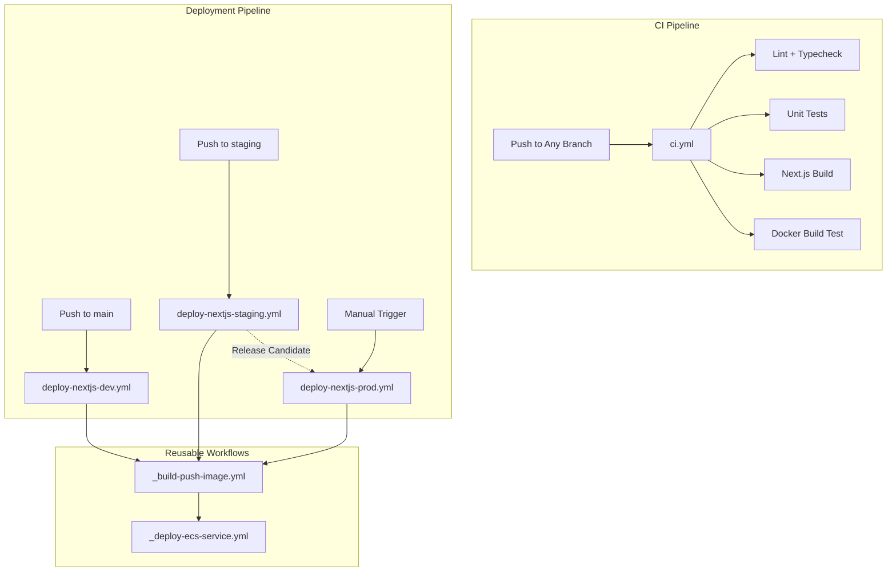

# GitHub Actions Architecture Overview

Your CI/CD pipeline follows a **Docker-based deployment pattern** with a focus on **immutable images** and **automatic rollback**.



---

## Workflow Breakdown

### 1. `ci.yml` — Continuous Integration

**Purpose:** Quality gate that runs on every push/PR to ensure code health.

| Job              | What It Does                                                                                                                                   |
| ---------------- | ---------------------------------------------------------------------------------------------------------------------------------------------- |
| `detect-changes` | Uses `dorny/paths-filter` to determine which parts of the codebase changed (src, tests, styles, config, docker). Enables **targeted testing**. |
| `setup`          | Caches Node.js dependencies with Yarn v4 for fast job execution                                                                                |
| `audit`          | Runs npm audit to check for package vulnerabilities                                                                                            |
| `lint`           | ESLint code quality checks                                                                                                                     |
| `typecheck`      | TypeScript compiler validation                                                                                                                 |
| `test`           | Jest unit tests with coverage reporting                                                                                                        |
| `build`          | Compiles Next.js application, verifies build output                                                                                            |
| `docker-build`   | Tests Docker image builds successfully and container starts                                                                                    |

**Key Design Decisions:**

- **Smart change detection** — Only runs relevant jobs when specific files change
- **Docker build test** — Catches Dockerfile issues before deployment
- **Coverage reporting** — Test coverage uploaded as artifact

---

### 2. `_build-push-image.yml` — Reusable Docker Build

**Purpose:** Build Next.js Docker image and push to Amazon ECR.

**Inputs:**

- `environment` — Target environment (development, staging, production)
- `image-tag` — Docker image tag (default: commit SHA)
- `ssm-ecr-param` — SSM parameter name for ECR repository URL

**What It Does:**

1. Configures AWS credentials via **OIDC** (no long-lived secrets!)
2. Retrieves ECR repository URL from **SSM Parameter Store**
3. Builds Docker image with BuildKit caching
4. Pushes to ECR with environment-based tagging

**Outputs:**

- `image-uri` — Full Docker image URI
- `image-digest` — Image digest for verification
- `image-tag` — Tag used

---

### 3. `_deploy-ecs-service.yml` — Reusable ECS Deployment

**Purpose:** Update ECS service with new Docker image, with automatic rollback.

**Inputs:**

- `environment` — Target environment
- `image-uri` — Docker image to deploy
- `ssm-cluster-param` — SSM parameter for ECS cluster name
- `ssm-service-param` — SSM parameter for ECS service name
- `ssm-taskdef-family-param` — SSM parameter for task definition family
- `wait-for-stability` — Wait for service to stabilize (default: true)
- `stability-timeout` — Timeout in minutes (default: 10)

**What It Does:**

1. Retrieves ECS configuration from SSM
2. Creates new task definition with updated image
3. Updates ECS service
4. Waits for service stability
5. Performs health check
6. **Automatic rollback** on failure

**Key Design:** Uses **SSM Parameter Store** for all configuration, enabling environment-specific deployments without hardcoded values.

---

### 4. `deploy-nextjs-dev.yml` — Development Deployment

**Trigger:** Push to `main` branch (source files only)

**Purpose:** Fast, iterative deployment for development work.

**Flow:**

```
Build Docker Image → Push to ECR → Update ECS Service → Health Check
```

**Key Features:**

- ✅ Automatic deployment on push
- ✅ Path-based triggering (only deploys when source changes)
- ✅ Automatic rollback on failure

---

### 5. `deploy-nextjs-staging.yml` — Staging Deployment

**Trigger:** Push to `staging` branch

**Purpose:** Pre-production validation with **release candidate creation**.

**Additional Features:**

- Creates `release-candidate.json` artifact with deployment metadata
- This release candidate can be used for production deployment

---

### 6. `deploy-nextjs-prod.yml` — Production Deployment

**Trigger:** Manual `workflow_dispatch` only

**Purpose:** Safe, controlled production deployment.

**Safety Features:**

| Feature                  | Description                           |
| ------------------------ | ------------------------------------- |
| **Confirmation gate**    | Must type "DEPLOY" to proceed         |
| **Staging image option** | Can deploy the staging-verified image |
| **Automatic rollback**   | Rolls back on health check failure    |
| **Detailed summary**     | Full deployment audit trail           |

---

## SSM Parameter Structure

The pipelines expect the following SSM parameters per environment:

```
/frontend/{env}/ecr-repository-url
/frontend/{env}/ecs-cluster-name
/frontend/{env}/ecs-service-name
/frontend/{env}/ecs-taskdef-family
```

Where `{env}` is `dev`, `staging`, or `prod`.

---

## Custom Actions

### `setup-node-yarn`

Composite action for Node.js setup with Yarn v4:

- Reads Node.js version from `.nvmrc`
- Enables Corepack for Yarn v4
- Caches dependencies (node_modules, .yarn/cache)
- Retry logic for network resilience

---

## Design Principles Summary

1. **Immutable Docker Images:** Same image deployed across environments
2. **SSM-Based Configuration:** No hardcoded infrastructure values
3. **OIDC Authentication:** No long-lived AWS credentials in GitHub
4. **Automatic Rollback:** Failed deployments automatically revert
5. **Smart Change Detection:** Run only necessary jobs to save CI minutes
6. **Health Check Verification:** HTTP health checks after deployment
7. **Release Candidate Pattern:** Staging creates artifacts for production
8. **Manual Production Gate:** Production requires explicit confirmation
