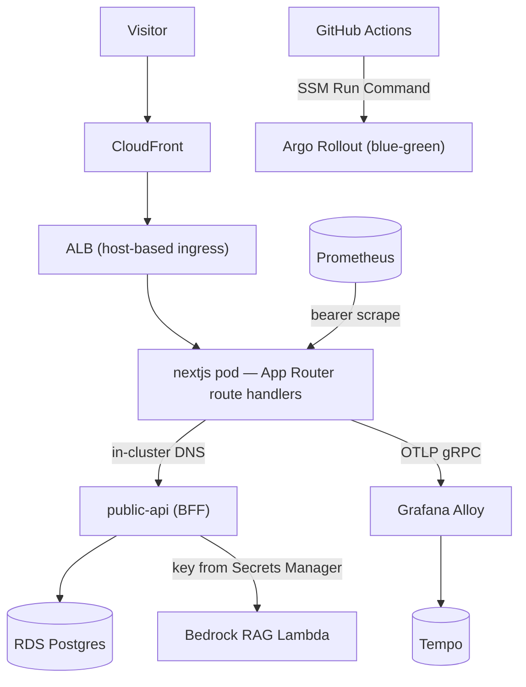

# Personal Portfolio & Cloud Architecture Showcase

A production Next.js 15 / React 19 site that runs as a pure **consumer** on a self-managed **EKS** cluster — reading all dynamic data through an in-cluster Backend-for-Frontend over **RDS**, instrumented end-to-end with **OpenTelemetry, Prometheus, and Grafana Faro**, and shipped via **Argo Rollouts** blue-green deploys.

[](https://github.com/Nelson-Lamounier/frontend-portfolio/actions/workflows/ci.yml)
[](https://sonarcloud.io/dashboard?id=Nelson-Lamounier_frontend-portfolio)

> Public for portfolio, recruiter, and engineering review. Not an open-source template or starter kit — see [LICENSE.md](LICENSE.md).

## What it does

Serves Nelson Lamounier's portfolio and technical-writing site: MDX articles, project case studies, a downloadable resume, and an AWS Bedrock RAG chatbot ("Lami"). The app holds **no AWS data credentials** — articles, resume, chat, and engagement (likes/comments) are all read from an in-cluster `public-api` BFF backed by RDS Postgres, with the producer side (content pipeline) owned by separate services.

## Why this exists

It doubles as a working demonstration of cloud/DevOps practice rather than a static site. The dynamic data plane was deliberately moved off direct DynamoDB/S3 access behind a single in-cluster BFF so the public-facing pod carries no secrets and every data domain has one typed, rate-limited contract ([in-cluster BFF consumer architecture](docs/concepts/in-cluster-bff-consumer.md)). The tradeoff — an extra network hop versus direct SDK calls — buys credential isolation, centralised rate limiting, and graceful degradation when the BFF is unreachable (build/ISR still succeed).

## Highlights

- **Consumer-only BFF architecture** — articles, chat, resume, and likes/comments all proxy to `public-api.public-api:3001` over Kubernetes service DNS; zero direct DynamoDB/S3 at runtime ([docs](docs/concepts/in-cluster-bff-consumer.md)).
- **Secure Bedrock RAG chatbot** — server-side proxy to a session-aware RAG endpoint; the Bedrock API key lives in the BFF (Secrets Manager), never in the browser ([docs](docs/concepts/bedrock-rag-proxy.md)).
- **Full three-signal observability** — OpenTelemetry traces (OTLP/gRPC → Alloy → Tempo), Prometheus metrics, and Grafana Faro browser RUM, correlated via W3C trace context ([docs](docs/concepts/observability-architecture.md)).
- **Authenticated metrics endpoint** — `/api/metrics` validates a bearer token resolved from SSM (5-min cache, constant-time compare) and fails closed in production ([docs](docs/tools/metrics-endpoint.md)).
- **Blue-green deploys via SSM** — GitHub Actions drives `kubectl argo rollouts promote` over an SSM Run Command against a private cluster, gated on ArgoCD image-sync to avoid stale-Healthy cutovers ([docs](docs/concepts/blue-green-rollout-via-ssm.md)).

## Architecture



## Tech stack

- **Framework:** Next.js 15 App Router, React 19, TypeScript
- **Styling:** Tailwind CSS v4, Framer Motion, Headless UI
- **Content:** MDX, `next-mdx-remote`, `remark-gfm`, `rehype-prism-plus`
- **Data plane:** in-cluster `public-api` BFF → RDS Postgres; S3 + CloudFront for static assets; SSM Parameter Store
- **AI:** AWS Bedrock RAG (via the BFF)
- **Observability:** OpenTelemetry, `prom-client` / Prometheus, Grafana Faro, Tempo, AWS X-Ray
- **Deploy:** Docker (standalone output), EKS, Argo Rollouts, ArgoCD, ECR
- **CI/CD:** GitHub Actions, SonarCloud
- **Testing:** Jest, React Testing Library

## Key design decisions

- **Consumer/producer split behind a BFF** — the site only reads; content is produced elsewhere into RDS. See [in-cluster BFF consumer architecture](docs/concepts/in-cluster-bff-consumer.md).
- **Chatbot as a secure proxy** — no Bedrock credentials in the public app. See [Bedrock RAG chat proxy](docs/concepts/bedrock-rag-proxy.md) and [chatbot data security](docs/concepts/chatbot-data-security.md).
- **Self-managed observability over a single APM** — vendor-neutral signals, full label/bucket control. See [observability architecture](docs/concepts/observability-architecture.md).
- **Blue-green over rolling deploys** — instant atomic cutover and trivial rollback by aborting pre-promotion. See [blue-green rollout via SSM](docs/concepts/blue-green-rollout-via-ssm.md).

## Repository structure

```text
apps/site/
  src/app/            routes, layouts, API route handlers, server components
  src/components/      UI and experience components (incl. chat widget)
  src/lib/             BFF consumer layers, observability, content services
  scripts/             local/dev utilities
docs/                  concepts, runbooks, tools, troubleshooting (see docs/README.md)
.github/workflows/     ci.yml, deploy-frontend.yml
Dockerfile             standalone production container for apps/site
```

## Running locally

```bash
yarn install
yarn workspace site dev
```

The dev server runs on <http://localhost:3000>. Local development works without
production AWS secrets; set `PUBLIC_API_URL` only to point at a reachable BFF.

Quality gates (the same checks CI runs):

```bash
yarn npm audit --all --severity high
yarn lint
yarn workspace site exec tsc --noEmit
yarn test --ci --coverage --runInBand --watchman=false
yarn build
```

## Deploying

The site is containerised by the root `Dockerfile`. The
[`deploy-frontend.yml`](.github/workflows/deploy-frontend.yml) pipeline builds the
image, pushes it to ECR (URI from SSM), syncs static assets to S3/CloudFront,
writes the promoted image URI to SSM, and drives an Argo Rollouts blue-green
promotion over SSM, then smoke-tests the live rollout in-cluster. See the
[frontend deploy pipeline runbook](docs/runbooks/frontend-deploy-pipeline.md).

## Related projects

| Repository | Role |
| --- | --- |
| `tucaken-app` | Producer / admin — triggers AI content generation into RDS |
| `ai-applications` | The `public-api` BFF, Bedrock RAG services, and content pipeline |
| `kubernetes-bootstrap` | EKS cluster, Helm charts, ArgoCD apps, ingress |

## License

Source-available for review only. See [LICENSE.md](LICENSE.md) and
[THIRD_PARTY_NOTICES.md](THIRD_PARTY_NOTICES.md).
