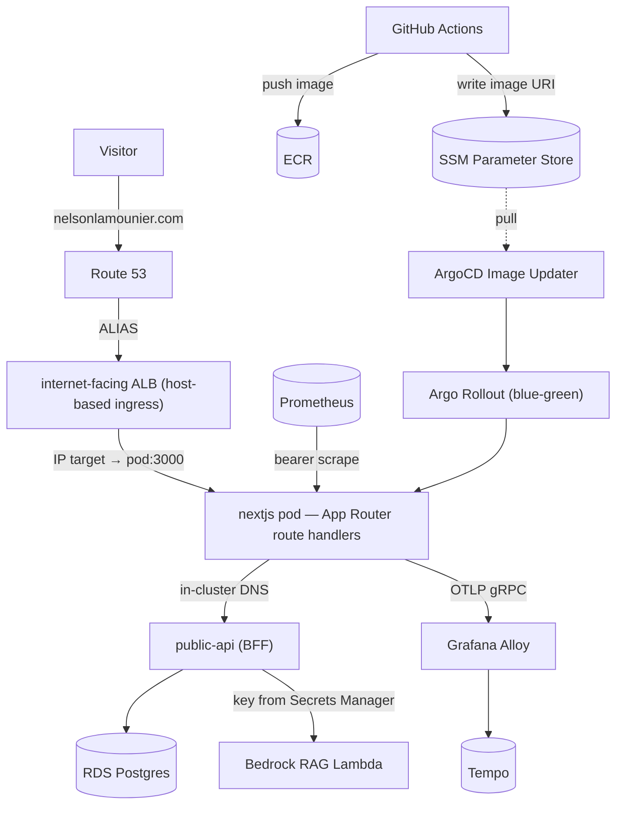

# Personal Portfolio & Cloud Architecture Showcase

A production Next.js 15 / React 19 portfolio whose centerpiece is **"Lami" — a real Retrieval-Augmented Generation chatbot** you can ask about my work in plain English. It runs as a pure **consumer** on a self-managed **EKS** cluster, reads all dynamic data through an in-cluster Backend-for-Frontend over **RDS**, is instrumented end-to-end with **OpenTelemetry, Prometheus, and Grafana Faro**, and ships via **Argo Rollouts** blue-green deploys.

[](https://github.com/Nelson-Lamounier/frontend-portfolio/actions/workflows/ci.yml)
[](https://sonarcloud.io/dashboard?id=Nelson-Lamounier_frontend-portfolio)

> Public for portfolio, recruiter, and engineering review. Not an open-source template or starter kit — see [LICENSE.md](LICENSE.md).

## Meet Lami — the differentiator

Most personal portfolios are static pages you scroll. This one you can **talk to**. Lami is a floating chat assistant that answers questions about my projects, skills, and experience — grounded in a knowledge base built from my actual GitHub repositories, not the model's general knowledge.

- **It's a genuine RAG system, not a chatbot gimmick** — hybrid **vector + keyword retrieval** (pgvector + BM25, fused with Reciprocal Rank Fusion) over embedded repo content, then **Amazon Bedrock (Claude Sonnet 4.6)** generates an answer constrained to what was retrieved.
- **It stays on topic and can't leak** — layered guardrails (input prompt-injection filtering, a non-negotiable system-prompt scope boundary with a fixed refusal, output PII/infrastructure redaction) plus an owner-scoped, row-level-security data model. It's a RAG assistant, **not a database gateway** — a prompt never becomes SQL.
- **It's credential-free at the edge** — the browser and the site pod hold **no Bedrock key and no database access**; everything privileged runs behind the in-cluster BFF.

Ask it *"What has he built with Kubernetes?"* or *"Show me evidence of CI/CD design"* and it answers with specifics from the repos. **Full design → [The "Lami" chatbot — RAG architecture, workflow & guardrails](docs/concepts/chatbot-architecture.md).**

## What it does

Serves Nelson Lamounier's portfolio and technical-writing site: the **Lami RAG chatbot** (above), MDX articles, project case studies, a downloadable resume, and article engagement (likes/comments). The app holds **no AWS data credentials** — chat, articles, resume, and engagement are all read from an in-cluster `public-api` BFF backed by RDS Postgres, with the producer side (content + embedding pipeline) owned by separate services.

## Why this exists

It doubles as a working demonstration of cloud/DevOps practice rather than a static site. The dynamic data plane was deliberately moved off direct DynamoDB/S3 access behind a single in-cluster BFF so the public-facing pod carries no secrets and every data domain has one typed, rate-limited contract ([in-cluster BFF consumer architecture](docs/concepts/in-cluster-bff-consumer.md)). The tradeoff — an extra network hop versus direct SDK calls — buys credential isolation, centralised rate limiting, and graceful degradation when the BFF is unreachable (build/ISR still succeed).

## Highlights

- **"Lami" — a grounded RAG chatbot** — multi-query hybrid retrieval (pgvector + BM25 via RRF) over a GitHub-repo knowledge base, generated by Bedrock **Claude Sonnet 4.6**, with layered guardrails and owner-scoped row-level security. Session-aware, credential-free at the edge ([architecture](docs/concepts/chatbot-architecture.md), [proxy mechanics](docs/concepts/bedrock-rag-proxy.md), [security](docs/concepts/chatbot-data-security.md)).
- **Consumer-only BFF architecture** — chat, articles, resume, and likes/comments all proxy to `public-api.public-api:3001` over Kubernetes service DNS; zero direct DynamoDB/S3 at runtime ([docs](docs/concepts/in-cluster-bff-consumer.md)).
- **Full three-signal observability** — OpenTelemetry traces (OTLP/gRPC → Alloy → Tempo), Prometheus metrics, and Grafana Faro browser RUM, correlated via W3C trace context ([docs](docs/concepts/observability-architecture.md)).
- **Authenticated metrics endpoint** — `/api/metrics` validates a bearer token resolved from SSM (5-min cache, constant-time compare) and fails closed in production ([docs](docs/tools/metrics-endpoint.md)).
- **GitHub-led CI/CD** — CI is a path-filtered quality gate (audit, lint, type-check, test, build, container smoke test) on every branch and PR; on merge to `main`, CD builds the image, pushes it to ECR, and writes the tag to SSM ([CI docs](docs/concepts/ci-pipeline.md), [CD docs](docs/concepts/cd-pipeline.md)).
- **Blue-green deploys via GitOps hand-off** — GitHub's responsibility ends at ECR + SSM; in-cluster ArgoCD Image Updater and Argo Rollouts pull the new image and auto-promote the blue-green cutover, keeping the Kubernetes API private ([docs](docs/concepts/cd-pipeline.md)).

## Architecture



## Tech stack

- **Framework:** Next.js 15 App Router, React 19, TypeScript
- **Styling:** Tailwind CSS v4, Framer Motion, Headless UI
- **Content:** MDX, `next-mdx-remote`, `remark-gfm`, `rehype-prism-plus`
- **Data plane:** in-cluster `public-api` BFF → RDS Postgres; SSM Parameter Store (no CloudFront — the pod serves static assets; see [request routing](docs/concepts/request-routing-dns-to-pod.md))
- **AI:** AWS Bedrock RAG via the BFF — Claude Sonnet 4.6 (Converse) generation, Titan Text Embeddings v2, pgvector + BM25 retrieval
- **Observability:** OpenTelemetry, `prom-client` / Prometheus, Grafana Faro, Tempo, AWS X-Ray
- **Deploy:** Docker (standalone output), EKS, Argo Rollouts, ArgoCD, ECR
- **CI/CD:** GitHub Actions, SonarCloud
- **Testing:** Jest, React Testing Library

## Key design decisions

- **Consumer/producer split behind a BFF** — the site only reads; content is produced elsewhere into RDS. See [in-cluster BFF consumer architecture](docs/concepts/in-cluster-bff-consumer.md).
- **Chatbot as a secure proxy** — no Bedrock credentials in the public app. See [Bedrock RAG chat proxy](docs/concepts/bedrock-rag-proxy.md) and [chatbot data security](docs/concepts/chatbot-data-security.md).
- **Self-managed observability over a single APM** — vendor-neutral signals, full label/bucket control. See [observability architecture](docs/concepts/observability-architecture.md).
- **GitHub Actions leads delivery; ArgoCD follows** — GitHub builds, pushes to ECR, and publishes the tag to SSM, then hands off to in-cluster GitOps rather than reaching into the cluster API. See [CD pipeline](docs/concepts/cd-pipeline.md).
- **Blue-green over rolling deploys** — instant atomic cutover and trivial rollback; auto-promoted in-cluster by Argo Rollouts. See [CD pipeline](docs/concepts/cd-pipeline.md).

## Repository structure

```text
apps/site/
  src/app/            routes, layouts, API route handlers, server components
  src/components/      UI and experience components (incl. chat widget)
  src/lib/             BFF consumer layers, observability, content services
  scripts/             local/dev utilities
docs/                  concepts, runbooks, tools, troubleshooting, history (see docs/README.md)
.github/
  workflows/           ci.yml, deploy-frontend.yml, _sync-assets.yml, sonarqube.yml
  actions/             setup-node-yarn, configure-aws (composite actions)
Dockerfile             standalone production container for apps/site
```

## Running locally

```bash
yarn install
yarn workspace site dev
```

The dev server runs on <http://localhost:3000>. Local development works without
production AWS secrets; set `PUBLIC_API_URL` only to point at a reachable BFF.

Quality gates (the same checks CI runs):

```bash
yarn npm audit --all --severity high
yarn lint
yarn workspace site exec tsc --noEmit
yarn test --ci --coverage --runInBand --watchman=false
yarn build
```

## CI/CD & branch strategy

GitHub Actions leads both integration and delivery
([CI docs](docs/concepts/ci-pipeline.md), [CD docs](docs/concepts/cd-pipeline.md)).

**Branching** is trunk-based. Work happens on short-lived, typed-prefix branches
(`feat/`, `fix/`, `ci/`, `chore/`, `docs/`) that open a Pull Request into `main`.
[`ci.yml`](.github/workflows/ci.yml) runs on every branch and PR;
[`sonarqube.yml`](.github/workflows/sonarqube.yml) adds the SonarCloud quality
gate on PRs into `main`. A PR merges only when the aggregated `ci-success` check
(and SonarCloud) is green — so nothing reaches `main` unvalidated.

**Delivery** is triggered by landing on `main`. The
[`deploy-frontend.yml`](.github/workflows/deploy-frontend.yml) pipeline builds the
image (containerised by the root `Dockerfile`), pushes it to ECR (URI from SSM),
runs a legacy static-asset S3 sync step, and writes the new image URI to SSM. That
SSM write is the hand-off: in-cluster **ArgoCD Image Updater** and **Argo
Rollouts** pull the new image and auto-promote the blue-green cutover — GitHub
never touches the Kubernetes API. Visitors reach the pod via **Route 53 → ALB →
pod** with no CDN (CloudFront retired); see
[request routing](docs/concepts/request-routing-dns-to-pod.md). Deploys can also be run manually
(`workflow_dispatch`, with an optional ref) or triggered cross-repo
(`repository_dispatch`). See the
[frontend deploy pipeline runbook](docs/runbooks/frontend-deploy-pipeline.md).

## Related projects

| Repository | Role |
| --- | --- |
| `tucaken-app` | Producer / admin — triggers AI content generation into RDS |
| `ai-applications` | The `public-api` BFF, Bedrock RAG services, and content pipeline |
| `kubernetes-bootstrap` | EKS cluster, Helm charts, ArgoCD apps, ingress |

## Security

Found a vulnerability? Please report it privately — see [SECURITY.md](SECURITY.md).

## License

Source-available for review only. See [LICENSE.md](LICENSE.md) and
[THIRD_PARTY_NOTICES.md](THIRD_PARTY_NOTICES.md).
