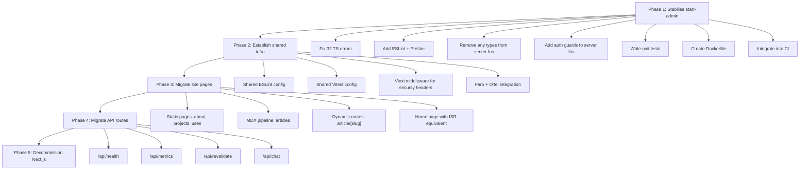

# Portfolio Frontend — Production Readiness Review

> **Scope**: `apps/start-admin` (TanStack Start) + `apps/site/src/app` (Next.js) migration assessment
> **Date**: 4 April 2026 · **Reviewer**: Antigravity

---

## Table of Contents

1. [Executive Summary](#executive-summary)
2. [Part A — `start-admin` Review](#part-a--start-admin-review)
   - [Architecture & Structure](#1-architecture--structure)
   - [Type Safety & Code Quality](#2-type-safety--code-quality)
   - [Security](#3-security)
   - [Automation & CI/CD](#4-automation--cicd)
   - [Observability & Error Handling](#5-observability--error-handling)
   - [Containerisation & Deployment](#6-containerisation--deployment)
   - [Testing](#7-testing)
3. [Part B — `apps/site` Migration Assessment](#part-b--appssite-migration-assessment)
   - [Current Site Architecture](#current-site-architecture)
   - [Migration Benefits](#migration-benefits)
   - [Migration Risks & Considerations](#migration-risks--considerations)
   - [Gap Analysis](#gap-analysis)
   - [Recommended Migration Strategy](#recommended-migration-strategy)
4. [Consolidated Findings Table](#consolidated-findings-table)
5. [Prioritised Action Items](#prioritised-action-items)

---

## Executive Summary

The `start-admin` application has been successfully migrated from Next.js to TanStack Start. The core architecture is sound — the route tree, server functions, and auth flow are correctly structured. However, the application has **32 unresolved TypeScript errors**, no ESLint configuration, no test suite, no dedicated Dockerfile, and several security concerns (API keys committed to `.env.local`, debug file-writes to `/tmp`, `any` casts pervasive in server functions). The CI pipeline only covers the `site` app.

The `apps/site` (Next.js) application is a public-facing portfolio with a mature CI/CD pipeline, Docker build, ESLint, Jest tests, and OpenTelemetry instrumentation. Migrating it to TanStack Start would bring routing type-safety and faster DX, but requires careful handling of SSR/SEO features, ISR, middleware, MDX content rendering, and the existing observability stack.

> [!CAUTION]
> **The `start-admin` app is NOT production-ready in its current state.** Critical blockers include unresolved TypeScript errors, zero test coverage, no linting, exposed secrets, and no CI/CD integration.

---

## Part A — `start-admin` Review

### 1. Architecture & Structure

**What's Working Well ✅**

| Area | Assessment |
|------|------------|
| Route tree layout | Clean flat-file convention using TanStack Router (`_dashboard.*` prefix pattern) |
| Server/client boundary | Server functions correctly isolated in `src/server/` |
| Feature-based organisation | `src/features/{applications,articles,resumes,comments,overview,ai-agent}` |
| Layout guard | `_dashboard.tsx` properly checks `context.auth.user` and redirects |
| Shared package | `@repo/shared` via workspace protocol for shared types, UI, auth |
| Devtools | Lazy-loaded in development only via `process.env.NODE_ENV` check |
| QueryClient | Singleton with sensible defaults (`staleTime: 5m`) |

**Gaps & Issues 🔴**

| Issue | Severity | File(s) |
|-------|----------|---------|
| **`'use client'` directive on `AppLayout.tsx`** — TanStack Start doesn't use RSC, so `'use client'` is a no-op legacy artefact | Low | [AppLayout.tsx](file:///Users/nelsonlamounier/Desktop/portfolio/frontend-portfolio/apps/start-admin/src/components/layouts/AppLayout.tsx#L1) |
| **Placeholder logo** — Using Tailwind CSS's demo logo (`tailwindcss.com/plus-assets/img/logos/mark.svg`) | Medium | [AppLayout.tsx](file:///Users/nelsonlamounier/Desktop/portfolio/frontend-portfolio/apps/start-admin/src/components/layouts/AppLayout.tsx#L138-L141) |
| **Dead route comment block** — `_dashboard.index.tsx` has a mapping table comment that should be in docs, not in code | Low | [_dashboard.index.tsx](file:///Users/nelsonlamounier/Desktop/portfolio/frontend-portfolio/apps/start-admin/src/app/_dashboard.index.tsx#L9-L17) |
| **Orphan nav items** — Sidebar has routes for `/projects` and `/calendar` but no corresponding route files exist | Medium | [AppLayout.tsx](file:///Users/nelsonlamounier/Desktop/portfolio/frontend-portfolio/apps/start-admin/src/components/layouts/AppLayout.tsx#L36-L38) |
| **Debug artefacts checked in** — `ts_errors.txt`, `ts_errors2.txt`, `ts_errors3.txt` are committed | Low | Root of `start-admin` |
| **`dist/` checked in** — Build output directory is present in git | Medium | `apps/start-admin/dist/` |

---

### 2. Type Safety & Code Quality

> [!WARNING]
> **32 TypeScript errors are present** (captured in [ts_errors.txt](file:///Users/nelsonlamounier/Desktop/portfolio/frontend-portfolio/apps/start-admin/ts_errors.txt)). The build will fail with `strict: true`.

#### TypeScript Error Breakdown

| Category | Count | Key Files |
|----------|-------|-----------|
| **Unused imports/variables** (`TS6133`) | 13 | `ApplicationDetailTabs.tsx`, `ApplicationsList.tsx`, `NewAnalysisPanel.tsx`, `ProgressBars.tsx` |
| **`inputValidator` type mismatch** (`TS2322`) | 9 | `use-admin-articles.ts`, `use-admin-comments.ts` |
| **Missing module** (`TS2307`) | 1 | `applications.ts` → `@/lib/types/strategist.types` |
| **Type mismatch** (`TS2345`) | 1 | `comments.ts` — `'APPROVED'` vs `'approve'` |
| **Implicit `any` rest params** (`TS7019`) | 2 | `ProgressBar.tsx`, `TabUnderline.tsx` |
| **Possibly undefined** (`TS2532`, `TS18048`) | 2 | `TabUnderline.tsx`, `DashboardOverview.tsx` |

#### `any` Type Usage — Critical Violations

Every server function uses `(d: any) => d` as the input validator and `(ctx: any)` as handler params. This defeats the purpose of TanStack Start's type-safe server functions:

```typescript
// ❌ Current pattern (every server file)
export const getArticlesFn = createServerFn({ method: 'GET' })
  .inputValidator((d: any) => d)       // ← any
  .handler(async (ctx: { data: any }) => {  // ← any
```

```typescript
// ✅ Expected pattern with proper Zod schema
const getArticlesInput = z.object({ status: z.enum(['all', 'draft', 'published']) })

export const getArticlesFn = createServerFn({ method: 'GET' })
  .validator(getArticlesInput)
  .handler(async ({ data }) => {  // ← fully typed
```

#### Missing Configuration

| Item | Status |
|------|--------|
| ESLint config | ❌ **Missing entirely** — no `eslint.config.js` or `.eslintrc` |
| Prettier config | ❌ **Missing** |
| `import type` enforcement | ❌ Not enforced despite `verbatimModuleSyntax: true` |
| JSDoc/TSDoc on server functions | ⚠️ Partial — `auth.ts` has comments, other server files do not |

---

### 3. Security

> [!CAUTION]
> Multiple critical security issues identified.

| Issue | Severity | Detail |
|-------|----------|--------|
| **API key committed to `.env.local`** | 🔴 Critical | `BEDROCK_AGENT_API_KEY=1WF3tPvm...` is a **live API key** checked into the repo. Must be rotated immediately and stored in AWS Secrets Manager/SSM. |
| **Cognito secrets committed** | 🔴 Critical | `AUTH_COGNITO_CLIENT_ID`, `NEXTAUTH_SECRET` are in `.env.local`. While `.env.local` is typically gitignored, verify it is not tracked. |
| **Debug file writes to `/tmp`** | 🟡 Medium | Auth callback and session verification write error logs to `/tmp/auth_callback_debug.log` and `/tmp/auth-error.log` using `import('node:fs')`. This leaks error details to the filesystem and is a container security risk. |
| **No CSRF protection** | 🟡 Medium | `state` parameter is generated for OAuth but **never verified** on the callback. The `auth.callback.tsx` reads `search.state` but does not compare it to a stored value. |
| **Session cookie lacks `__Secure-` prefix** | 🟡 Medium | The `__session` cookie is `httpOnly` and `secure` in production, but lacks the `__Secure-` or `__Host-` prefix for additional browser protection. |
| **No rate limiting on server functions** | 🟡 Medium | `deleteApplicationFn`, `updateApplicationStatusFn`, and `triggerPipelineActionFn` have no rate limiting or request throttling. |
| **Upload function trusts `file.type`** | 🟡 Medium | `upload.ts` validates MIME type solely from `file.type` (client-provided). Should validate magic bytes server-side. |
| **No authorisation on server functions** | 🔴 Critical | Server functions (`getApplicationsFn`, `deleteApplicationFn`, `triggerPipelineActionFn`, etc.) do **not check the user session**. Authentication is only enforced at the route level (`_dashboard.tsx`), meaning direct server function calls bypass auth. |

---

### 4. Automation & CI/CD

> [!IMPORTANT]
> The `start-admin` app has **zero CI/CD integration**.

| CI/CD Aspect | `site` (Next.js) | `start-admin` (TanStack) |
|-------------|-------------------|--------------------------|
| Lint step | ✅ `yarn lint` | ❌ No ESLint configured |
| Type check | ✅ `yarn tsc --noEmit` | ❌ 32 errors would fail |
| Unit tests | ✅ `yarn test --ci --coverage` | ❌ No tests exist |
| Build verification | ✅ `yarn build` → check `.next` | ❌ Not in workflow |
| Docker build | ✅ Multi-stage + smoke test | ❌ No Dockerfile for TanStack |
| Security audit | ✅ `yarn npm audit` | ❌ Not included |
| SonarQube | ✅ `sonarqube.yml` | ❌ Not included |
| Change detection | ✅ Path filters | ❌ Path filters only check `apps/site` paths |

The existing CI workflow at [ci.yml](file:///Users/nelsonlamounier/Desktop/portfolio/frontend-portfolio/.github/workflows/ci.yml) explicitly checks `apps/site/.next` and `apps/admin/.next` — it has **no awareness of `apps/start-admin`**.

---

### 5. Observability & Error Handling

| Aspect | Status | Notes |
|--------|--------|-------|
| Grafana Faro RUM | ❌ Not integrated | `site` has Faro; `start-admin` does not |
| OpenTelemetry | ❌ Not integrated | `site` has `instrumentation.ts`; `start-admin` has nothing |
| Error boundaries | ✅ Root error boundary | `__root.tsx` has `ErrorComponent` |
| 404 handling | ✅ `notFoundComponent` | Correctly shows 404 page |
| Toast notifications | ✅ `<Toaster />` | Present in `RootDocument` |
| Console error logs | ⚠️ Debug only | `console.warn/error` sprinkled; no structured logging |
| `/tmp` debug writes | ❌ Anti-pattern | Should use structured logging, not filesystem writes |

---

### 6. Containerisation & Deployment

The existing [Dockerfile](file:///Users/nelsonlamounier/Desktop/portfolio/frontend-portfolio/Dockerfile) is tailored exclusively for Next.js (`next build`, `.next/standalone`, `server.js`). TanStack Start produces a Vinxi-based build output (`dist/`) which requires a completely different container strategy:

| Requirement | Status |
|-------------|--------|
| Dedicated Dockerfile for TanStack Start | ❌ Missing |
| `docker-compose.yml` service entry | ❌ Missing |
| Health check endpoint | ❌ No `/api/health` equivalent |
| K8s manifests (ArgoCD) | ❌ Not created |
| Production server config (Vinxi/Nitro) | ❌ Not configured |

---

### 7. Testing

| Test Type | Status |
|-----------|--------|
| Unit tests | ❌ **Zero tests** — `vitest` is in devDependencies but no test files exist |
| Integration tests | ❌ None |
| E2E tests | ❌ None |
| Component tests | ❌ None |

The `package.json` has `"test": "vitest run"` configured but there are no `*.test.ts` or `*.spec.ts` files anywhere in the project.

---

## Part B — `apps/site` Migration Assessment

### Current Site Architecture

The public-facing portfolio site is a **Next.js 15 App Router** application with:

| Feature | Implementation |
|---------|---------------|
| **Pages** | Home, About, Articles (static MDX + DynamoDB), Projects, Music, Uses, Thank-you |
| **API Routes** | 7 routes: articles, chat, health, metrics, resume, revalidate, track-error |
| **Auth** | NextAuth v5 beta (Cognito) — for admin routes only |
| **Data** | DynamoDB + S3 for articles; ISR with `revalidate = 3600` |
| **Styling** | Tailwind CSS v4 + Typography plugin |
| **State** | Zustand + React Query |
| **Observability** | Grafana Faro RUM + OpenTelemetry SDK (traces, metrics) |
| **Content** | MDX via `next-mdx-remote` + `@next/mdx` |
| **Animations** | Framer Motion |
| **Middleware** | Custom `middleware.ts` for Faro proxy, CSP headers, security headers |
| **CI/CD** | Full pipeline: lint → typecheck → test → build → Docker → smoke test |
| **Docker** | Multi-stage Amazon Linux 2023, standalone output |
| **Testing** | Jest + Testing Library |
| **SEO** | Server-side metadata, RSC, ISR, RSS feed generation |

### Migration Benefits

| Benefit | Impact | Detail |
|---------|--------|--------|
| **End-to-end type-safe routing** | 🟢 High | Route params, search params, and loader data are fully typed. Currently Next.js `useParams()` returns `string \| string[]` requiring manual parsing. |
| **Unified data-fetching model** | 🟢 High | Eliminate RSC vs client boundary confusion. `createServerFn` provides clear RPC-style data access. |
| **Faster DX** | 🟢 High | Vite HMR is significantly faster than Next.js webpack/turbopack. Instant cold starts. |
| **Transparent caching** | 🟢 Medium | No hidden Next.js route/data cache layers. Full control over React Query `staleTime`/`gcTime`. |
| **Shared auth pattern** | 🟢 Medium | Reuse the PKCE auth flow already built for `start-admin`. |
| **Smaller bundle** | 🟢 Medium | No Next.js runtime overhead. Vite produces optimised ESM bundles. |
| **Monorepo consistency** | 🟢 Medium | Both apps on the same framework simplifies maintenance, shared components, and CI. |

### Migration Risks & Considerations

| Risk | Severity | Detail |
|------|----------|--------|
| **SSR/SEO parity** | 🔴 High | TanStack Start SSR is less mature than Next.js. Metadata API (`export const metadata`), `generateStaticParams`, ISR, and `<head>` management need manual equivalents. |
| **MDX content pipeline** | 🔴 High | `next-mdx-remote` and `@next/mdx` are Next.js-specific. Need `@mdx-js/rollup` or equivalent for Vite. |
| **Middleware** | 🟡 Medium | Next.js middleware handles Faro proxy, CSP headers, admin auth redirects. TanStack Start uses Vinxi/Nitro server middleware — different API entirely. |
| **Image Optimisation** | 🟡 Medium | Next.js `<Image>` provides automatic WebP/AVIF, lazy loading, and CDN integration. Must replace with a Vite plugin or manual `` with CloudFront. |
| **RSS/Feed generation** | 🟡 Medium | Currently uses Next.js `feed.xml` route. Need a Vinxi server route or build-time generation. |
| **OpenTelemetry instrumentation** | 🟡 Medium | `instrumentation.ts` uses Next.js-specific hooks. Must adapt for Vinxi server runtime. |
| **Framer Motion** | 🟢 Low | Framework-agnostic. Works in TanStack Start without changes. |
| **Existing test suite** | 🟡 Medium | Jest tests need migration to Vitest (different config, different module resolution). |
| **API routes** | 🟡 Medium | 7 API routes (`/api/health`, `/api/metrics`, etc.) must be converted to Vinxi server routes or TanStack server functions. |
| **Static export potential** | 🟡 Medium | Some pages (about, projects, uses) are fully static. Next.js generates these at build time. TanStack Start will SSR them on every request unless explicit caching is added. |
| **ArgoCD/K8s deployment** | 🔴 High | Current Dockerfile, K8s manifests, and health checks are tightly coupled to Next.js standalone output. Complete rewrite required. |

### Gap Analysis

| Capability | `site` (Next.js) ✅ | `start-admin` (TanStack) ❌ |
|------------|---------------------|------------------------------|
| ESLint | ✅ `eslint.config.js` with strict rules | ❌ **Missing** |
| Prettier | ✅ `prettier.config.cjs` | ❌ **Missing** |
| Tests | ✅ Jest + Testing Library | ❌ **None** |
| Docker | ✅ Multi-stage, health-checked | ❌ **None** |
| CI/CD | ✅ Full pipeline | ❌ **Not integrated** |
| Observability | ✅ Faro + OTel | ❌ **None** |
| SEO metadata | ✅ Per-page metadata | ⚠️ Only root `<title>` |
| Security headers | ✅ CSP, HSTS via middleware | ❌ **None** |
| Error tracking | ✅ Faro error capture | ❌ Console only |
| Structured logging | ⚠️ Basic | ❌ `/tmp` writes |

### Recommended Migration Strategy

> [!IMPORTANT]
> Do NOT migrate `apps/site` until `apps/start-admin` is production-ready. Fix the admin app first to establish patterns and CI infrastructure.



---

## Consolidated Findings Table

| # | Finding | Severity | Category | App |
|---|---------|----------|----------|-----|
| 1 | 32 unresolved TypeScript errors | 🔴 Critical | Code Quality | `start-admin` |
| 2 | No ESLint configuration | 🔴 Critical | Code Quality | `start-admin` |
| 3 | Pervasive `any` in server functions | 🔴 Critical | Type Safety | `start-admin` |
| 4 | API key committed to `.env.local` | 🔴 Critical | Security | `start-admin` |
| 5 | Server functions lack auth guards | 🔴 Critical | Security | `start-admin` |
| 6 | CSRF `state` not verified | 🟡 Medium | Security | `start-admin` |
| 7 | Zero test coverage | 🔴 Critical | Testing | `start-admin` |
| 8 | No CI/CD integration | 🔴 Critical | Automation | `start-admin` |
| 9 | No Dockerfile | 🔴 Critical | Deployment | `start-admin` |
| 10 | No observability (Faro, OTel) | 🟡 Medium | Observability | `start-admin` |
| 11 | Debug writes to `/tmp` | 🟡 Medium | Security | `start-admin` |
| 12 | Upload MIME type not validated server-side | 🟡 Medium | Security | `start-admin` |
| 13 | Orphan navigation items (Projects, Calendar) | 🟡 Medium | UX | `start-admin` |
| 14 | Placeholder Tailwind logo in sidebar | 🟡 Medium | UX | `start-admin` |
| 15 | `'use client'` directive (no-op) | 🟢 Low | Code Quality | `start-admin` |
| 16 | `dist/` and `ts_errors*.txt` committed | 🟡 Medium | Repo Hygiene | `start-admin` |
| 17 | `avatarImage as any` cast | 🟢 Low | Type Safety | `start-admin` |
| 18 | BatchWrite limited to 25 items silently | 🟡 Medium | Data Integrity | `start-admin` |
| 19 | Missing JSDoc on most server functions | 🟡 Medium | Documentation | `start-admin` |
| 20 | CI path filters don't include `start-admin` | 🔴 Critical | Automation | CI |

---

## Prioritised Action Items

### 🔴 P0 — Must fix before any deployment

1. **Rotate the exposed Bedrock API key** and move all secrets to SSM/Secrets Manager
2. **Add server-side auth guards** to all server functions (check `getCookie('__session')` + verify JWT)
3. **Fix all 32 TypeScript errors** — unused imports, type mismatches, missing modules
4. **Remove `any` from all `inputValidator` and handler params** — use Zod schemas
5. **Add ESLint config** — extend the `site` app's `eslint.config.js`
6. **Create a Dockerfile** for TanStack Start (Vinxi output)
7. **Integrate into CI/CD** — add `start-admin` to the workflow's change detection, lint, typecheck, and build steps

### 🟡 P1 — Required for production stability

8. **Write unit tests** for server functions (at minimum: auth, applications, articles)
9. **Remove `/tmp` debug writes** — replace with structured logging
10. **Verify OAuth `state` parameter** on callback
11. **Add security headers** via Vinxi server middleware (CSP, HSTS, X-Frame-Options)
12. **Integrate Faro RUM** for client-side error tracking
13. **Add `.gitignore` entries** for `dist/`, `ts_errors*.txt`
14. **Handle `BatchWriteCommand` pagination** for apps with >25 records
15. **Replace placeholder logo** with actual branding

### 🟢 P2 — Polish and optimisation

16. Remove `'use client'` directives
17. Add JSDoc/TSDoc to all server functions
18. Remove dead navigation items or implement stub pages
19. Add Prettier configuration
20. Plan `apps/site` migration after admin is stable
