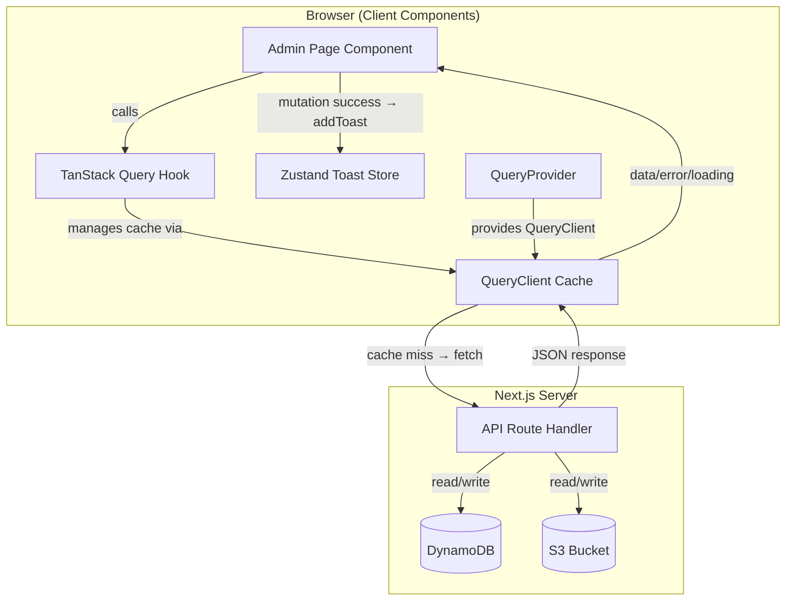
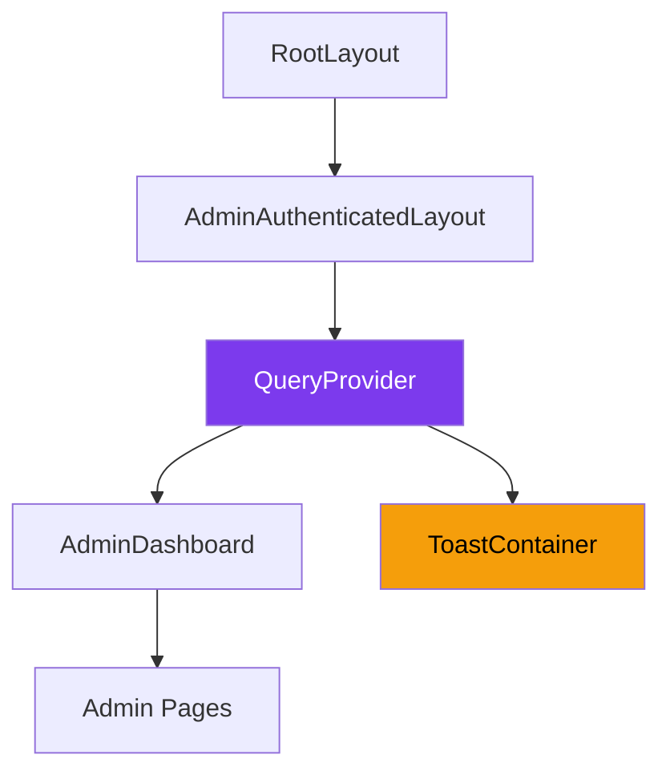
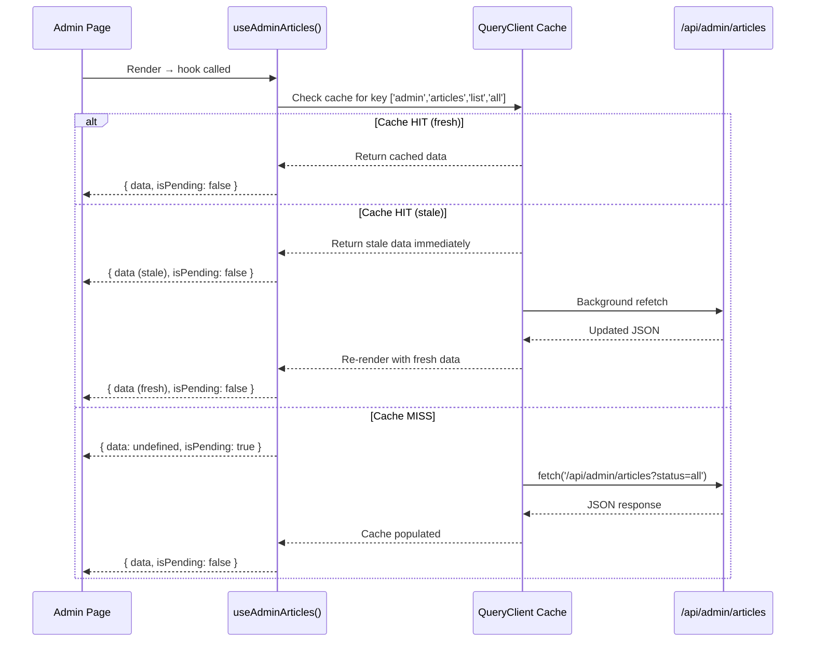
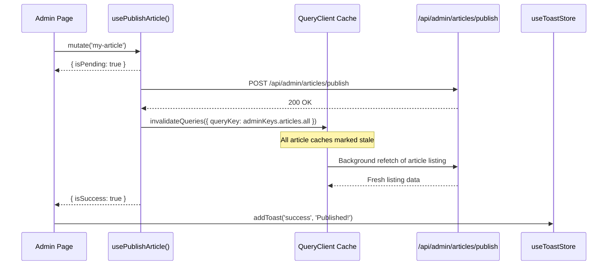

# Architecture Design — Admin State Management

> Detailed technical design of the three-layer state management architecture,
> data-flow diagrams, cache lifecycle, and component wiring.

---

## 1. System Architecture

### 1.1 High-Level Data Flow



### 1.2 Component Tree



The `QueryProvider` sits at the layout level (`src/app/admin/(authenticated)/layout.tsx`),
ensuring all admin pages share the same `QueryClient` instance. The `ToastContainer`
reads from the Zustand store and is positioned as a sibling to the dashboard, rendering
notifications as a fixed overlay.

---

## 2. Layer Specifications

### 2.1 API Layer — `src/lib/api/`

The API layer contains **pure async functions** — no React hooks, no side effects.
Each function is usable as a TanStack Query `queryFn` or called imperatively.

#### `admin-api.ts`

| Function | HTTP | Endpoint | Returns |
|----------|------|----------|---------|
| `fetchAdminArticles()` | GET | `/api/admin/articles?status=all` | `AdminArticlesResponse` |
| `fetchArticleContent(slug)` | GET | `/api/admin/articles/content?slug=` | `ArticleContentResponse` |
| `publishArticle(slug)` | POST | `/api/admin/articles/publish` | `void` |
| `unpublishArticle(slug)` | POST | `/api/admin/articles/unpublish` | `void` |
| `deleteArticle(slug)` | DELETE | `/api/admin/articles/delete` | `void` |
| `updateArticleMetadata(slug, updates)` | PATCH | `/api/admin/articles/metadata` | `void` |
| `saveArticleContent(slug, content)` | PUT | `/api/admin/articles/content` | `void` |
| `fetchAdminComments()` | GET | `/api/admin/comments` | `AdminComment[]` |
| `moderateComment(id, action)` | PUT | `/api/admin/comments/:id` | `void` |
| `deleteComment(id)` | DELETE | `/api/admin/comments/:id` | `void` |
| `fetchAdminResumes()` | GET | `/api/admin/resumes` | `AdminResume[]` |
| `fetchResumeById(id)` | GET | `/api/admin/resumes/:id` | `AdminResumeWithData` |
| `activateResume(id)` | POST | `/api/admin/resumes/:id/activate` | `void` |
| `deleteResume(id)` | DELETE | `/api/admin/resumes/:id` | `void` |
| `publishDraft(fileName, content)` | POST | `/api/admin/publish-draft` | `PublishDraftResponse` |

**Error handling** is centralised in the `adminFetch<T>()` helper:

```typescript
async function adminFetch<T>(url: string, options?: RequestInit): Promise<T> {
  const response = await fetch(url, { credentials: 'same-origin', ...options })

  if (response.status === 401) throw new UnauthorisedError()
  if (!response.ok) {
    const body = await response.json().catch(() => ({ error: 'Unknown error' }))
    throw new ApiError(body.error ?? `HTTP ${response.status}`, response.status)
  }
  if (response.status === 204) return undefined as T
  return response.json() as Promise<T>
}
```

#### `query-keys.ts`

Hierarchical query key factory following TanStack's recommended pattern:

```typescript
export const adminKeys = {
  all: ['admin'] as const,

  articles: {
    all: ['admin', 'articles'] as const,
    list: (status: string) => ['admin', 'articles', 'list', status] as const,
    content: (slug: string) => ['admin', 'articles', 'content', slug] as const,
  },

  comments: {
    all: ['admin', 'comments'] as const,
    list: () => ['admin', 'comments', 'list'] as const,
  },

  resumes: {
    all: ['admin', 'resumes'] as const,
    list: () => ['admin', 'resumes', 'list'] as const,
    detail: (id: string) => ['admin', 'resumes', id] as const,
  },
} as const
```

**Invalidation hierarchy:**

```
adminKeys.all
├── adminKeys.articles.all
│   ├── adminKeys.articles.list('all')
│   ├── adminKeys.articles.list('draft')
│   └── adminKeys.articles.content('my-slug')
├── adminKeys.comments.all
│   └── adminKeys.comments.list()
└── adminKeys.resumes.all
    ├── adminKeys.resumes.list()
    └── adminKeys.resumes.detail('uuid')
```

Invalidating `adminKeys.articles.all` clears both the listing and all individual
content caches, but leaves comments and resumes completely untouched.

---

### 2.2 Hooks Layer — `src/lib/hooks/`

Each hook file maps to one admin domain and follows a strict pattern:

```typescript
// QUERIES — read data
export function useAdminArticles() {
  return useQuery<AdminArticlesResponse>({
    queryKey: adminKeys.articles.list('all'),
    queryFn: fetchAdminArticles,
  })
}

// MUTATIONS — write data + invalidate cache
export function usePublishArticle() {
  const queryClient = useQueryClient()
  return useMutation({
    mutationFn: (slug: string) => publishArticle(slug),
    onSuccess: () => {
      void queryClient.invalidateQueries({ queryKey: adminKeys.articles.all })
    },
  })
}
```

#### Hooks by Domain

| File | Queries | Mutations |
|------|---------|-----------|
| `use-admin-articles.ts` | `useAdminArticles`, `useArticleContent` | `usePublishArticle`, `useUnpublishArticle`, `useDeleteArticle`, `useUpdateMetadata`, `useSaveContent` |
| `use-admin-comments.ts` | `useAdminComments` | `useModerateComment`, `useDeleteComment` |
| `use-admin-resumes.ts` | `useAdminResumes`, `useResumePreview` | `useActivateResume`, `useDeleteResume` |
| `use-publish-draft.ts` | — | `usePublishDraft` |

#### Cache Invalidation Matrix

| Mutation | Invalidates | Scope |
|----------|------------|-------|
| `usePublishArticle` | `adminKeys.articles.all` | All article queries |
| `useUnpublishArticle` | `adminKeys.articles.all` | All article queries |
| `useDeleteArticle` | `adminKeys.articles.all` | All article queries |
| `useUpdateMetadata` | `adminKeys.articles.all` | All article queries |
| `useSaveContent` | `adminKeys.articles.content(slug)` | Specific article only |
| `useModerateComment` | `adminKeys.comments.all` | All comment queries |
| `useDeleteComment` | `adminKeys.comments.all` | All comment queries |
| `useActivateResume` | `adminKeys.resumes.all` | All resume queries |
| `useDeleteResume` | `adminKeys.resumes.all` | All resume queries |
| `usePublishDraft` | `adminKeys.articles.all` | All article queries |

---

### 2.3 Store Layer — `src/lib/stores/`

#### `toast-store.ts` — Zustand

Global notification system for the admin dashboard. Toasts auto-dismiss after a
configurable duration (default: 4000ms).

```typescript
interface Toast {
  readonly id: string
  readonly type: 'success' | 'error' | 'info' | 'warning'
  readonly message: string
  readonly duration: number
}

// Usage in any component — no Provider needed
const { addToast } = useToastStore()
addToast('success', 'Article published successfully!')
```

**Why Zustand over Context for toasts:**

1. Toasts can be triggered from mutation `onSuccess` callbacks — Zustand's store
   is accessible outside the React render tree.
2. Only the `ToastContainer` component re-renders when toasts change — other
   components that call `addToast` do not re-render.
3. Zero provider boilerplate.

---

### 2.4 QueryClient Factory — `src/lib/query-client.ts`

SSR-safe singleton pattern:

```typescript
function makeQueryClient(): QueryClient {
  return new QueryClient({
    defaultOptions: {
      queries: {
        staleTime: 60_000,           // 60s before refetch
        refetchOnWindowFocus: true,  // Refresh when tab regains focus
        retry: 1,                    // One retry on failure
      },
      mutations: {
        onError: (error: Error) => {
          console.error('[Admin Mutation Error]', error.message)
        },
      },
    },
  })
}

export function getQueryClient(): QueryClient {
  // Server: fresh client per request (prevents cross-request leakage)
  if (typeof globalThis.window === 'undefined') return makeQueryClient()

  // Browser: singleton (persists across navigations)
  if (!browserQueryClient) browserQueryClient = makeQueryClient()
  return browserQueryClient
}
```

---

## 3. Request Lifecycle

### 3.1 Query Lifecycle (Read)



### 3.2 Mutation Lifecycle (Write)



---

## 4. Rendering Strategy Comparison

### Public Pages (Unchanged)

| Aspect | Value |
|--------|-------|
| **Render mode** | Server Component (SSR/ISR) |
| **Data source** | Direct DynamoDB queries on the server |
| **Client JS** | Zero data-fetching JavaScript shipped |
| **Caching** | Next.js ISR with revalidation |
| **When** | On user request or ISR timer |

### Admin Pages (After Migration)

| Aspect | Value |
|--------|-------|
| **Render mode** | Client Component (`'use client'`) |
| **Data source** | TanStack Query → `/api/admin/**` → DynamoDB |
| **Client JS** | ~14 KB gzipped (react-query + zustand) |
| **Caching** | TanStack Query in-memory cache (60s stale time) |
| **When** | On mount, on window focus, on cache invalidation |

**Key insight:** Public-facing pages (SEO-critical) pay zero cost from this
migration. Only authenticated admin pages — which are never indexed by search
engines — include the TanStack Query and Zustand runtime.

---

## 5. Extending the Architecture

### Adding a New Admin Domain

To add, for example, a "Tags" management section:

1. **API layer** — Add `fetchAdminTags()`, `createTag()`, `deleteTag()` to `admin-api.ts`
2. **Query keys** — Add `tags` sub-keys to `adminKeys` in `query-keys.ts`
3. **Hooks** — Create `use-admin-tags.ts` with `useAdminTags()` query and mutation hooks
4. **Page** — Create `src/app/admin/(authenticated)/tags/page.tsx` using the hooks
5. **Toast** — Call `addToast()` on mutation success/error (already global)

### Adding a New Zustand Store

Only create a new Zustand store for **client-only ephemeral state** (UI flags,
modal states, theme preferences). Never use Zustand for server data — that belongs
in TanStack Query.

```typescript
// src/lib/stores/sidebar-store.ts
import { create } from 'zustand'

interface SidebarState {
  isCollapsed: boolean
  toggle: () => void
}

export const useSidebarStore = create<SidebarState>()((set) => ({
  isCollapsed: false,
  toggle: () => set((state) => ({ isCollapsed: !state.isCollapsed })),
}))
```
