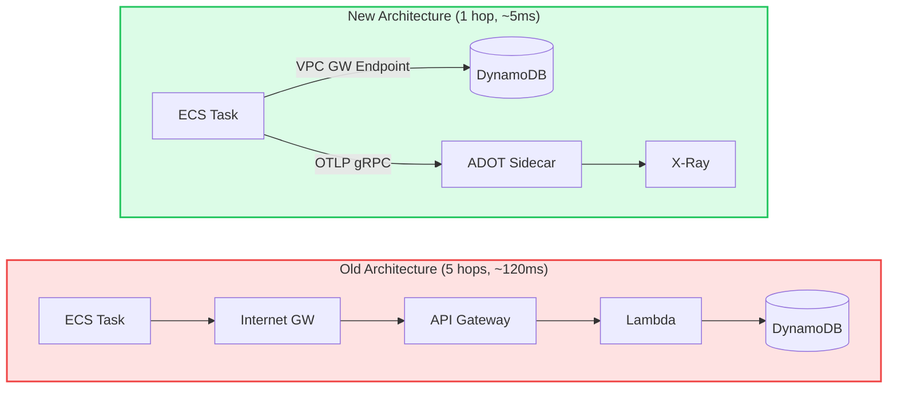
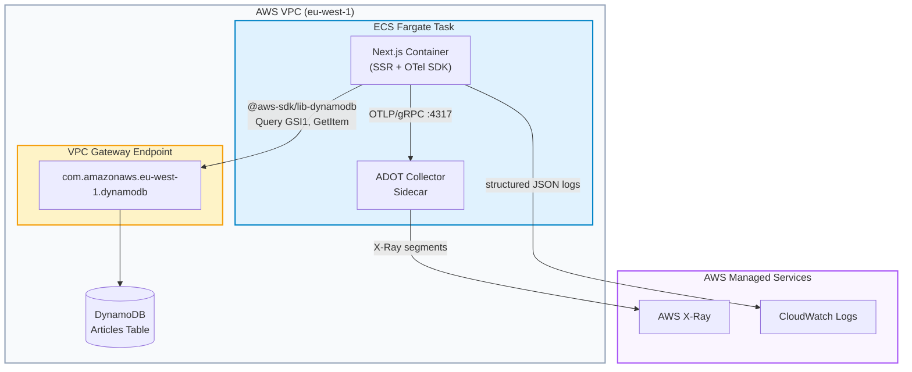
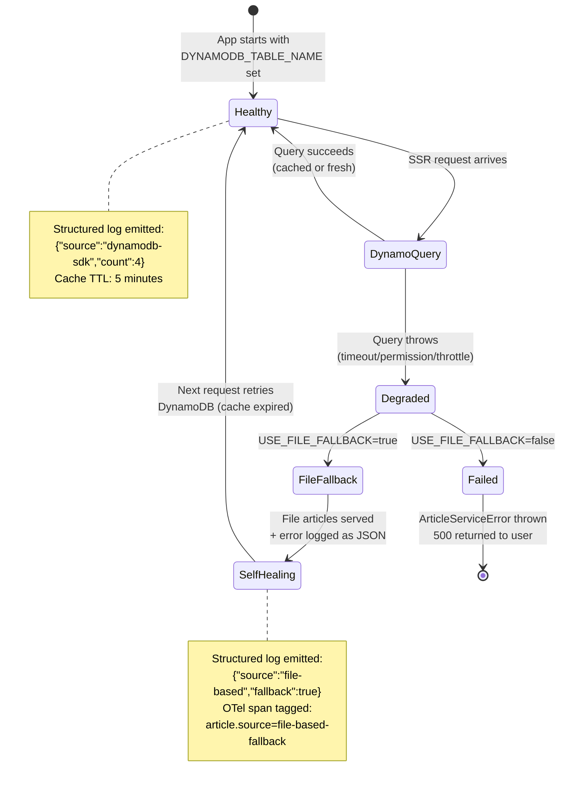

# Killing API Gateway: Direct DynamoDB SSR with X-Ray Tracing

## The "Solo-Preneur" Context

I run a portfolio site. One person. One AWS account. The articles powering the `/articles` page were stored in DynamoDB but accessed through a 5-hop chain:

```
ECS Task → Internet Gateway → API Gateway → Lambda → DynamoDB
```

Every SSR render traversed the public internet, paid API Gateway per-request fees, and cold-started a Lambda — to read 4 articles from a table that changes once a week.

**The constraint:** I needed sub-10ms article reads without paying for API Gateway invocations, Lambda compute, or NAT Gateway egress.

**The 2026 shift:** In 2026, the "API Gateway for everything" pattern is recognized as over-engineering for read-heavy, low-write workloads. Direct SDK access via VPC Gateway Endpoints is the FinOps-optimal path for server-side data layers.



---

## Architecture

The production data flow is a single VPC-internal hop. The observability path runs in parallel via an ADOT Collector sidecar.



### DynamoDB Access Patterns

| Operation               | Access Pattern | Index              | Key Structure                         |
| ----------------------- | -------------- | ------------------ | ------------------------------------- |
| List published articles | GSI1 Query     | `gsi1-status-date` | `pk=STATUS#published`, `sk=date#slug` |
| Get article metadata    | GetItem        | Primary            | `pk=ARTICLE#<slug>`, `sk=METADATA`    |
| Get article content     | GetItem        | Primary            | `pk=ARTICLE#<slug>`, `sk=CONTENT#v1`  |
| Articles by tag         | GSI2 Query     | `gsi2-tag-date`    | `pk=TAG#<tag>`, `sk=date#slug`        |

---

## The "Golden Path" Implementation

### Data Layer: Cache-Aside with TTL

The data layer (`dynamodb-articles.ts`) wraps all DynamoDB calls with a lightweight in-memory TTL cache. For a portfolio with <100 articles that change weekly, this eliminates 99%+ of DynamoDB reads.

:::tip
**Why not DAX?** DynamoDB Accelerator costs ~$0.04/hr idle (~$29/month). An in-process `Map<string, {data, expiresAt}>` is free and sufficient for a single-container portfolio app.
:::

```typescript
/**
 * Lightweight in-memory cache with TTL eviction.
 * Designed for low-write content (articles) where stale reads
 * are acceptable for the TTL window.
 */
class TTLCache {
  private store = new Map<string, CacheEntry<unknown>>()

  get<T>(key: string): T | null {
    const entry = this.store.get(key)
    if (!entry) return null
    if (Date.now() > entry.expiresAt) {
      this.store.delete(key)
      return null
    }
    return entry.data as T
  }

  set<T>(key: string, data: T, ttlMs: number = CACHE_TTL_MS): void {
    this.store.set(key, { data, expiresAt: Date.now() + ttlMs })
  }
}
```

Every query function follows cache-aside:

```typescript
export async function queryPublishedArticles(): Promise<ArticleWithSlug[]> {
  const cacheKey = 'published-articles'
  const cached = cache.get<ArticleWithSlug[]>(cacheKey)
  if (cached) return cached  // <1ms return

  const result = await docClient.send(new QueryCommand({ /* GSI1 query */ }))
  const articles = result.Items.map(entityToArticle)
  cache.set(cacheKey, articles)  // cached for 5 minutes
  return articles
}
```

### Hybrid Service Layer with OTel Business Spans

The service layer (`article-service.ts`) implements a priority chain with three observability layers embedded:

```typescript
import { trace, SpanStatusCode } from '@opentelemetry/api'

const tracer = trace.getTracer('article-service', '1.0.0')

export async function getAllArticles(): Promise<ArticleWithSlug[]> {
  return tracer.startActiveSpan('ArticleService.getAllArticles', async (span) => {
    const start = Date.now()
    try {
      if (isDynamoDBConfigured()) {
        const articles = await queryPublishedArticles()
        span.setAttributes({
          'article.source': 'dynamodb-sdk',
          'article.count': articles.length
        })
        slog({
          service: 'article-service',
          operation: 'getAllArticles',
          source: 'dynamodb-sdk',
          count: articles.length,
          latencyMs: Date.now() - start,
          level: 'info'
        })
        return articles
      }
      // ... file-based fallback with its own span attributes
    } finally {
      span.end()
    }
  })
}
```

:::warning
**The OTel tracer is a no-op without a collector.** When `OTEL_SDK_DISABLED=true` (the Dockerfile default), `tracer.startActiveSpan()` creates a no-op span with zero overhead. The code is always safe to run locally.
:::

**Agentic Insight:** The structured JSON logs output machine-parseable JSON to CloudWatch:

```json
{
  "timestamp": "2026-02-10T12:00:00.000Z",
  "service": "article-service",
  "operation": "getAllArticles",
  "source": "dynamodb-sdk",
  "count": 4,
  "latencyMs": 3,
  "level": "info"
}
```

An LLM agent (or CloudWatch Anomaly Detection) can parse these logs to auto-diagnose: _"getAllArticles switched from `dynamodb-sdk` to `file-based` source, indicating DynamoDB connectivity failure — check VPC endpoint route tables."_

### OTel Instrumentation Hook

Next.js's `instrumentation.ts` initializes the full OTel stack at server startup:

```typescript
export async function register() {
  if (process.env.NEXT_RUNTIME === 'nodejs') {
    if (process.env.OTEL_SDK_DISABLED === 'true') return

    const sdk = new NodeSDK({
      serviceName: process.env.OTEL_SERVICE_NAME || 'nextjs-portfolio',
      traceExporter: new OTLPTraceExporter({
        url: process.env.OTEL_EXPORTER_OTLP_ENDPOINT || 'http://localhost:4317',
      }),
      idGenerator: new AWSXRayIdGenerator(),
      textMapPropagator: new AWSXRayPropagator(),
      resourceDetectors: [awsEcsDetector],
      instrumentations: [
        getNodeAutoInstrumentations({
          '@opentelemetry/instrumentation-aws-sdk': {
            suppressInternalInstrumentation: true,
          },
          '@opentelemetry/instrumentation-fs': { enabled: false },
          '@opentelemetry/instrumentation-dns': { enabled: false },
          '@opentelemetry/instrumentation-net': { enabled: false },
        }),
      ],
    })

    sdk.start()
  }
}
```

This gives **two layers of tracing** in X-Ray:

1. **Infrastructure spans** (auto-generated): `HTTP GET /articles` → `DynamoDB Query`
2. **Business spans** (custom): `ArticleService.getAllArticles` → `source=dynamodb-sdk, count=4`

---

## The "Oh No" Moment: DynamoDB Failover Decision Chain

The most critical edge case: **What happens when DynamoDB is unreachable from ECS?**

This can occur when:

- VPC Gateway Endpoint route is deleted (infrastructure drift)
- IAM task role loses `dynamodb:Query` permission
- DynamoDB throttling (unlikely at our scale, but possible during migration)



:::danger
**The silent killer:** If the VPC Gateway Endpoint route is removed, the DynamoDB client hangs for the SDK timeout (default 3000ms) before failing over. In a future phase, I'll add a custom SDK `requestTimeout` of 500ms to fail fast.
:::

The fallback chain ensures the site **never goes fully down** due to a data layer issue. Users see stale-but-valid articles from MDX files while the structured logs alert on the source change.

---

## FinOps & Maintenance Impact

### Cost Analysis

| Component            | Old Architecture     | New Architecture        | Monthly Savings  |
| -------------------- | -------------------- | ----------------------- | ---------------- |
| API Gateway          | ~$3.50/million req   | $0 (removed)            | $3.50            |
| Lambda               | ~$0.20 (invocations) | $0 (removed)            | $0.20            |
| NAT Gateway          | ~$4.50 (egress)      | $0 (VPC endpoint)       | $4.50            |
| VPC Gateway Endpoint | N/A                  | $0 (free)               | —                |
| DynamoDB Reads       | ~$0.25 (via Lambda)  | ~$0.01 (direct, cached) | $0.24            |
| OTel / X-Ray         | N/A                  | ~$0.50 (trace sampling) | —                |
| **Total**            | ~$8.45/month         | ~$0.51/month            | **~$7.94 (94%)** |

:::tip
**The VPC Gateway Endpoint for DynamoDB is free.** Unlike Interface Endpoints ($7.20/month per AZ), Gateway Endpoints have no hourly charge and no data processing fee. This is the single most impactful FinOps decision in this implementation.
:::

### ROI

By replacing the API Gateway → Lambda → DynamoDB chain with direct SDK access through a VPC Gateway Endpoint:

- **94% cost reduction** on the data layer
- **~100ms → ~5ms** SSR latency (first read), **<1ms** for cached
- **Zero Lambda cold starts** affecting page render time

### Maintenance

This setup requires **<1 hour of maintenance per month** because:

- The DynamoDB client is a singleton with no connection pool to manage
- File-based fallback means infrastructure failures don't cause outages
- Structured logs surface issues before users report them

---

## Future-Proofing: What's Missing

### Phase 2 Improvements

1. **Custom SDK `requestTimeout`:** Current default (3000ms) is too long. Setting `requestTimeout: 500` would fail fast and trigger fallback sooner.

2. **CloudWatch Metric Filters on structured logs:** The JSON logs are ready for metric filters (e.g., alarm when `source` changes from `dynamodb-sdk` to `file-based`), but the filters aren't deployed yet.

3. **DynamoDB Streams → Cache Invalidation:** Currently, the TTL cache can serve stale data up to 5 minutes after an article update. A DynamoDB Stream → EventBridge → ECS cache-bust API would provide near-real-time freshness.

4. **Request-level trace sampling:** At current scale, 100% sampling is fine. At higher traffic, I'd configure head-based sampling in the ADOT Collector to reduce X-Ray costs.

5. **OTel Metrics (not just Traces):** Adding `@opentelemetry/sdk-metrics` would export cache hit/miss rates, DynamoDB latency histograms, and fallback frequency as CloudWatch custom metrics — enabling dashboards and anomaly detection without log parsing.

### Honest Critique

- The in-memory cache doesn't survive container restarts. For a portfolio site this is fine (5-minute TTL, low traffic). For a team app, you'd want Redis or ElastiCache.
- The file-based fallback only works because article MDX files are baked into the Docker image at build time. If articles were dynamic-only, this safety net wouldn't exist.
- There's no circuit breaker pattern. If DynamoDB is consistently failing, every request still attempts the SDK call before falling back. A circuit breaker would skip the attempt entirely after N consecutive failures.

---

## Files Changed

| File                                    | Change                                                                     |
| --------------------------------------- | -------------------------------------------------------------------------- |
| `src/lib/dynamodb-articles.ts`          | New data layer: DynamoDB SDK queries + in-memory TTL cache                 |
| `src/lib/article-service.ts`            | Hybrid service: DynamoDB → file fallback, structured JSON logs, OTel spans |
| `src/instrumentation.ts`                | OTel SDK init: X-Ray ID gen, OTLP exporter, auto-instrumentation           |
| `next.config.mjs`                       | `instrumentationHook: true`, `serverExternalPackages` for gRPC             |
| `Dockerfile`                            | OTel env vars (disabled by default)                                        |
| `scripts/dynamodb/verify-migration.ts`  | Smoke test: GSI1 + GSI2 query verification                                 |
| `__tests__/lib/article-service.test.ts` | 16 unit tests covering SDK path, fallback, errors, OTel spans              |
