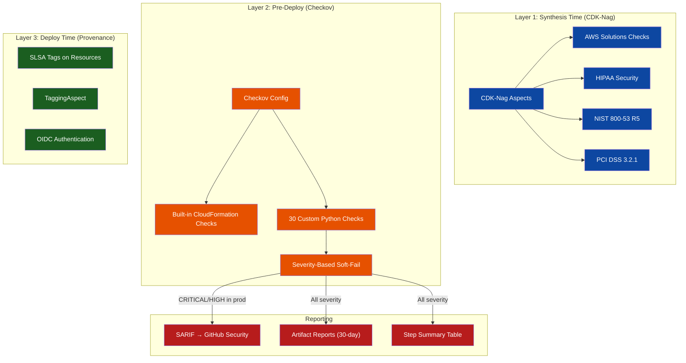
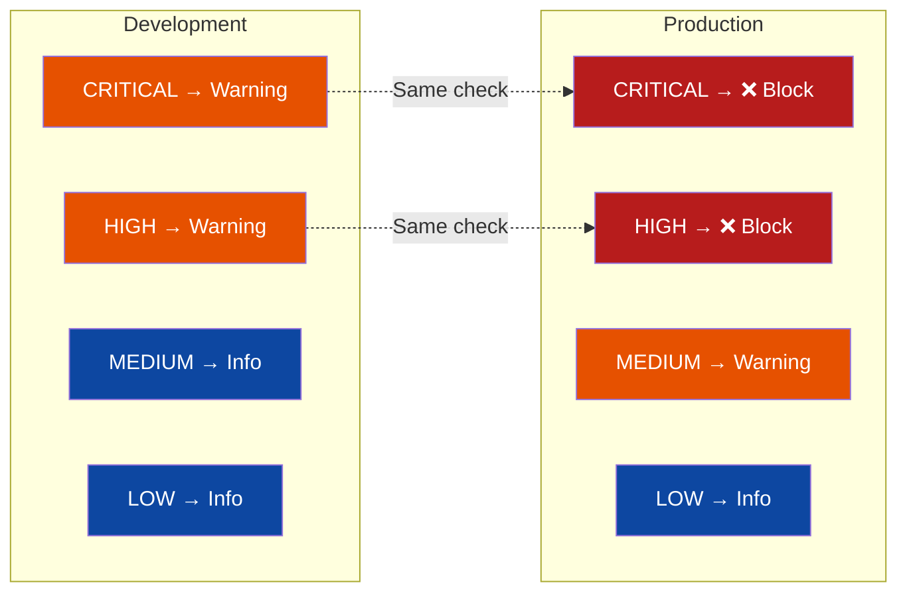
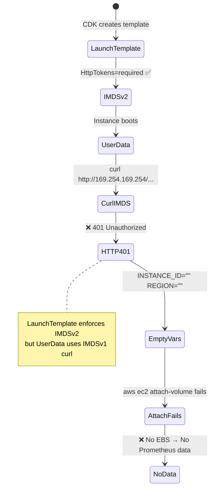
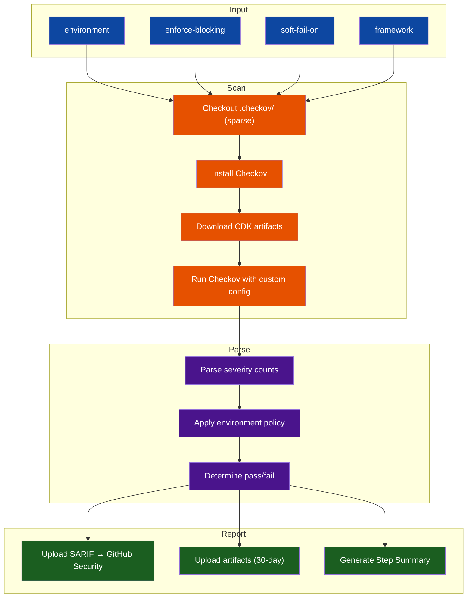

# DevSecOps Pipeline: 30 Custom Checkov Rules, CDK-Nag Compliance, and SARIF Integration

> **TL;DR** — IaC security scanning with default rules catches the obvious issues. This
> article walks through a production implementation where **30 custom Checkov rules** across
> 11 domain-grouped Python files enforce project-specific policies — from "no SSH ingress ever"
> to "UserData must use IMDSv2 tokens" — while **CDK-Nag** validates constructs against
> **4 compliance frameworks** (AWS Solutions, HIPAA, NIST 800-53, PCI DSS). The key pattern: a
> **severity-gated pipeline** where development gets non-blocking warnings, but production
> deployments fail on any CRITICAL or HIGH finding.

---

## 1. The "Solo-Preneur" Context

### The Constraint

I manage 4 AWS projects with 12+ stacks across 3 environments. Each stack generates a
CloudFormation template with hundreds of resources. Manual security review is impossible
at this scale — and dangerous, because the patterns that matter most (IMDSv2 enforcement,
SSH port 22 blocks, EBS encryption mandates) are exactly the ones humans forget when they
are making "quick fixes" at 11 PM.

### What I Needed

The project required automated security scanning on every CI run, with custom rules for
project-specific policies that go beyond generic CIS benchmarks. Development environments
needed non-blocking warnings to keep iteration fast, while production deployments had to fail
on any CRITICAL or HIGH finding — an environment-specific severity gating approach. Compliance
framework validation during CDK synthesis provided a second layer of defense, and SARIF
integration with the GitHub Security tab enabled historical tracking without any third-party
SaaS dependency. Every suppression — whether at the global Checkov level or the per-resource
CDK-Nag level — had to include a documented reason, making the suppression itself an auditable
artifact in Git history.

{/* SCREENSHOT: GitHub Actions security scan step summary showing passed/failed checks by severity with environment-specific blocking status */}

---

## 2. Architecture: Three-Layer Security Model



### Why Three Layers?

| Layer          | When         | What                              | Tool        |
| :------------- | :----------- | :-------------------------------- | :---------- |
| **Synthesis**  | `cdk synth`  | Construct-level validation        | CDK-Nag     |
| **Pre-Deploy** | CI pipeline  | Template-level policy enforcement | Checkov     |
| **Deploy**     | `cdk deploy` | Runtime provenance + tagging      | CDK Aspects |

Each layer catches different categories of issues. CDK-Nag validates **construct intent**
(e.g., "this S3 bucket should have encryption"). Checkov validates **template output** (e.g.,
"this CloudFormation resource has encryption property set"). Provenance tags validate
**deployment lineage** (e.g., "which commit deployed this stack"). The layers are intentionally
independent — a CDK-Nag suppression does not suppress the same issue in Checkov, which means
you must address the finding at both levels or provide documented reasons at each.

---

## 3. Decision Log: Why This Security Architecture

### Checkov Over tfsec, cfn-guard, and OPA

Checkov was chosen over alternatives for three reasons. First, as of February 2026, Checkov is
the only open-source scanner that supports custom CloudFormation checks in Python with full
access to the resolved template — cfn-guard uses its own DSL (less expressive for complex
checks like UserData parsing), and tfsec targets Terraform only. Second, Checkov natively
supports SARIF output, which integrates directly with GitHub's Security tab without format
conversion. Third, Checkov's `external-checks-dir` feature auto-discovers new Python files
in a directory — adding a new custom check is a single file addition with no configuration
changes.

### CDK-Nag Over Manual Construct Review

CDK-Nag provides synthesis-time validation that catches issues _before_ templates are
generated. The alternative — reviewing CloudFormation templates after synthesis — would
require maintaining a separate validation pipeline. CDK-Nag embeds the validation in the
synthesis step itself, which means a non-compliant construct fails `cdk synth` immediately.
The 4 compliance packs (AWS Solutions, HIPAA, NIST 800-53, PCI DSS) are available as drop-in
Aspects, and suppressions are documented inline with required reason strings.

### Severity Gating Over Binary Pass/Fail

A binary pass/fail approach was considered and rejected. In development, security findings
should not block iteration — the developer needs to see warnings and address them before
promoting to production, but a MEDIUM finding should not prevent a local deploy. In production,
only CRITICAL and HIGH findings block the pipeline. The graduated approach means the same
Checkov configuration file works for both environments, with the CI workflow overriding the
`soft-fail-on` and `enforce-blocking` inputs per environment.

### Inline CFN Metadata Over Global Skip Lists

Resource-specific exceptions use CDK inline metadata (`cfnInstance.addMetadata('checkov', {...})`)
rather than appending skip IDs to the global config. Global skip lists suppress checks across
all resources, which is appropriate for CDK-managed resources (e.g., `CKV_AWS_117` for custom
resource Lambdas that don't need VPC access) but dangerous for application resources where the
same check might be valid for one resource and not another. Inline metadata scopes the
suppression to a single CloudFormation resource and requires a `comment` field explaining
_why_ it's safe to skip.

---

## 4. The "Golden Path" Implementation

### 4.1: 30 Custom Checkov Rules Across 11 Domain-Grouped Files

The `.checkov/custom_checks/` directory contains 30 Python check classes consolidated into
11 domain-grouped files. Related checks share helpers and live together — for example,
`sg_rules.py` contains all 5 Security Group checks with shared `_has_external_cidr()` and
`_parse_ports()` helpers, and `compute_rules.py` contains 3 UserData checks with a single
shared `_extract_userdata_strings()` function (previously copy-pasted across 3 separate files):

| Domain              | File                 | Checks | Example                                    |
| :------------------ | :------------------- | :----: | :----------------------------------------- |
| **Security Groups** | `sg_rules.py`        |   5    | No SSH, restricted egress, no Grafana CIDR |
| **IAM**             | `iam_rules.py`       |   5    | Permissions boundary, no static names      |
| **Logging**         | `logging_rules.py`   |   3    | KMS encryption, retention, DeletionPolicy  |
| **EC2 UserData**    | `compute_rules.py`   |   3    | No hardcoded creds, IMDSv2, Docker ports   |
| **EBS Volumes**     | `ebs_rules.py`       |   3    | CMK encryption, min size, backup strategy  |
| **KMS**             | `kms_rules.py`       |   2    | No kms:\* wildcard, DeletionPolicy Retain  |
| **ASG**             | `asg_rules.py`       |   2    | ELB health check, MinSize ≥ 2              |
| **VPC**             | `vpc_rules.py`       |   2    | No auto-public IPs, endpoint policies      |
| **Lambda**          | `lambda_rules.py`    |   2    | Reserved concurrency, DLQ configured       |
| **SNS**             | `sns_rules.py`       |   2    | KMS encryption, SSL enforcement            |
| **SQS**             | `sqs_ssl_enabled.py` |   1    | SSL enforcement via queue policy           |

#### Example: No SSH Rule (`CKV_CUSTOM_SG_1`)

This rule enforces the SSM-only access model — no Security Group should ever allow port 22.
The rationale: EC2 instances use AWS Systems Manager Session Manager for shell access, which
requires no inbound ports, provides IAM-based access control, and logs every session to
CloudWatch. Even a `/32` SSH rule is problematic because IPs change, key management becomes an
operational burden, and SSH bypasses IAM entirely:

```python
# .checkov/custom_checks/sg_rules.py — one of 5 SG checks in this file
class SecurityGroupNoSSH(BaseResourceCheck):
    def __init__(self):
        name = "Ensure security groups do not allow SSH ingress (use SSM Session Manager)"
        id = "CKV_CUSTOM_SG_1"
        supported_resources = ["AWS::EC2::SecurityGroup"]
        categories = [CheckCategories.NETWORKING]

    def scan_resource_conf(self, conf):
        properties = conf.get("Properties", {})
        for rule in properties.get("SecurityGroupIngress", []):
            from_port, to_port = _parse_ports(rule)  # shared helper

            # Port 22 falls within the range
            if from_port is not None and from_port <= 22 <= to_port:
                return CheckResult.FAILED

        return CheckResult.PASSED
```

#### Example: IMDSv2 UserData Validation (`CKV_CUSTOM_COMPUTE_2`)

This catches a critical runtime bug: LaunchTemplates enforce `HttpTokens: required` (IMDSv2),
but UserData scripts using bare `curl` to the metadata endpoint get HTTP 401. The check
recursively parses CloudFormation UserData through `Fn::Base64`, `Fn::Sub`, and `Fn::Join`
intrinsic functions to extract the actual shell script, then validates that every IMDS `curl`
call includes the IMDSv2 token header:

```python
# .checkov/custom_checks/compute_rules.py — shared helper + 3 checks

# Shared helper (was copy-pasted in 3 files, now defined once)
def _extract_userdata_strings(userdata) -> list[str]:
    """Recursively extract string literals from CloudFormation UserData."""
    if isinstance(userdata, str):
        return [userdata]
    strings: list[str] = []
    if isinstance(userdata, dict):
        for key, value in userdata.items():
            if key in ("Fn::Base64", "Fn::Sub"):
                strings.extend(_extract_userdata_strings(value))
            elif key == "Fn::Join":
                # ...
    return strings

# IMDSv2 check uses the shared helper
IMDSV1_PATTERN = re.compile(
    r"curl\s+(?:(?!-H\s+[\"']X-aws-ec2-metadata-token).)*"
    r"http://169\.254\.169\.254/latest/meta-data",
    re.DOTALL,
)

class UserDataIMDSv2Required(BaseResourceCheck):
    def scan_resource_conf(self, conf):
        full_script = _get_userdata_script(conf)  # uses shared helper
        if not full_script:
            return CheckResult.PASSED

        has_imdsv1_calls = bool(IMDSV1_PATTERN.search(full_script))
        has_imdsv2_token = bool(IMDSV2_TOKEN_PATTERN.search(full_script))

        if has_imdsv1_calls and not has_imdsv2_token:
            return CheckResult.FAILED
        return CheckResult.PASSED
```

{/* SCREENSHOT: Terminal output showing Checkov scan results with custom checks passing, displaying CKV_CUSTOM_SG_1 and CKV_CUSTOM_COMPUTE_2 check names */}

### 4.2: Environment-Specific Severity Gating

The Checkov config implements a graduated security posture. The base configuration in
`.checkov/config.yaml` sets `soft-fail-on: [LOW, MEDIUM]`, which means development and
staging environments see findings as non-blocking warnings. The CI workflow overrides this
for production by setting `enforce-blocking: true`, which causes any CRITICAL or HIGH finding
to fail the pipeline:

```yaml
# .checkov/config.yaml
framework: cloudformation

# Custom checks directory — auto-discovers all .py files
external-checks-dir:
  - custom_checks

# Development: LOW and MEDIUM don't block
soft-fail-on:
  - LOW
  - MEDIUM

# Documented skip rules (CDK-managed exceptions)
skip-check:
  - CKV_AWS_117 # Lambda VPC — CDK custom resources don't need VPC
  - CKV_AWS_116 # Lambda DLQ — CDK custom resources handle retries
  - CKV_AWS_115 # Lambda concurrency — deployment-only functions
```

The CI workflow overrides this for production deployments:

```yaml
# _deploy-nextjs.yml — production overrides
security-scan:
  uses: ./.github/workflows/_iac-security-scan.yml
  with:
    environment: production
    enforce-blocking: true # CRITICAL/HIGH → fail the pipeline
    security-scan-blocking: true
```



### 4.3: CDK-Nag — Synthesis-Time Compliance

CDK-Nag validates constructs during `cdk synth`, catching issues before templates are even
generated. The implementation supports 4 compliance frameworks through a clean enum-based
configuration. As of February 2026, CDK-Nag provides 4 rule packs: AWS Solutions (general
best practices, enabled by default), HIPAA Security (healthcare compliance), NIST 800-53 R5
(federal security), and PCI DSS 3.2.1 (payment card security):

```typescript
// lib/aspects/cdk-nag-aspect.ts
export enum CompliancePack {
  AWS_SOLUTIONS = "AwsSolutions", // General best practices
  HIPAA = "HIPAA", // Healthcare compliance
  NIST_800_53 = "NIST800-53", // Federal security
  PCI_DSS = "PCI-DSS", // Payment card security
}

export function applyCdkNag(
  scope: IConstruct,
  config: CdkNagConfig = {},
): void {
  const { packs, verbose, reports } = { ...DEFAULT_CONFIG, ...config };

  for (const pack of packs) {
    switch (pack) {
      case CompliancePack.AWS_SOLUTIONS:
        Aspects.of(scope).add(new AwsSolutionsChecks({ verbose, reports }));
        break;
      case CompliancePack.HIPAA:
        Aspects.of(scope).add(new HIPAASecurityChecks({ verbose, reports }));
        break;
      // ... NIST, PCI DSS
    }
  }
}
```

Common suppressions are centralized in `COMMON_SUPPRESSIONS` with documented reasons. The
project has 7 common suppressions, each explaining _why_ the finding is acceptable. Zero
suppressions are allowed without a `reason` string — CDK-Nag enforces this at compile time:

```typescript
// lib/aspects/cdk-nag-aspect.ts — 7 documented suppressions
export const COMMON_SUPPRESSIONS: NagPackSuppression[] = [
  {
    id: "AwsSolutions-EC23",
    reason:
      "Security group allows ingress from specific trusted CIDRs only, not 0.0.0.0/0",
  },
  {
    id: "AwsSolutions-IAM4",
    reason:
      "AWS managed policies used for SSM and CloudWatch — standard for EC2 monitoring",
  },
  {
    id: "AwsSolutions-IAM5",
    reason:
      "Wildcard permissions required for CloudWatch Logs and SSM document execution",
  },
];
```

### 4.4: EnforceReadOnlyDynamoDbAspect — Domain-Specific Governance

Beyond generic compliance, the project implements a custom CDK Aspect that enforces a
domain-specific security invariant: ECS task roles must never have DynamoDB write permissions.
The Next.js application reads directly from DynamoDB via the task role, but writes must go
through the API Gateway → Lambda path for audit logging and rate limiting. The aspect inspects
IAM `CfnPolicy` L1 constructs, resolves `{ Ref: 'LogicalId' }` tokens to identify task role
policies, and fails synthesis if any of 8 forbidden DynamoDB actions are found:

```typescript
// lib/aspects/enforce-readonly-dynamodb-aspect.ts
export const DYNAMODB_WRITE_ACTIONS: readonly string[] = [
  "dynamodb:PutItem",
  "dynamodb:DeleteItem",
  "dynamodb:UpdateItem",
  "dynamodb:BatchWriteItem",
] as const;

export const DYNAMODB_ADMIN_ACTIONS: readonly string[] = [
  "dynamodb:CreateTable",
  "dynamodb:DeleteTable",
  "dynamodb:UpdateTable",
  "dynamodb:CreateGlobalTable",
] as const;

export class EnforceReadOnlyDynamoDbAspect implements cdk.IAspect {
  visit(node: IConstruct): void {
    if (!(node instanceof iam.CfnPolicy)) return;

    const resolved = cdk.Stack.of(node).resolve(node.roles);
    const isTaskRolePolicy = resolved.some((role) => {
      const roleId =
        typeof role === "string"
          ? role
          : ((role as { Ref?: string })?.Ref ?? "");
      return roleId.toLowerCase().includes(this.roleNamePattern);
    });

    if (isTaskRolePolicy) {
      this.inspectPolicyDocument(node, node.policyDocument);
    }
  }
}
```

This catches drift _before deployment_. If someone accidentally grants `dynamodb:PutItem` to
the task role (perhaps by using `table.grantReadWriteData()` instead of `table.grantReadData()`),
CDK synthesis fails with a clear error message — not a production incident where the ECS task
could bypass the write audit path.

### 4.5: TaggingAspect — Resource Governance

Every taggable resource gets consistent governance tags via a CDK Aspect. The `TaggingAspect`
applies 5 tags (`Environment`, `Project`, `Owner`, `ManagedBy`, and optionally `CostCenter`)
to every resource in the stack. Combined with the SLSA provenance tags from the CI/CD pipeline
(`DeployCommit`, `DeployRunId`, `DeployActor`), every CloudFormation resource has both
governance metadata and deployment lineage:

```typescript
// lib/aspects/tagging-aspect.ts
export class TaggingAspect implements cdk.IAspect {
  constructor(config: TagConfig) {
    this.tags = {
      Environment: config.environment,
      Project: config.project,
      Owner: config.owner,
      ManagedBy: "CDK",
      ...(config.costCenter && { CostCenter: config.costCenter }),
    };
  }

  public visit(node: IConstruct): void {
    if (cdk.TagManager.isTaggable(node)) {
      Object.entries(this.tags).forEach(([key, value]) => {
        node.tags.setTag(key, value);
      });
    }
  }
}
```

### 4.6: SARIF Integration — GitHub Security Tab

Checkov scan results are uploaded as SARIF files to GitHub's Security tab, providing
historical tracking of security findings across deployments, per-environment categorization
(see findings for dev vs staging vs production), and integration with GitHub PRs where
findings appear as code annotations. The 30-day artifact retention for detailed JSON reports
provides a compliance audit trail without any third-party SaaS dependency:

```yaml
# _iac-security-scan.yml
- name: Upload SARIF to GitHub Security
  if: always() && hashFiles('security-reports/results_sarif.sarif') != ''
  uses: github/codeql-action/upload-sarif@b5ebac6f4c00c8c...
  with:
    sarif_file: security-reports/results_sarif.sarif
    category: checkov-${{ inputs.environment }}
```

The `category: checkov-${{ inputs.environment }}` tag is the key — it allows the Security tab
to show separate finding trends for development, staging, and production, making it easy to
identify environment-specific regressions.

{/* SCREENSHOT: GitHub Security tab showing Checkov SARIF results with environment-specific categories and finding trends over time */}

### 4.7: Inline Metadata Suppressions

For resource-specific exceptions that cannot use global skip lists, CDK uses inline
CloudFormation metadata. The `comment` field is required — Checkov reads these metadata blocks
and skips the check for that specific resource only, not globally:

```typescript
// Example: Monitoring EC2 instance — dev default password isn't a real secret
const cfnInstance = this.instance.node.defaultChild as cdk.CfnResource;
cfnInstance.addMetadata("checkov", {
  skip: [
    {
      id: "CKV_AWS_46",
      comment:
        "GrafanaPassword in user data is a non-sensitive dev default (admin) " +
        "— real secrets use SSM SecureString",
    },
  ],
});
```

This pattern means that every suppression is version-controlled, auditable, and scoped.
A reviewer can search the codebase for `addMetadata("checkov"` to find every exception
and verify that each has a valid reason.

---

## 5. The "Oh No" Moment: IMDSv2 vs UserData

### The Problem

The LaunchTemplate enforced `HttpTokens: required` (IMDSv2), but the UserData script used
plain `curl` to the metadata endpoint. The result: every metadata call returned HTTP 401,
causing the EBS volume attachment to fail silently. The instance booted, but without the
data volume, Prometheus had no persistent storage — and no data meant no dashboards.



### The Fix

Created `CKV_CUSTOM_COMPUTE_2` to catch this at scan time. The check parses UserData
through CloudFormation intrinsic functions (`Fn::Base64`, `Fn::Sub`, `Fn::Join`) and flags
any IMDS `curl` call without an IMDSv2 token header. This turned a **runtime failure**
(empty variables → failed EBS attach → missing Prometheus data) into a **pre-deploy failure**
(Checkov blocks the pipeline with a clear message identifying the offending UserData line).

The lesson: infrastructure security checks must understand the _runtime behavior_ of
UserData scripts, not just the CloudFormation properties that declare them. Wrapping IMDSv2
enforcement in a LaunchTemplate property is necessary but not sufficient — the UserData
script that runs _inside_ the instance must also use the correct token-based metadata API.

---

## 6. Security Scan Workflow Architecture

The `_iac-security-scan.yml` reusable workflow (308 lines) handles the full scan lifecycle.
It accepts environment, enforcement mode, and soft-fail configuration as inputs, downloads
the CDK synthesis artifacts from the parent workflow, runs Checkov with custom config,
parses severity counts from the JSON output, applies environment-specific blocking policy,
and produces 3 report types:



The workflow outputs structured results for downstream consumption — the parent deployment
workflow can read `scan-passed`, `findings-count`, `critical-count`, and `high-count` to
decide whether to proceed with deployment or abort:

```yaml
# _iac-security-scan.yml — structured outputs
outputs:
  scan-passed: ${{ jobs.checkov-scan.outputs.scan-passed }}
  findings-count: ${{ jobs.checkov-scan.outputs.findings-count }}
  critical-count: ${{ jobs.checkov-scan.outputs.critical-count }}
  high-count: ${{ jobs.checkov-scan.outputs.high-count }}
```

---

## 7. FinOps & Maintenance Impact

### Security Pipeline Cost

| Resource             | Monthly Cost | Notes                   |
| :------------------- | :----------- | :---------------------- |
| Checkov (OSS)        | $0           | Open source Python tool |
| CDK-Nag (OSS)        | $0           | Open source CDK plugin  |
| GitHub Actions       | $0           | Within free tier limits |
| GitHub SARIF uploads | $0           | Free for public repos   |
| **Total**            | **$0**       | All OSS tooling         |

### Maintenance Patterns

Adding a new custom Checkov check means adding a class to the appropriate domain-grouped file
in `.checkov/custom_checks/` (e.g., add an SG check to `sg_rules.py`). Checks are
auto-discovered by the `external-checks-dir` configuration — no YAML changes, no registration,
no imports. If a new domain is needed, a single new file is created and auto-discovered.
Adding a new CDK-Nag suppression requires
inline metadata or an entry in `COMMON_SUPPRESSIONS` with a required `reason` string.
Enabling additional compliance packs is a one-line change to the `applyCdkNag()` call in the
app entry point. All skip-rule changes in `.checkov/config.yaml` are documented with inline
comments explaining the justification.

---

## 8. What Needs Work — and What's Next

### What's Working

| Pattern                                   |   Status   | Impact                                        |
| :---------------------------------------- | :--------: | :-------------------------------------------- |
| 30 Custom Checkov Checks (11 files)       | ✅ Shipped | Project-specific policies catch real bugs     |
| Severity Gating (dev/prod)                | ✅ Shipped | Development stays fast, production is secure  |
| SARIF → GitHub Security Tab               | ✅ Shipped | Historical tracking without SaaS              |
| Documented Suppressions (inline metadata) | ✅ Shipped | Every skip has a reason, auditable in Git     |
| CDK-Nag (4 compliance packs)              | ✅ Shipped | Synthesis-time construct validation           |
| EnforceReadOnlyDynamoDb Aspect            | ✅ Shipped | Domain-specific governance for ECS task roles |
| TaggingAspect + SLSA Provenance           | ✅ Shipped | Governance metadata + deployment lineage      |

### Remaining Gaps and Roadmap

| Improvement                                   | Effort  | Impact                                   | Status      |
| :-------------------------------------------- | :------ | :--------------------------------------- | :---------- |
| Unit tests for custom Checkov rules           | 1 day   | Prevent false positives from bad regex   | Planned     |
| Enable NIST 800-53 pack by default            | 1 hour  | Full federal compliance validation       | Planned     |
| Continuous scanning via AWS Config            | 2 days  | Detect runtime drift from deployed state | Evaluating  |
| OPA/Rego policies for cross-cloud portability | 3 days  | Multi-cloud policy enforcement           | Researching |
| Secret scanning integration with Checkov      | 3 hours | Unified scanning in one pipeline step    | Planned     |

The custom Checkov rules are the most impactful investment — particularly `CKV_CUSTOM_COMPUTE_2`
(IMDSv2 UserData), which caught a real runtime failure during development that would have been
invisible until dashboards went blank. The recent consolidation from 26 single-purpose files
into 11 domain-grouped files eliminated triple-duplicated helper code and removed 3 checks
that produced no useful signal (one always returned PASSED, one false-positived on every IAM
policy, one used an indirect proxy instead of checking what it claimed). The next priority is
adding pytest fixtures with sample CloudFormation templates so that each check has regression
tests — a regex change in the IMDSv2 pattern could silently break detection. Enabling the
NIST 800-53 pack is the lowest-effort improvement with the highest compliance return.
Longer-term, continuous scanning via AWS Config would close the gap between synthesis-time
validation and runtime reality — catching manual console changes that bypass the CDK pipeline
entirely.

> **The three-layer security model — CDK-Nag at synthesis, Checkov at pre-deploy, provenance
> tags at deploy — creates a defense-in-depth posture where security findings must be
> addressed or explicitly suppressed at every stage. The 30 custom checks encode the project's
> security opinions into automated policy, the severity gating keeps development fast without
> compromising production, and the SARIF integration provides the audit trail that makes
> compliance reviewable — not just enforceable.**

---

## 9. Related Files

| File                                              | Description                                                |
| :------------------------------------------------ | :--------------------------------------------------------- |
| `.checkov/config.yaml`                            | Checkov configuration (framework, skips, soft-fail)        |
| `.checkov/custom_checks/*.py`                     | 30 custom Python security checks (11 domain-grouped files) |
| `.github/workflows/_iac-security-scan.yml`        | Reusable security scan workflow (308 lines)                |
| `lib/aspects/cdk-nag-aspect.ts`                   | CDK-Nag 4-pack compliance (146 lines)                      |
| `lib/aspects/tagging-aspect.ts`                   | Resource tagging governance (60 lines)                     |
| `lib/aspects/enforce-readonly-dynamodb-aspect.ts` | DynamoDB read-only IAM enforcement (202 lines)             |
| `lib/aspects/index.ts`                            | Aspects barrel export                                      |

---

## 10. Tech Stack Summary

| Category            | Technology                                                                                                        |
| :------------------ | :---------------------------------------------------------------------------------------------------------------- |
| IaC Scanner         | Checkov (CloudFormation framework)                                                                                |
| Custom Rules        | 30 Python checks across 11 domain-grouped files (SG, IAM, logging, compute, EBS, VPC, Lambda, KMS, ASG, SNS, SQS) |
| Compliance          | CDK-Nag (AWS Solutions, HIPAA, NIST 800-53, PCI DSS)                                                              |
| Resource Governance | CDK Aspects (TaggingAspect, EnforceReadOnlyDynamoDb)                                                              |
| CI Integration      | GitHub Actions reusable workflow (308 lines)                                                                      |
| Reporting           | SARIF → GitHub Security, JSON artifacts (30-day)                                                                  |
| Severity Policy     | Soft-fail (dev), blocking (prod) for CRITICAL/HIGH                                                                |
| Provenance          | SLSA-inspired CloudFormation tags                                                                                 |
| Suppressions        | Inline CFN metadata with required comment field                                                                   |
