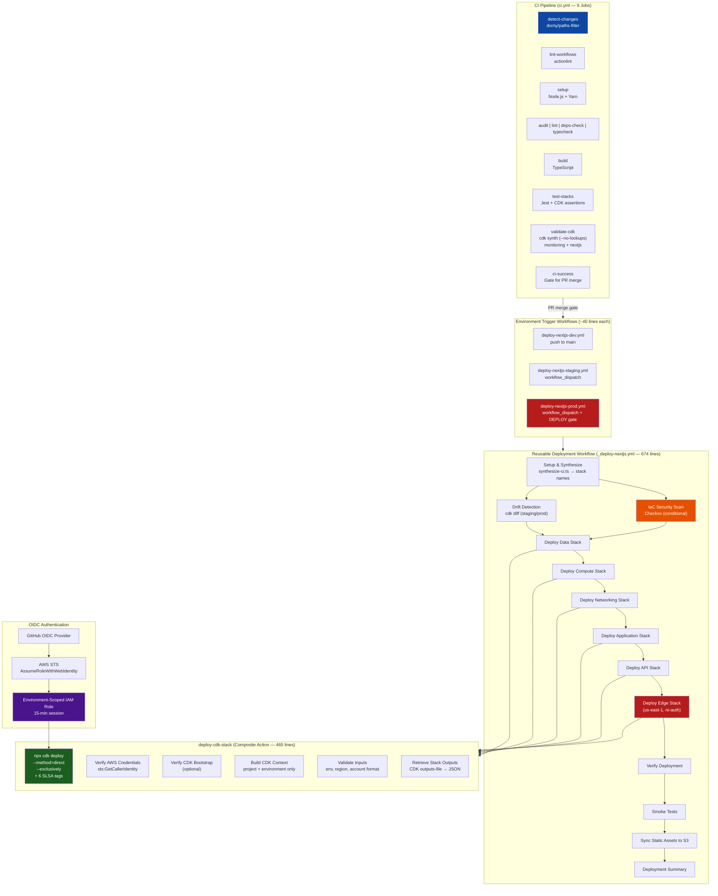
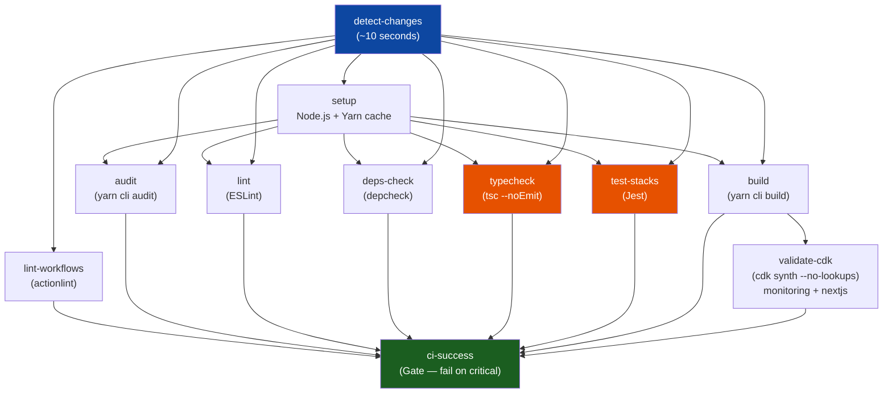
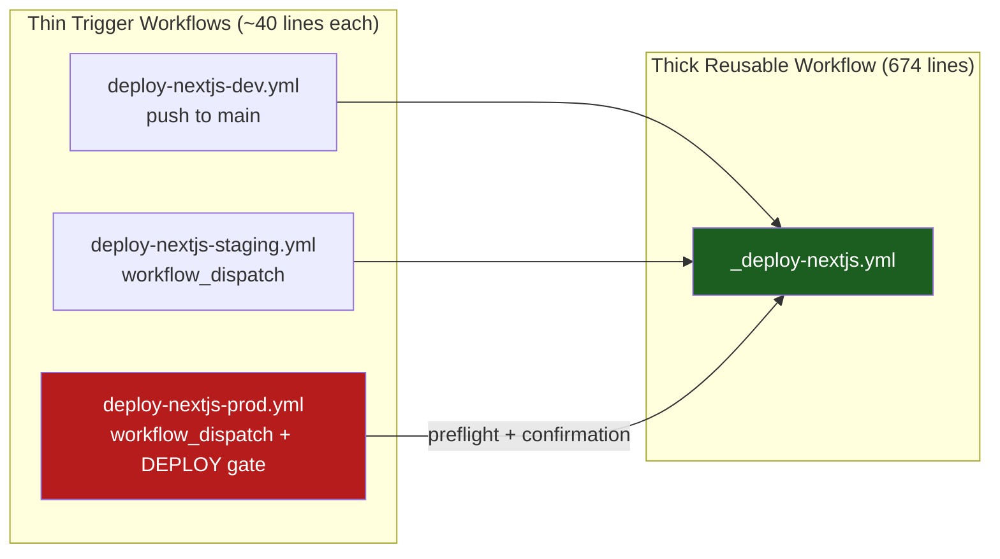
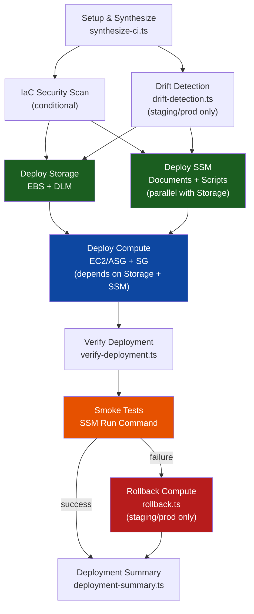

# Enterprise CI/CD Pipeline: Multi-Project CDK Deployments

> **TL;DR** — This article documents a production CI/CD system that deploys **4 CDK projects,
> 11 CloudFormation stacks, across 3 AWS accounts** — from a single GitHub repository using
> **zero long-lived AWS credentials**. The pipeline is split into three tiers: a **9-job CI
> pipeline** with change detection that skips unnecessary work, **reusable deployment workflows**
> that orchestrate per-stack deployment with inline security scanning, and a **465-line composite
> action** that handles bootstrap verification, SLSA provenance tagging, and stack output capture.
> The key insight: production deployments aren't just about `cdk deploy` — they're about
> **what happens before** (synthesis, security scanning, drift detection), **what happens after**
> (verification, smoke tests), and **what happens when things fail** (auto-rollback to last
> known-good template).

---

## 1. The Deployment Landscape

I deploy four CDK projects from a single monorepo. Each project has its own stack topology,
deployment trigger, and authentication path:

| Project        | Stacks | Deploy Region(s)      | Authentication                       | Trigger                           |
| :------------- | :----: | :-------------------- | :----------------------------------- | :-------------------------------- |
| **Shared**     |   1    | eu-west-1             | OIDC → dev/staging/prod accounts     | Push to main                      |
| **Monitoring** |   3    | eu-west-1             | OIDC → dev/staging/prod accounts     | Push to main                      |
| **Next.js**    |   6    | eu-west-1 + us-east-1 | OIDC → dev/staging/prod + root (DNS) | Push (dev), Manual (staging/prod) |
| **Org**        |   1    | us-east-1             | OIDC → root account                  | Manual only                       |

Each environment maps to a dedicated AWS account with progressively stricter security controls:

| Environment | Account      | Region    | Trigger Policy                   | Security Scan             |
| :---------- | :----------- | :-------- | :------------------------------- | :------------------------ |
| Development | 771826808455 | eu-west-1 | Push to main                     | Non-blocking (warnings)   |
| Staging     | 692738841103 | eu-west-1 | Manual dispatch                  | Blocking on HIGH/CRITICAL |
| Production  | 607700977986 | eu-west-1 | Manual + `"DEPLOY"` confirmation | Blocking on ALL findings  |

The full pipeline system spans roughly 5,000 lines across 19 workflow files, 2 composite
actions, and ~20 TypeScript deployment scripts:

| Component                    |                   Files                    |   Lines    | Role                                        |
| :--------------------------- | :----------------------------------------: | :--------: | :------------------------------------------ |
| CI Pipeline                  |                  `ci.yml`                  |    441     | 9-job quality gate with change detection    |
| Deploy Next.js (reusable)    |            `_deploy-nextjs.yml`            |    674     | 6-stack sequential deployment               |
| Deploy Monitoring (reusable) |          `_deploy-monitoring.yml`          |    410     | 3-stack deployment + rollback + smoke tests |
| Deploy Stack (composite)     |       `deploy-cdk-stack/action.yml`        |    465     | Bootstrap, deploy, provenance, outputs      |
| IaC Security Scan            |          `_iac-security-scan.yml`          |    308     | Checkov with environment-scoped severity    |
| Smoke Tests                  |             `_smoke-tests.yml`             |    193     | SSM Run Command → instance health checks    |
| Stack Verify                 |            `_verify-stack.yml`             |    ~100    | Post-deploy stack verification              |
| Environment triggers         |                  10 files                  |    ~600    | Per-project × per-environment dispatch      |
| TypeScript CLI               |        `scripts/deployment/cli.ts`         |    952     | 15+ commands for local + CI operations      |
| Stack Config                 |       `scripts/deployment/stacks.ts`       |    349     | Typed stack definitions + dependency graph  |
| **Total**                    | **19 workflows + 2 actions + ~20 scripts** | **~5,000** | Full pipeline system                        |

---

## 2. Architecture: The Three-Tier Pipeline

The pipeline architecture follows a composition pattern that GitHub Actions calls
`workflow_call`. I chose this over alternatives like Jenkins shared libraries or GitLab
parent-child pipelines because GitHub Actions' `workflow_call` + `secrets: inherit` combination
gives me complete secret isolation without explicit per-secret wiring — a feature that, as of
February 2026, neither GitLab CI nor CircleCI offer natively for environment-scoped secrets.

The three tiers are: thin trigger workflows (one per project × environment), thick reusable
workflows (one per project), and a single composite action that every stack deployment shares.



---

## 3. Decision Log: Why This Architecture Over the Alternatives

### GitHub Actions Over CDK Pipelines

AWS CDK Pipelines (`pipelines.CodePipeline`) is the AWS-blessed approach for self-mutating CDK
deployments. I evaluated it and chose GitHub Actions for three reasons. First, CDK Pipelines
requires a CodePipeline resource per project, which costs ~$1/month per pipeline and adds a
17-stage CloudFormation stack that is itself difficult to debug. Second, CDK Pipelines'
self-mutation feature — where the pipeline updates itself before deploying application stacks —
introduces a bootstrap problem: if the pipeline update fails, you need manual CloudFormation
intervention to recover. Third, my monorepo contains 4 projects with different deployment
triggers (push vs. manual vs. conditional), and CDK Pipelines expects a single linear pipeline
per application.

GitHub Actions' `workflow_call` gives me the same composability without the CodePipeline
overhead, and the `secrets: inherit` pattern allows environment-scoped secret resolution
without declaring each secret explicitly.

### Composite Action Over Reusable Workflows for Stack Deployment

I could have made `deploy-cdk-stack` a reusable workflow instead of a composite action. The
difference matters: reusable workflows run as separate jobs (separate runners, separate
checkout, separate environment setup), while composite actions run as steps _within_ the
calling job. Since each stack deployment needs the CDK synthesis output from the setup job
(passed as an artifact), running deploy as a reusable workflow would require re-downloading
and re-extracting the synthesis artifact for every stack. The composite action inherits the
calling job's workspace, so the synthesis output is already available — saving ~30 seconds per
stack × 6 stacks = ~3 minutes per Next.js deployment.

### OIDC Over Static Credentials

Every AWS API call from GitHub Actions uses OIDC federation. There are zero long-lived access
keys stored as GitHub secrets. As of February 2026, the `aws-actions/configure-aws-credentials@v4`
action supports OIDC natively with `role-to-assume`, making this a one-line configuration
change per environment:

```yaml
# .github/workflows/_deploy-monitoring.yml
- name: Configure AWS Credentials
  uses: aws-actions/configure-aws-credentials@ececac1a45f3b08a01d2dd070d28d111c5fe6722 # v4.1.0
  with:
    role-to-assume: ${{ secrets.AWS_OIDC_ROLE }} # Per-environment GitHub Secret
    aws-region: ${{ env.AWS_REGION }}
    audience: sts.amazonaws.com
```

The `AWS_OIDC_ROLE` secret is scoped to each GitHub Environment. This means the _same_ workflow
file deploys to any account — the environment context determines which IAM role is assumed:

| GitHub Environment | IAM Role                     | Account      | Trust Policy                                                   |
| :----------------- | :--------------------------- | :----------- | :------------------------------------------------------------- |
| `development`      | `github-actions-deploy-role` | 771826808455 | `repo:Nelson-Lamounier/cdk-monitoring:environment:development` |
| `staging`          | `github-actions-deploy-role` | 692738841103 | `repo:Nelson-Lamounier/cdk-monitoring:environment:staging`     |
| `production`       | `github-actions-deploy-role` | 607700977986 | `repo:Nelson-Lamounier/cdk-monitoring:environment:production`  |

| Factor                | IAM Access Keys               | OIDC Federation                                  |
| :-------------------- | :---------------------------- | :----------------------------------------------- |
| Credential lifetime   | Until manually rotated        | 15 minutes (STS session)                         |
| Blast radius          | Anyone with the key           | Only matching repo + environment + branch        |
| Rotation              | Manual process                | Automatic (ephemeral tokens)                     |
| Audit trail           | CloudTrail shows key ID       | CloudTrail shows GitHub repo, workflow, actor    |
| Environment isolation | Same key for all environments | Different roles per environment via trust policy |

### The Edge Stack Challenge: Dual-Region Authentication

The Next.js Edge stack (CloudFront, ACM, WAF) must deploy to `us-east-1` because CloudFront
distributions require certificates and WAF WebACLs in that region — this is an AWS-imposed
constraint, not a design choice. All other stacks deploy to `eu-west-1`. Rather than creating
a separate IAM role in `us-east-1`, the workflow re-authenticates with the same OIDC role but
a different region parameter:

```yaml
# .github/workflows/_deploy-nextjs.yml — Edge stack deploys to us-east-1
deploy-edge:
  name: Deploy Edge (us-east-1)
  needs: [setup, deploy-api]
  uses: ./.github/workflows/_deploy-stack.yml
  with:
    stack-name: ${{ needs.setup.outputs.edge-stack }}
    project: nextjs
    environment: ${{ inputs.environment }}
    aws-account-id: ${{ needs.setup.outputs.aws-account-id }}
    aws-region: us-east-1 # ← Different region for CloudFront/ACM/WAF
    require-approval: ${{ inputs.require-approval }}
  secrets: inherit
```

---

## 4. The CI Pipeline: 9 Jobs, Smart Change Detection

The CI pipeline's design reflects a trade-off between thoroughness and speed. Running every
check on every push would take ~8 minutes; with change detection, most pushes complete in
~2 minutes because only the affected checks run.

### Change Detection (Job 1)

The pipeline starts with `dorny/paths-filter` to categorize what changed. A key decision: if
CDK Aspects or CI configuration (`tsconfig`, `jest.config`, `package.json`) change, _all_
tests run regardless of which source files were modified. This is because Aspects affect every
stack, and CI config changes can alter how tests execute:

```yaml
# .github/workflows/ci.yml — Change Detection
- name: Detect Changed Paths
  uses: dorny/paths-filter@de90cc6fb38fc0963ad72b210f1f284cd68cea36 # v3.0.2
  id: filter
  with:
    filters: |
      stacks:
        - 'lib/*-stack.ts'
        - 'tests/unit/stacks/**'
      aspects:
        - 'lib/aspects/**'
      ci-config:
        - '.github/**'
        - 'package.json'
        - 'yarn.lock'
        - 'tsconfig*.json'
        - 'jest.config.*'
      any-src:
        - 'lib/**/*.ts'
        - 'bin/**/*.ts'
      any-tests:
        - 'tests/**/*.ts'

# Conditional: aspects or CI config change → run ALL tests
- name: Compute Run Flags
  run: |
    if [[ "${{ steps.filter.outputs.aspects }}" == "true" ]] || \
       [[ "${{ steps.filter.outputs.ci-config }}" == "true" ]]; then
      echo "run-all=true" >> $GITHUB_OUTPUT
    else
      echo "run-all=false" >> $GITHUB_OUTPUT
    fi
```

### The 9-Job Dependency Graph



### Design Decisions Behind the CI Graph

The `typecheck` and `test-stacks` jobs both run with `continue-on-error: true`. This was a
deliberate choice: during the migration from JavaScript to TypeScript, strict type errors
would have blocked every deployment for weeks. The `ci-success` gate job only fails on `build`
or `validate-cdk` failures — these are the synthesis-critical gates. The idea is that the CI
pipeline should _report_ everything but only _block_ on what actually prevents deployment.

I intentionally exclude IaC security scanning (Checkov) from CI. Checkov scans take ~2–3
minutes and require a full CDK synthesis, which adds unnecessary latency to the developer
feedback loop. CDK-Nag already catches most issues during local synthesis as a CDK Aspect,
so Checkov only runs in the deployment pipeline where the environment-specific context is
available.

The `validate-cdk` job uses `--no-lookups` to avoid calling AWS APIs during synthesis. CDK's
`Vpc.fromLookup()` normally makes API calls to resolve VPC IDs, but with `--no-lookups`, CDK
reads from the cached `cdk.context.json` file instead. This means CI validation doesn't
require AWS credentials, which keeps the CI pipeline auth-free:

```yaml
# .github/workflows/ci.yml — CDK Validation
- name: Synthesize CDK Stacks
  run: |
    npx cdk synth -c project=nextjs -c environment=dev --no-lookups --quiet
    npx cdk synth -c project=monitoring -c environment=dev --no-lookups --quiet
  env:
    AWS_REGION: eu-west-1
    NOTIFICATION_EMAIL: ci-validation@placeholder.local # Required by API stack
    SES_FROM_EMAIL: ci-validation@placeholder.local
    VERIFICATION_SECRET: ci-placeholder-secret
```

---

## 5. The 465-Line Composite Action: `deploy-cdk-stack`

Every stack deployment — regardless of project, environment, or region — follows the same
sequence: validate inputs → verify credentials → check bootstrap (optional) → build CDK context
→ deploy with provenance tags → capture outputs. Rather than duplicating this 465-line sequence
across 11 different stack deployment jobs, the composite action encapsulates it once:

```yaml
# .github/actions/deploy-cdk-stack/action.yml

inputs:
  stack-name:     { required: true }           # CDK stack name to deploy
  project:        { required: true }           # monitoring, nextjs, org
  environment:    { required: true }           # development, staging, production
  aws-account-id: { required: true }           # 12-digit account ID
  aws-region:     { required: true }           # eu-west-1 or us-east-1
  require-approval: { default: "never" }       # CDK approval level
  verify-bootstrap: { default: "false" }       # Check CDKToolkit stack
  outputs-directory: { default: "" }           # Save stack outputs to file

outputs:
  deployment-status: { value: ${{ steps.deploy.outputs.status }} }
  stack-outputs:     { value: ${{ steps.outputs.outputs.stack_outputs }} }
  outputs-file:      { value: ${{ steps.save-outputs.outputs.file_path }} }
```

### SLSA Provenance Tagging

Every deployed resource gets 6 audit tags automatically. These tags are inspired by SLSA
(Supply Chain Levels for Software Artifacts), though I don't claim full SLSA compliance — I
adopted the provenance concept specifically because it answers the question I kept asking
during incident response: "Which deployment changed this resource, and who triggered it?"

```bash
# .github/actions/deploy-cdk-stack/action.yml — Provenance tags
DEPLOY_CMD="$DEPLOY_CMD --tags DeployCommit=${GITHUB_SHA:-unknown}"
DEPLOY_CMD="$DEPLOY_CMD --tags DeployRunId=${GITHUB_RUN_ID:-0}"
DEPLOY_CMD="$DEPLOY_CMD --tags DeployActor=${GITHUB_ACTOR:-local}"
DEPLOY_CMD="$DEPLOY_CMD --tags DeployRepo=${GITHUB_REPOSITORY:-local}"
DEPLOY_CMD="$DEPLOY_CMD --tags DeployTimestamp=$(date -u +%Y-%m-%dT%H:%M:%SZ)"
DEPLOY_CMD="$DEPLOY_CMD --tags DeployWorkflow=${GITHUB_WORKFLOW:-manual}"
```

With these tags on every CloudFormation resource, incident investigation becomes a tag lookup
instead of a CloudTrail deep-dive:

```bash
# "Which commit changed this S3 bucket policy?"
aws resourcegroupstaggingapi get-resources \
  --tag-filters Key=DeployCommit,Values=abc1234
```

### Why `--method=direct` and `--exclusively`

Two CDK deploy flags required careful reasoning:

```bash
# .github/actions/deploy-cdk-stack/action.yml
DEPLOY_CMD="$DEPLOY_CMD --method=direct"     # Skip changesets
DEPLOY_CMD="$DEPLOY_CMD --exclusively"        # Don't auto-deploy dependencies
```

The `--method=direct` flag calls `UpdateStack`/`CreateStack` directly instead of creating
CloudFormation changesets. I chose this because concurrent workflow runs (e.g., dev and staging
deploying simultaneously) can encounter `ChangeSetNotFoundException` when a previous run's
changeset was already executed. Direct API calls avoid this race condition entirely. The
trade-off is that you lose the changeset preview, but drift detection (Section 9) provides
the same visibility at the right point in the pipeline.

The `--exclusively` flag prevents CDK from automatically deploying dependency stacks. Without
it, deploying the Application stack would trigger CDK to also deploy Data, Compute, and
Networking — violating the workflow's explicit ordering and potentially re-deploying a stack
that was already deployed by a previous job in the same run. The workflow controls the
dependency chain explicitly:
Data → Compute → Networking → Application → API → Edge.

---

## 6. Workflow Composition: Thin Triggers, Thick Reusables

The pipeline uses a composition pattern: thin per-environment trigger workflows (~40 lines
each) call thick reusable workflows (~400–674 lines) via `workflow_call`:



This pattern means adding a new environment requires only a new ~40-line trigger file and a
GitHub Environment — the 674-line reusable workflow, the 465-line composite action, the security
scanning, and the OIDC authentication are all shared. Adding a new _project_ requires a new
reusable workflow and its trigger files — the composite action and security scanning are still
shared.

### Production Safety: Manual Gate + Staging Check

The production trigger workflow requires explicit confirmation to guard against accidental
deployments. I chose a string match (`"DEPLOY"`) over a boolean toggle because it forces
conscious intent — a checkbox can be clicked absently, but typing `DEPLOY` requires deliberation:

```yaml
# .github/workflows/deploy-nextjs-prod.yml
on:
  workflow_dispatch:
    inputs:
      confirm-deployment:
        description: 'Type "DEPLOY" to confirm production deployment'
        required: true
        type: string
      skip-staging-check:
        description: "Skip staging verification check (emergency only)"
        required: false
        type: boolean
        default: false

jobs:
  preflight:
    steps:
      - name: Validate Confirmation
        run: |
          if [ "${{ inputs.confirm-deployment }}" != "DEPLOY" ]; then
            echo "ERROR: Deployment not confirmed. Type 'DEPLOY' to proceed."
            exit 1
          fi

      - name: Check Staging Status
        if: inputs.skip-staging-check != true
        run: |
          echo "Verifying staging deployment was successful..."
```

The `skip-staging-check` escape hatch exists for emergencies (hotfixes that need to bypass
staging), but it's documented as "emergency only" and the default is `false`.

---

## 7. The Monitoring Deployment: Deploy → Verify → Smoke Test → Rollback

The Monitoring pipeline is the most complete implementation of the full deployment lifecycle. It
demonstrates every safety mechanism in the system: security scanning, drift detection,
sequential deployment with dependency ordering, post-deploy verification, smoke tests via SSM,
and automatic rollback on failure.



### The Rollback Conditional

The rollback job has a sophisticated conditional that encodes the exact failure scenarios where
automatic rollback is appropriate:

```yaml
# .github/workflows/_deploy-monitoring.yml
rollback:
  name: Rollback Compute
  needs: [setup, deploy-compute, verify, smoke-tests]
  if: |
    always()
    && needs.deploy-compute.result == 'success'        # Only rollback if deploy succeeded
    && (needs.verify.result == 'failure'                # ... but verification failed
      || needs.smoke-tests.result == 'failure')         # ... or smoke tests failed
    && inputs.cdk-environment != 'development'          # Never rollback dev
```

This conditional says: "If we successfully deployed new infrastructure but verification or
smoke tests prove it's broken, automatically rollback the Compute stack to the last known-good
CloudFormation template — but only in staging or production." Development is intentionally
excluded because failed dev deployments are learning opportunities, not incidents.

---

## 8. IaC Security Scanning: Three Layers, Progressive Severity

Security scanning happens at three distinct layers, each with a different tool and enforcement
model. I chose this layered approach because catching issues at synthesis time (CDK-Nag) is
cheaper than catching them at deployment time (Checkov), which is cheaper than catching them
in production (incident response).

| Layer       | Tool                     | When                                       | Mode                              |
| :---------- | :----------------------- | :----------------------------------------- | :-------------------------------- |
| Local (dev) | CDK-Nag (AwsSolutions)   | `cdk synth`                                | Real-time feedback via CDK Aspect |
| CI          | CDK-Nag (AwsSolutions)   | `validate-cdk` job                         | Block PR merge if synth fails     |
| Deploy      | Checkov (CloudFormation) | Pre-deployment in `_iac-security-scan.yml` | Environment-scoped severity       |

### Environment-Scoped Checkov

The scan severity escalates with environment criticality. Development findings never block
deployments — they're informational. Staging blocks on HIGH and CRITICAL. Production blocks
on everything, including LOW severity:

| Environment | `enforce-blocking` | `soft-fail-on` | Effect                                   |
| :---------- | :----------------: | :------------- | :--------------------------------------- |
| Development |      `false`       | `LOW,MEDIUM`   | All findings are warnings — never blocks |
| Staging     |       `true`       | `""`           | HIGH and CRITICAL block; LOW/MEDIUM warn |
| Production  |       `true`       | `""`           | ALL severity levels block deployment     |

The caller configures this via the reusable workflow inputs:

```yaml
# .github/workflows/deploy-nextjs-prod.yml → _deploy-nextjs.yml
uses: ./.github/workflows/_deploy-nextjs.yml
with:
  environment: production
  enable-security-scan: true # Opt-in per environment
  security-scan-blocking: true # Block deployment on any finding
```

The `_iac-security-scan.yml` workflow downloads the CDK synthesis artifact and runs Checkov
against the generated CloudFormation templates. Running Checkov on synthesized templates
rather than CDK source code is an important distinction: Checkov's CloudFormation rules cover
the final resource configuration after CDK's L2/L3 constructs have been resolved, which
catches issues that CDK-level analysis would miss (like overly permissive IAM policies
generated by CDK's `grant` methods).

---

## 9. Drift Detection: Catching Manual Changes Before Deployment

Drift detection runs `cdk diff` for every stack before deployment in staging and production.
Development is excluded because manual console changes in dev are expected during
experimentation. The rationale for running drift detection at deploy time (not in CI) is that
drift is environment-specific — a manual change in staging doesn't affect production, so
checking drift in a project-wide CI pipeline would produce false positives.

```yaml
# .github/workflows/_deploy-monitoring.yml
drift-detection:
  name: Drift Detection
  needs: setup
  if: needs.setup.result == 'success' && inputs.cdk-environment != 'development'
  steps:
    - name: Run Drift Detection
      run: npx tsx scripts/deployment/drift-detection.ts monitoring ${{ inputs.cdk-environment }}
```

The `drift-detection.ts` script runs `cdk diff` for each stack and writes the results to
`GITHUB_STEP_SUMMARY`. This gives reviewers a clear view of what will actually change during
the deployment — including unexpected modifications from manual console changes, CDK library
updates that alter resource properties, or configuration drift from environment variable
changes since the last synthesis. The diff output acts as a pre-deployment review gate: if the
drift is unexpected, I can cancel the workflow run before any stacks are modified.

---

## 10. SSM-Based Smoke Tests: No SSH, No Public Endpoints

Post-deployment smoke tests run on the instance itself via SSM Run Command. I chose SSM over
SSH for the same reason I chose OIDC over access keys: fewer persistent credentials to manage.
SSM Run Command requires only an IAM role on the instance and an SSM agent (pre-installed on
Amazon Linux 2023) — no SSH keys, no exposed ports, no bastion hosts, no Security Group rules
for port 22.

```yaml
# .github/workflows/_smoke-tests.yml
- name: Run Smoke Tests via SSM
  run: |
    # Base64 encode to avoid JSON parsing issues
    SCRIPT_B64=$(base64 -w0 scripts/monitoring/smoke-test.sh)
    WRAPPER_CMD="echo $SCRIPT_B64 | base64 -d | bash"

    COMMAND_ID=$(aws ssm send-command \
      --instance-ids "${{ steps.find-instance.outputs.instance_id }}" \
      --document-name "AWS-RunShellScript" \
      --parameters "{\"commands\":[\"$WRAPPER_CMD\"]}" \
      --timeout-seconds 300 \
      --query 'Command.CommandId' \
      --output text)

    aws ssm wait command-executed \
      --command-id "$COMMAND_ID" \
      --instance-id "$INSTANCE_ID"
```

The smoke test script checks container health (Grafana, Prometheus, Node Exporter), HTTP
endpoint availability (ports 3000, 9090, 9100), EBS volume mount (`/data/monitoring`), and the
Loki/Promtail log pipeline. If any check fails, the workflow proceeds to the rollback job
(Section 7).

### Instance Discovery via Tags

The workflow discovers the target instance dynamically using resource tags rather than
hardcoded instance IDs. This is essential because the monitoring EC2 instance is managed by an
Auto Scaling Group — its instance ID changes on every replacement:

```bash
# .github/workflows/_smoke-tests.yml
INSTANCE_ID=$(aws ec2 describe-instances \
  --filters \
    "Name=tag:Project,Values=Monitoring" \
    "Name=tag:Environment,Values=${{ inputs.environment }}" \
    "Name=instance-state-name,Values=running" \
  --query 'Reservations[0].Instances[0].InstanceId' \
  --output text)
```

---

## 11. TypeScript Deployment CLI: 952 Lines, 15+ Commands

### Why Not Just `cdk deploy`?

Raw CDK commands require verbose context flags (`-c project=nextjs -c environment=dev`),
manual AWS profile switching, and careful dependency ordering. The TypeScript CLI wraps
all of this into named commands that resolve context, profiles, and ordering automatically:

```bash
# Instead of:
npx cdk deploy NextJS-Data-development \
  -c project=nextjs -c environment=development \
  --profile dev-account --require-approval never

# You run:
yarn cli deploy -p nextjs -s data -e development
```

The CLI exists for two reasons: local development ergonomics and CI script simplification.
Many of the deployment scripts (`synthesize-ci.ts`, `drift-detection.ts`, `rollback.ts`) share
the same stack resolution logic with the CLI, so all of them import from `stacks.ts`.

### The `stacks.ts` Configuration (349 Lines)

Every CDK stack in the monorepo is defined as a typed `StackConfig` with dependency information,
context requirements, and optional region overrides:

```typescript
// scripts/deployment/stacks.ts
export interface StackConfig {
  id: string; // Short identifier: 'data', 'compute', 'edge'
  name: string; // Display name: 'Data Stack'
  getStackName: (env: Environment) => string; // Full CDK name: 'NextJS-Data-development'
  description: string;
  dependsOn?: string[]; // Deploy order: ['data'] → compute depends on data
  optional?: boolean; // True for CloudFront (requires extra context)
  requiredContext?: string[]; // Extra context keys: ['domainName', 'hostedZoneId']
  region?: string; // Override: 'us-east-1' for Edge stack
}
```

### `getEffectiveStacks()`: Smart Stack Filtering

The `getEffectiveStacks()` function filters optional stacks based on available context. This
solves a real problem: the Edge stack (CloudFront, ACM, WAF) requires `domainName`,
`hostedZoneId`, and `crossAccountRoleArn` context values that aren't available in all
environments. Without this function, you'd need to manually skip the Edge stack or let CDK
fail with a cryptic "context value not found" error:

```typescript
// scripts/deployment/stacks.ts
export function getEffectiveStacks(
  projectId: string,
  extraContext?: ExtraContext,
): { stacks: StackConfig[]; skipped: StackConfig[] } {
  const allStacks = getAllStacksForProject(projectId);
  const stacks: StackConfig[] = [];
  const skipped: StackConfig[] = [];

  for (const stack of allStacks) {
    if (!stack.optional) {
      stacks.push(stack);
      continue;
    }

    // Check if all required context is available
    const requiredContext = stack.requiredContext ?? [];
    const hasAllContext = requiredContext.every((key) => {
      if (key === "domainName") return !!extraContext?.domainName;
      if (key === "hostedZoneId") return !!extraContext?.hostedZoneId;
      if (key === "crossAccountRoleArn")
        return !!extraContext?.crossAccountRoleArn;
      return false;
    });

    if (hasAllContext) stacks.push(stack);
    else skipped.push(stack);
  }

  return { stacks, skipped };
}
```

### CLI Commands Map

| Command                   | Purpose                                         | Lines |
| :------------------------ | :---------------------------------------------- | :---: |
| `yarn cli synth`          | Synthesize CDK stacks                           |  ~30  |
| `yarn cli deploy`         | Deploy with interactive project/stack selection |  ~55  |
| `yarn cli diff`           | Show CDK diff against deployed stacks           |  ~40  |
| `yarn cli destroy`        | Destroy with safety confirmations               |  ~55  |
| `yarn cli list`           | List available projects and stacks              |  ~25  |
| `yarn cli setup-dns-role` | Deploy cross-account DNS role (one-time)        |  ~90  |
| `yarn cli audit`          | Security package audit with retry               |  ~10  |
| `yarn cli lint`           | ESLint wrapper                                  |  ~5   |
| `yarn cli typecheck`      | TypeScript compiler check                       |  ~5   |
| `yarn cli build`          | TypeScript build                                |  ~5   |

---

## 12. Environment Variable Scoping: The `secrets: inherit` Pattern

GitHub Actions has three scopes for secrets: repository secrets (available to all workflows),
environment secrets (available only in environment-scoped jobs), and organization secrets
(available to all repos in an org). I use environment secrets exclusively for AWS credentials
and project-specific values because they provide per-account isolation without any secret
cross-contamination risk.

The `secrets: inherit` pattern passes all available secrets from the calling workflow to the
reusable workflow without declaring each one explicitly. This matters because adding a new
secret would otherwise require updating both the trigger workflow and the reusable workflow's
`secrets:` declaration — a maintenance burden that scales with the number of secrets:

```yaml
# .github/workflows/deploy-monitoring-dev.yml (thin trigger)
jobs:
  deploy:
    uses: ./.github/workflows/_deploy-monitoring.yml
    with:
      environment: development
      cdk-environment: dev
    secrets: inherit # ← Passes ALL secrets from calling workflow

# .github/workflows/_deploy-monitoring.yml (thick reusable)
on:
  workflow_call:
    secrets:
      AWS_OIDC_ROLE:
        description: "Resolved from environment context, not passed by caller"
        required: false
      GRAFANA_ADMIN_PASSWORD:
        description: "Grafana admin password for monitoring stack synthesis"
        required: false
```

### Variable Scoping Map

| Variable                 | Scope                | Purpose                             |
| :----------------------- | :------------------- | :---------------------------------- |
| `AWS_OIDC_ROLE`          | Environment secret   | OIDC role ARN per account           |
| `GRAFANA_ADMIN_PASSWORD` | Environment secret   | Synth-time monitoring secret        |
| `VERIFICATION_SECRET`    | Environment secret   | Next.js API verification            |
| `AWS_ACCOUNT_ID`         | Environment variable | Target account (12-digit)           |
| `AWS_REGION`             | Environment variable | Default: eu-west-1                  |
| `DOMAIN_NAME`            | Environment variable | CloudFront domain per environment   |
| `HOSTED_ZONE_ID`         | Environment variable | Route53 hosted zone per environment |
| `DNS_VALIDATION_ROLE`    | Environment variable | Cross-account DNS role ARN          |

---

## 13. FinOps: The $0/Month CI/CD System

The entire CI/CD system operates within GitHub's free tier. This is not accidental — it was a
design constraint from day one. I wanted a pipeline system where the only AWS costs are the
resources being deployed, not the deployment toolchain itself.

### CI/CD Cost Analysis

| Component               | Monthly Cost | Notes                            |
| :---------------------- | :----------- | :------------------------------- |
| GitHub Actions (CI)     | $0           | Free tier: 2,000 min/month       |
| GitHub Actions (Deploy) | $0           | Free tier: 2,000 min/month       |
| SSM Run Command         | $0           | No charge for SSM agent commands |
| Checkov (security scan) | $0           | Open source, runs in CI          |
| CDK-Nag (compliance)    | $0           | Synthesis-time only              |
| GitHub Environments     | $0           | Free for public repos            |
| **Total CI/CD cost**    | **$0/mo**    | All within free tier             |

### Pipeline Timing

| Stage                             |  Duration  | Notes                                              |
| :-------------------------------- | :--------: | :------------------------------------------------- |
| CI (full)                         |   ~4 min   | With change detection: ~2 min if only docs changed |
| Setup + Synthesize                |   ~3 min   | Yarn install + CDK synth                           |
| Security scan                     |   ~2 min   | Checkov on synthesized templates                   |
| Deploy per stack                  |  ~2-5 min  | Varies by resource count                           |
| Full Next.js deploy (6 stacks)    | ~20-25 min | Sequential dependency chain                        |
| Full Monitoring deploy (3 stacks) | ~10-15 min | Storage ‖ SSM → Compute                            |
| Verification + Smoke tests        |  ~3-5 min  | AWS SDK checks + SSM commands                      |

### Maintenance Footprint

The pipeline requires roughly 2 hours of maintenance per month. The composite action
encapsulates 465 lines of deployment logic in one place, so changes to the deployment sequence
(like adding a new provenance tag or updating the CDK deploy flags) propagate automatically
to all 11 stack deployments. The `stacks.ts` file is the single source of truth for stack
names and dependencies, eliminating hardcoded strings in workflow files. The `secrets: inherit`
pattern means adding a new secret to a GitHub Environment automatically makes it available
to every workflow that deploys to that environment.

---

## 14. What Needs Work — and What's Next

### What's Working

The three-tier architecture (thin triggers → thick reusables → composite action) has proven
its value: adding the Org project required only a new trigger file and 3 lines in `stacks.ts`.
OIDC federation has completely eliminated credential rotation as an operational concern —
there are no access keys to rotate. The SLSA provenance tags have already paid for themselves
twice during incident response, where identifying the exact commit that changed a resource
took seconds instead of a CloudTrail deep-dive. The auto-rollback mechanism has caught one
genuine deployment failure in staging, reverting the Compute stack before I even opened the
GitHub Actions UI.

### Remaining Gaps and Roadmap

| Improvement                                       | Effort  | Impact                                | Status      |
| :------------------------------------------------ | :------ | :------------------------------------ | :---------- |
| CDK Pipelines self-mutating deployment            | 2 days  | Eliminate manual workflow maintenance | Evaluating  |
| Canary deployment for Next.js                     | 1 day   | Progressive traffic shifting          | Planned     |
| GitHub Actions SARIF integration for Checkov      | 2 hours | Security tab finding visibility       | Planned     |
| Staging smoke tests comparison gate → prod unlock | 4 hours | Automated staging → prod promotion    | Planned     |
| Deployment frequency / DORA metrics               | 1 day   | Track MTTR, change failure rate       | Researching |

The direction is clear: the pipeline's _structure_ (three-tier composition, environment-scoped
secrets, progressive security scanning) is stable and extensible. The next improvements are
about visibility (SARIF integration, DORA metrics) and automation (staging-to-prod gating,
canary deployments). The composability of the system means these features can be added as new
reusable workflows without modifying the existing deployment logic.

---

## 15. Related Files

| File                                           | Description                                                   |
| :--------------------------------------------- | :------------------------------------------------------------ |
| `.github/workflows/ci.yml`                     | 441-line CI pipeline — 9 jobs with change detection           |
| `.github/workflows/_deploy-nextjs.yml`         | 674-line reusable Next.js deployment — 6 stacks               |
| `.github/workflows/_deploy-monitoring.yml`     | 410-line reusable Monitoring deployment — 3 stacks + rollback |
| `.github/workflows/_deploy-stack.yml`          | Reusable single-stack deployment wrapper                      |
| `.github/workflows/_iac-security-scan.yml`     | 308-line Checkov scanning with environment-scoped severity    |
| `.github/workflows/_smoke-tests.yml`           | 193-line SSM Run Command smoke tests                          |
| `.github/workflows/_smoke-tests-nextjs.yml`    | Next.js-specific health checks                                |
| `.github/workflows/_verify-stack.yml`          | Post-deployment stack verification                            |
| `.github/workflows/deploy-nextjs-prod.yml`     | Production trigger with DEPLOY confirmation gate              |
| `.github/workflows/deploy-monitoring-prod.yml` | Production Monitoring trigger with manual approval            |
| `.github/workflows/deploy-org.yml`             | Organization project trigger for root account                 |
| `.github/workflows/sync-dashboards.yml`        | Grafana dashboard sync to S3                                  |
| `.github/actions/deploy-cdk-stack/action.yml`  | 465-line composite action with SLSA provenance                |
| `.github/actions/setup-node-yarn/action.yml`   | Node.js + Yarn composite action                               |
| `scripts/deployment/cli.ts`                    | 952-line TypeScript CLI — 15+ commands                        |
| `scripts/deployment/stacks.ts`                 | 349-line typed stack configurations and dependency graph      |
| `scripts/deployment/synthesize-ci.ts`          | CI synthesis script — outputs stack names to `GITHUB_OUTPUT`  |
| `scripts/deployment/verify-deployment.ts`      | Post-deploy verification using AWS SDK                        |
| `scripts/deployment/drift-detection.ts`        | CDK diff runner for staging/production                        |
| `scripts/deployment/rollback.ts`               | CloudFormation rollback to previous template                  |
| `scripts/deployment/deployment-summary.ts`     | GitHub Step Summary generator                                 |
| `scripts/deployment/smoke-tests-nextjs.ts`     | Next.js smoke test runner                                     |

---

## 16. Tech Stack Summary

| Layer             | Tool                      | Role                                          |
| :---------------- | :------------------------ | :-------------------------------------------- |
| CI Orchestrator   | GitHub Actions            | 19 workflow files, 2 composite actions        |
| Authentication    | OIDC Federation           | Zero static credentials, 15-min sessions      |
| Infrastructure    | AWS CDK v2 (TypeScript)   | Synthesis, diff, deploy                       |
| Deployment Method | `--method=direct`         | Skip changesets, prevent race conditions      |
| Security (Local)  | CDK-Nag (AwsSolutions)    | Real-time CDK Aspect feedback                 |
| Security (Deploy) | Checkov                   | Environment-scoped severity scanning          |
| Provenance        | SLSA-Inspired Tags        | 6 audit tags on every resource                |
| Smoke Tests       | SSM Run Command           | No SSH, no public endpoints                   |
| Rollback          | CloudFormation            | Auto-rollback on verification failure         |
| CLI               | TypeScript (Commander.js) | 952 lines, 15+ interactive commands           |
| Stack Config      | TypeScript                | 349 lines, typed dependency graph             |
| Secret Scoping    | GitHub Environments       | Per-account isolation with `secrets: inherit` |
