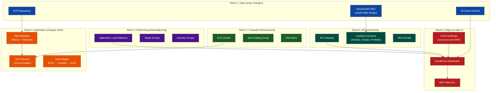
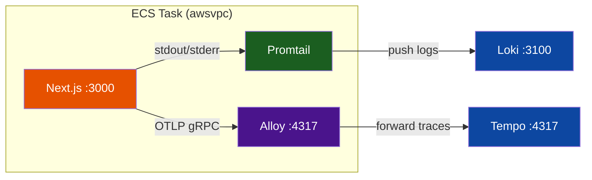
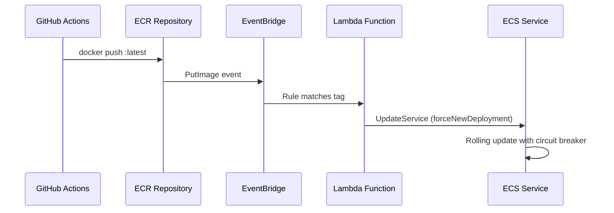
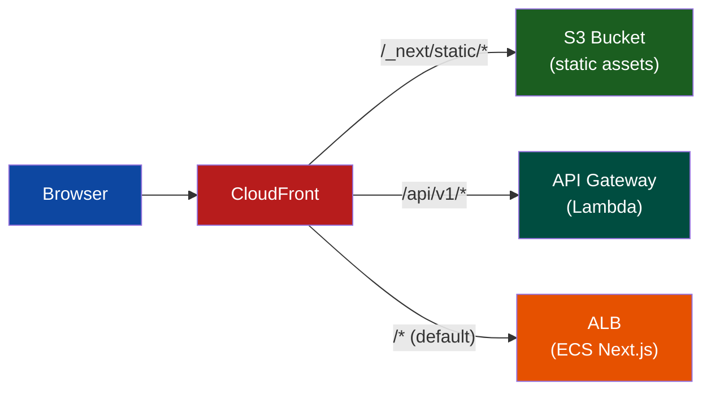
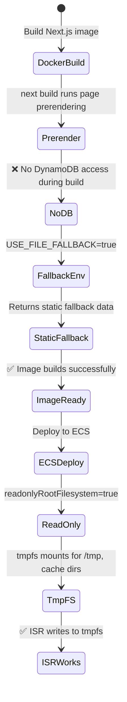

# Next.js on AWS: A 6-Stack ECS Architecture with CloudFront, API Gateway, and Zero-Downtime Deploys

> **TL;DR** — Running Next.js on AWS requires more than `npx deploy`. This article walks
> through a **6-stack CDK architecture** that deploys a containerized Next.js application
> across ECS on EC2, CloudFront (with WAF and cross-account ACM), API Gateway with Lambda
> backends, DynamoDB for portfolio data, and S3 for static assets. The key pattern: a
> **domain-driven stack split** where Data (rarely changes) deploys independently from
> Application (changes every push), with an **auto-deploy pipeline** that triggers ECS
> service updates from ECR push events.

---

## 1. The "Solo-Preneur" Context

### The Constraint

I need a portfolio website that demonstrates production-grade AWS architecture — not because
a portfolio needs it, but because the infrastructure _is_ the portfolio. The application
serves as a living showcase of ECS, CloudFront, API Gateway, DynamoDB, and CDK patterns that
I would build in a team context, compressed into a solo-managed monorepo.

### What I Needed

The application required server-side rendering and incremental static regeneration through the
Next.js App Router, with a global CDN (CloudFront) providing custom domain routing, WAF
protection, and S3 static asset offloading. The serverless API layer — Lambda functions behind
API Gateway — needed to handle a contact form, an articles API, and portfolio data queries
against DynamoDB. Container orchestration via ECS on EC2 with `awsvpc` networking gave me full
control over task-level security groups and observability sidecars. Zero-downtime deploys — from
ECR image pushes triggering automatic ECS service updates with deployment circuit breakers —
ensured that every push reaches production without manual intervention. All of this needed to
run at single-digit monthly cost for the entire stack.

{/* SCREENSHOT: The live portfolio website showing the homepage with a modern design, served via CloudFront with the custom domain visible in the browser URL bar */}

---

## 2. Architecture: The 6-Stack Domain Split



### Why 6 Stacks?

| Stack           | Change Frequency | Deploy Time | Reason for Separation                   |
| :-------------- | :--------------- | :---------- | :-------------------------------------- |
| **Data**        | Monthly          | ~2 min      | ECR, DynamoDB, S3 rarely change         |
| **Compute**     | Weekly           | ~3 min      | ECS cluster, ASG are infrastructure     |
| **Networking**  | Rarely           | ~2 min      | ALB changes require careful rollout     |
| **Application** | Daily            | ~5 min      | Task def + service update on every push |
| **API**         | Weekly           | ~3 min      | Lambda functions update independently   |
| **Edge**        | Rarely           | ~8 min      | CloudFront takes time to propagate      |

The dependency chain is: **Data → Compute → Networking → Application** (sequential), with
**API** branching off from Data (parallel), and **Edge** fanning in from Networking + Application + API.
This split means a DynamoDB schema change (Data stack) _never_ triggers a CloudFront
invalidation (Edge stack), and a task definition update (Application stack) deploys in ~5
minutes without touching the ALB configuration (Networking stack).

---

## 3. Decision Log: Why This Architecture Over the Alternatives

### ECS on EC2 Over Fargate

Fargate simplifies compute management but removes control over host-level instrumentation.
I chose ECS on EC2 because the monitoring stack requires a Node Exporter daemon running
alongside the Next.js task for Prometheus host metrics — CPU, memory, disk, and network
at the instance level. Fargate does not expose `/proc` or `/sys` to containers, making
host-level metrics impossible. The EC2 launch type also allows `HOST` networking for the
Node Exporter daemon, which is required for scraping instance-level metrics. The trade-off
is managing an Auto Scaling Group, but CDK's L2 `AutoScalingGroup` construct handles
capacity provider configuration, health checks, and instance refresh automatically.

### CloudFront→ALB via HTTP (Not HTTPS)

The Edge stack configures CloudFront to communicate with the ALB origin over HTTP, not HTTPS.
This is intentional: the ALB's AWS-generated DNS name (`*.elb.amazonaws.com`) does not match
the custom domain certificate, causing SSL hostname mismatches. HTTPS termination happens at
the CloudFront edge — the CloudFront→ALB hop runs within AWS's internal network. To prevent
clients from bypassing CloudFront and hitting the ALB directly (which would skip WAF), the
ALB origin includes a custom `X-CloudFront-Origin` header that the ALB validates before
routing requests:

```typescript
// lib/stacks/nextjs/edge/edge-stack.ts — origin verification
const albOrigin = new origins.HttpOrigin(albDnsName, {
  protocolPolicy: cloudfront.OriginProtocolPolicy.HTTP_ONLY,
  customHeaders: { "X-CloudFront-Origin": envName },
});
```

### Cross-Account ACM via Lambda Custom Resource

The domain is registered in a separate AWS organization root account. Rather than creating a
hosted zone in the workload account (which would require NS record delegation and ongoing
maintenance), the Edge stack assumes a cross-account IAM role to create DNS validation records
directly in the root account's hosted zone. A Lambda-backed custom resource handles the
certificate issuance, validation record creation, and DNS alias record creation in a single
deployment:

```typescript
// lib/stacks/nextjs/edge/edge-stack.ts — cross-account certificate validation
const certificateConstruct = new AcmCertificateDnsValidationConstruct(
  this,
  "Certificate",
  {
    environment: envName,
    domainName: props.domainName,
    hostedZoneId: props.hostedZoneId,
    crossAccountRoleArn: props.crossAccountRoleArn,
    validationFunction: this.validationLambda.function,
    namePrefix,
  },
);
```

The same Lambda is reused for DNS alias record creation via a `SkipCertificateCreation` flag,
reducing the number of Lambda functions while keeping the logic cleanly separated.

### Regional WAF on API Gateway (Not Just CloudFront WAF)

As of February 2026, CloudFront's WAF only protects requests routed through the distribution.
API Gateway endpoints are also reachable at their `execute-api` domain, which bypasses CloudFront
entirely. The API stack attaches a second regional WAF (`scope: 'REGIONAL'`) to the API Gateway
REST API, ensuring that even direct `execute-api` access is protected by rate limiting and AWS
managed rule groups. This is a defense-in-depth pattern — the CloudFront WAF handles edge
protection, and the regional WAF handles direct-access protection.

### SSM Parameter Store Over CloudFormation Exports

All 6 stacks communicate through SSM Parameter Store instead of CloudFormation cross-stack
exports. The rationale: CloudFormation exports create permanent lock-in. You cannot delete or
modify an exported value without first updating every importing stack. SSM parameters are
intentionally decoupled — the Edge stack reads the ALB DNS name and S3 bucket name from
`eu-west-1` SSM parameters via `AwsCustomResource` cross-region readers, and stack refactoring
never requires consumer changes. The SSM paths are centralized in `lib/config/ssm-paths.ts`
(271 lines) with 4 namespace conventions.

---

## 4. The "Golden Path" Implementation

### 4.1: Containerized Next.js with Security Hardening

The ECS task definition runs Next.js in a hardened container with a read-only root filesystem.
This prevents a compromised container from persisting changes to the filesystem, but Next.js
needs to write ISR cache files and temporary data. The solution: `tmpfs` mounts for `/tmp` and
the Next.js cache directory, configured via `USE_FILE_FALLBACK` to handle prerendering without
database access during Docker builds:

```typescript
// lib/stacks/nextjs/application/application-stack.ts
const taskDef = new EcsTaskDefinitionConstruct(this, "TaskDef", {
  cpu: ecsConfigs.task.cpu, // 512
  memoryMiB: ecsConfigs.task.memory, // 1024
  networkMode: ecs.NetworkMode.AWS_VPC,
  ssmParameterPathPrefix: "...",
});

const container = taskDef.addContainer("NextJsApp", {
  image: ecs.ContainerImage.fromEcrRepository(repository, imageTag),
  memoryLimitMiB: 896,
  readonlyRootFilesystem: true, // Security hardening
  environment: {
    NODE_ENV: "production",
    USE_FILE_FALLBACK: "true", // ISR fallback during build
  },
});

// tmpfs mounts for Next.js runtime writes
container.addMountPoints({
  sourceVolume: "tmp",
  containerPath: "/tmp",
  readOnly: false,
});
```

The `readonlyRootFilesystem: true` setting combined with `tmpfs` mounts means that Next.js
can write temporary files (ISR cache, build artifacts) to RAM-backed storage, but a container
compromise cannot modify the application binary or configuration files on disk. The
`USE_FILE_FALLBACK=true` environment variable tells the Next.js application to return static
fallback data during `next build` prerendering, since the Docker build environment does not
have network access to DynamoDB.

### 4.2: Observability Sidecars — 3 Containers Per Task

Each ECS task runs 3 containers as a single unit. The Next.js application container serves
traffic on port 3000. A Promtail sidecar reads stdout/stderr from the application container
and pushes structured logs to Loki on the monitoring EC2 instance. A Grafana Alloy sidecar
receives OTLP gRPC traces from the Next.js OpenTelemetry instrumentation and forwards them
to Tempo. Both sidecars communicate with the monitoring stack via the internal VPC — no
logs or traces leave the cluster over the public internet.



```typescript
// lib/stacks/nextjs/application/application-stack.ts
// Promtail sidecar — log forwarding
this.addPromtailSidecar({
  monitoring: props.monitoring!,
  environment: envName,
  isProd,
  namePrefix,
});

// Alloy sidecar — OTLP trace collection
this.addAlloySidecar({
  monitoring: props.monitoring!,
  environment: envName,
  isProd,
  namePrefix,
});
```

Promtail configuration is injected as an environment variable and piped to stdin at runtime —
the standard ECS pattern since containers using `awsvpc` networking cannot mount ad-hoc files
from the host filesystem.

### 4.3: Auto-Deploy Pipeline — ECR Push → ECS Update

New container images trigger automatic ECS service updates without manual intervention. The
pipeline uses EventBridge to detect ECR `PutImage` events, then invokes a Lambda function
that calls `UpdateService` with `forceNewDeployment: true`. The ECS service's deployment
circuit breaker monitors container health checks and automatically rolls back if containers
fail to stabilize:



```typescript
// lib/stacks/nextjs/application/application-stack.ts
// Auto-deploy: EventBridge → Lambda → ECS UpdateService
this.addAutoDeployPipeline({
  props,
  repository,
  environment: envName,
  isProd,
  namePrefix,
});
```

The deployment circuit breaker is the safety net: if the new container image fails health
checks (the ALB health check returns non-200 for `/api/health`), ECS automatically rolls back
to the previous task definition revision. In production, `enableExecuteCommand` is disabled
to prevent interactive debugging sessions on live containers:

```typescript
// lib/stacks/nextjs/application/application-stack.ts
const service = new ecs.Ec2Service(this, "Service", {
  cluster,
  taskDefinition: taskDef,
  circuitBreaker: {
    enable: true,
    rollback: true,
  },
  enableExecuteCommand: !isProd, // Debug access in non-prod only
});
```

### 4.4: CloudFront Multi-Origin Routing

The Edge stack routes requests across 3 origins based on path patterns. Static assets (Next.js
build output with content-hashed filenames) route directly to S3 with aggressive 1-year cache
TTLs. API requests route to the ALB with caching disabled. The default catch-all routes to
the ALB for server-rendered pages with ISR-compatible cache policies:



| Path Pattern      | Origin | Cache Behavior                         |
| :---------------- | :----- | :------------------------------------- |
| `/_next/static/*` | S3     | Aggressive caching (immutable hashes)  |
| `/_next/data/*`   | S3     | ISR data files with revalidation       |
| `/images/*`       | S3     | Article images (immutable)             |
| `/api/*`          | ALB    | No cache, forward all headers          |
| `/*` (default)    | ALB    | ISR cache with query string forwarding |

The S3 origin uses **origin access control** (OAC), which replaced the deprecated origin
access identity (OAI). As of February 2026, CDK's `S3BucketOrigin.withOriginAccessControl()`
is the recommended way to configure S3 origins — no public bucket access is required. The
ALB origin uses `HTTP_ONLY` protocol policy with origin verification via the
`X-CloudFront-Origin` custom header (see Decision Log, Section 3).

### 4.5: Cross-Region SSM for Edge Stack Discovery

The Edge stack deploys in `us-east-1` (CloudFront + WAF requirement), but the ALB and S3
bucket exist in `eu-west-1`. The stack reads their values via `AwsCustomResource` SSM
cross-region readers — a pattern that constructs precise ARNs for least-privilege IAM access:

```typescript
// lib/stacks/nextjs/edge/edge-stack.ts — cross-region SSM reader
const ssmParameterArns = [
  `arn:aws:ssm:${ssmRegion}:${this.account}:parameter${props.albDnsSsmPath}`,
  `arn:aws:ssm:${bucketSsmRegion}:${this.account}:parameter${props.assetsBucketSsmPath}`,
];

const ssmReaderPolicy = cr.AwsCustomResourcePolicy.fromStatements([
  new iam.PolicyStatement({
    actions: ["ssm:GetParameter"],
    resources: ssmParameterArns,
  }),
]);

const albDnsName = this.readSsmParameter(
  "ReadAlbDnsName",
  props.albDnsSsmPath,
  ssmRegion,
  ssmReaderPolicy,
);
```

The `readSsmParameter()` helper centralizes the `AwsCustomResource` boilerplate. It omits
the `onDelete` handler intentionally — these are read-only resources. The `onUpdate` handler
re-reads the SSM parameter on every deployment, which is correct since the backing values
(ALB DNS name, bucket name) can change between deployments.

### 4.6: Serverless API with Lambda + DynamoDB

The API stack provides 3 Lambda functions behind API Gateway: an articles endpoint for
portfolio content, a contact form handler with SES email notification, and a portfolio data
query endpoint. Each Lambda is provisioned with the L3 `LambdaFunctionConstruct` which
bundles the handler code, creates a log group with retention policies, and configures IAM
permissions automatically:

```typescript
// lib/stacks/nextjs/networking/api-stack.ts
const articlesLambda = new LambdaFunctionConstruct(this, "ArticlesLambda", {
  handler: "articles/handler.handler",
  environment: {
    TABLE_NAME: tableName, // From SSM
    GSI1_NAME: PORTFOLIO_GSI1_NAME,
    GSI2_NAME: PORTFOLIO_GSI2_NAME,
  },
});

const contactLambda = new LambdaFunctionConstruct(this, "ContactLambda", {
  handler: "contact/handler.handler",
  environment: {
    TABLE_NAME: tableName,
    FROM_EMAIL: sesFromEmail,
    NOTIFICATION_EMAIL: notificationEmail,
  },
});
```

Each Lambda function is configured with a per-function Dead Letter Queue (SQS), reserved
concurrency to prevent noisy-neighbor issues across Lambda functions, and CloudWatch error
alarms with SNS notifications. The API Gateway itself is protected by a regional WAF
(`scope: 'REGIONAL'`) in addition to the CloudFront WAF — the defense-in-depth pattern
described in the Decision Log.

### 4.7: SSM Parameter Discovery — Zero Cross-Stack Exports

All 6 stacks communicate through SSM Parameter Store instead of CloudFormation exports.
The Data stack writes the ECR repository URI, DynamoDB table name, and S3 bucket name as
SSM parameters. The Application stack reads these to construct its task definition. The
Edge stack reads the ALB DNS name and S3 bucket name via cross-region SSM readers. The
pattern eliminates the "stack locked" problem where updating an exported value requires
updating all importing stacks first:

```typescript
// Data stack writes
new ssm.StringParameter(this, "TableNameParam", {
  parameterName: "/nextjs/development/dynamodb-table-name",
  stringValue: table.tableName,
});

// API stack reads
const tableName = ssm.StringParameter.valueForStringParameter(
  this,
  "/nextjs/development/dynamodb-table-name",
);
```

This pattern is used for: ECR repository URI, DynamoDB table name, S3 bucket name,
ALB DNS name, security group IDs, Loki/Tempo endpoints, and CloudFront distribution ID.
All SSM paths are centralized in `lib/config/ssm-paths.ts` (271 lines), eliminating
inline string concatenation and enforcing 4 namespace conventions across all stacks.

---

## 5. The "Oh No" Moment: Read-Only Filesystem + Next.js ISR

### The Problem

Enabling `readonlyRootFilesystem: true` broke Next.js ISR (Incremental Static Regeneration).
Next.js writes regenerated pages to `.next/cache/`, but the read-only filesystem blocks all
writes. The container immediately failed with `EROFS: read-only file system` errors, and the
ECS circuit breaker rolled back the deployment automatically:

```
Error: EROFS: read-only file system, open '.next/cache/...'
```

### The Fix

The solution required two changes. First, add `tmpfs` mounts for all directories Next.js needs
to write to — `/tmp` and the `.next/cache` directory. `tmpfs` is RAM-backed storage that
satisfies the write requirement without compromising the read-only filesystem security posture.
Second, set `USE_FILE_FALLBACK=true` so that prerendering during `docker build` does not
attempt to query DynamoDB (which is not available during CI builds):



The `tmpfs` approach means ISR cache is ephemeral — it is lost when the container restarts —
but this is acceptable for a portfolio application where regeneration latency on the first
request after a restart is minimal. For high-traffic applications, an external cache (Redis
or DynamoDB) would be more appropriate.

---

## 6. FinOps & Maintenance Impact

### Monthly Cost Breakdown

| Resource                | Monthly Cost   | Notes                             |
| :---------------------- | :------------- | :-------------------------------- |
| ECS on EC2 (`t3.small`) | ~$12           | Shared with Node Exporter sidecar |
| ALB                     | ~$16           | Fixed + LCU charges               |
| CloudFront              | ~$1            | Low traffic portfolio             |
| API Gateway             | ~$0.50         | REST API free tier                |
| Lambda                  | ~$0.01         | Minimal invocations               |
| DynamoDB (on-demand)    | ~$0.50         | Read-heavy, small dataset         |
| S3                      | ~$0.10         | Static assets + articles          |
| ECR                     | ~$0.50         | Container image storage           |
| ACM                     | $0             | Free SSL certificates             |
| Route 53                | ~$0.50         | Hosted zone                       |
| **Total**               | **~$31/month** | Full production stack             |

### ROI

The 6-stack domain split eliminated the biggest operational pain: deploying a task definition
change no longer requires re-synthesizing the CloudFront distribution (8-minute propagation)
or the DynamoDB table (2-minute CFN drift check). The auto-deploy pipeline removed all manual
deployment steps — a `docker push` triggers the full delivery chain through to ECS service
update and circuit breaker verification. The SSM parameter pattern eliminated 3 instances of
the "stack locked" import/export problem that previously required carefully ordered multi-stack
deployments. The security hardening (read-only filesystem, restricted task egress, WAF on both
CloudFront and API Gateway) runs at zero incremental cost since it is entirely synthesis-time
configuration.

### Maintenance Burden

This deployment requires roughly 1–2 hours of maintenance per month. The auto-deploy pipeline
handles routine deployments without intervention. CDK Aspects (tagging, DynamoDB read-only
enforcement, CDK-Nag compliance) catch configuration drift at synthesis time. The 6-stack
split means infrastructure changes are isolated — an ALB rule change (Networking stack) does
not risk a CloudFront invalidation (Edge stack). The main recurring task is EC2 AMI updates
for the ECS instances, which CDK's `MachineImage.latestAmazonLinux2023()` handles
automatically on the next deployment.

---

## 7. What Needs Work — and What's Next

### What's Working

| Pattern                                  |   Status   | Impact                                   |
| :--------------------------------------- | :--------: | :--------------------------------------- |
| 6-Stack Domain Split                     | ✅ Shipped | Data changes don't trigger App deploys   |
| Auto-Deploy Pipeline (ECR → ECS)         | ✅ Shipped | Zero-touch deployments from image pushes |
| Deployment Circuit Breaker               | ✅ Shipped | Failed deploys auto-rollback             |
| Observability Sidecars (3 containers)    | ✅ Shipped | Every task ships logs + traces           |
| SSM Discovery (zero cross-stack exports) | ✅ Shipped | No "stack locked" problems               |
| Read-Only Filesystem + tmpfs             | ✅ Shipped | Security hardening without ISR breakage  |
| Dual WAF (CloudFront + API Gateway)      | ✅ Shipped | Defense-in-depth at both layers          |
| Cross-Account ACM via Lambda             | ✅ Shipped | Single-deployment certificate issuance   |

### Remaining Gaps and Roadmap

| Improvement                                   | Effort | Impact                                  | Status      |
| :-------------------------------------------- | :----- | :-------------------------------------- | :---------- |
| Fargate migration for simplified compute      | 1 day  | Eliminate EC2/ASG management overhead   | Evaluating  |
| Multi-AZ deployment for high availability     | 3 hrs  | ALB across 2 AZs, service spread        | Planned     |
| Automated CloudFront cache invalidation in CI | 2 hrs  | Invalidate after static asset sync      | Planned     |
| Blue/green deployment via CodeDeploy          | 1 day  | Eliminate mixed-version rolling updates | Researching |
| Lambda@Edge for A/B testing                   | 2 days | Feature flagging at the edge            | Researching |

The architecture's _structure_ — domain-driven stack split, SSM discovery, auto-deploy
pipeline — is stable and has proven resilient through dozens of deployments. The next
improvements target operational simplification: a Fargate migration would eliminate the
EC2 Auto Scaling Group management entirely (at the cost of losing host-level Prometheus
metrics until Fargate supports sidecar containers with host access). Multi-AZ is the most
impactful short-term improvement, adding genuine high availability for roughly 3 hours of
work. The longer-term investments — blue/green deployments and Lambda@Edge — would bring
the deployment model closer to the zero-downtime guarantees expected in enterprise
environments.

> **The 6-stack split turns a single application into a deployment pipeline where each layer
> changes at its own cadence. Data is monthly, compute is weekly, application is daily. The
> auto-deploy pipeline, circuit breaker, and SSM discovery pattern together create a
> deployment surface that requires zero manual intervention — from `docker push` to production
> traffic — while the dual WAF, read-only filesystem, and origin verification ensure the
> security posture never degrades.**

---

## 8. Related Files

| File                                                 | Description                                  |
| :--------------------------------------------------- | :------------------------------------------- |
| `lib/stacks/nextjs/data/data-stack.ts`               | ECR + DynamoDB + S3 (509 lines)              |
| `lib/stacks/nextjs/compute/compute-stack.ts`         | ECS Cluster + ASG                            |
| `lib/stacks/nextjs/networking/networking-stack.ts`   | ALB + Target Groups + SG                     |
| `lib/stacks/nextjs/application/application-stack.ts` | Task Def + Service + Auto-Deploy (965 lines) |
| `lib/stacks/nextjs/networking/api-stack.ts`          | API Gateway + Lambda (617 lines)             |
| `lib/stacks/nextjs/edge/edge-stack.ts`               | CloudFront + WAF + ACM (652 lines)           |
| `lib/factories/nextjs-factory.ts`                    | Stack wiring + SSM resolution                |
| `lib/config/nextjs/`                                 | Environment-specific configurations          |
| `.github/workflows/_deploy-nextjs.yml`               | 6-stack sequential deployment                |
| `scripts/deployment/verify-nextjs.ts`                | Post-deployment health checks                |

---

## 9. Tech Stack Summary

| Category       | Technology                                            |
| :------------- | :---------------------------------------------------- |
| Frontend       | Next.js 14 (App Router, SSR + ISR)                    |
| Container      | ECS on EC2 (awsvpc networking)                        |
| CDN            | CloudFront + S3 origin (OAC) + WAF                    |
| API            | API Gateway REST + Lambda (Node.js)                   |
| Database       | DynamoDB (single-table, on-demand)                    |
| Storage        | S3 (static assets, versioned)                         |
| Registry       | ECR with auto-deploy pipeline                         |
| SSL            | ACM with cross-account DNS validation                 |
| Email          | SES (contact form notifications)                      |
| Discovery      | SSM Parameter Store (zero cross-stack exports)        |
| Observability  | Promtail sidecar (logs) + Alloy sidecar (traces)      |
| Security       | Read-only filesystem + dual WAF + origin verification |
| Infrastructure | AWS CDK v2, 6-stack domain-driven split               |
