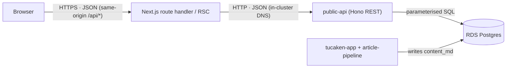
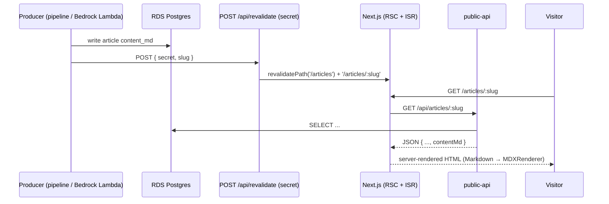

## Overview

This document answers, with code evidence, how the UI communicates with the
backend and the database: the **protocol**, whether it is a **REST API**, how
**articles are queried and what the response looks like**, how a **saved article
reaches the UI**, whether the app uses **cookies** or **CORS**, and which **CRUD**
operations exist.

One-line summary: the site is a **same-origin REST/JSON BFF proxy**. The browser
talks only to the site's own `/api/*` routes (or receives server-rendered HTML);
those server-side handlers forward to the in-cluster `public-api` BFF, which runs
parameterised SQL against RDS Postgres. **The UI never touches the database
directly, and holds no database credentials.**

## Protocol — is it a REST API?

Yes. Application data moves as **REST over JSON**, across two hops:

| Hop | Transport | Format | Notes |
| --- | --- | --- | --- |
| Browser ↔ site (`/api/*` or page HTML) | HTTPS | `application/json` (or HTML for pages) | Same-origin only |
| Site ↔ `public-api` BFF | HTTP (in-cluster) | `application/json` | `http://public-api.public-api:3001` over Kubernetes DNS |
| BFF ↔ RDS Postgres | (owned by the BFF) | SQL | The site never sees this hop |

- **Not GraphQL, not gRPC** for application data. The BFF is a Hono REST API;
  the site's handlers are Next.js Route Handlers returning `NextResponse.json`.
- **gRPC appears only for telemetry** — OpenTelemetry traces export over
  OTLP/gRPC — which is a separate concern from the data plane.
- **Chat is request/response JSON, not streaming/websocket**: `/api/chat` does a
  single buffered `POST` and returns `{ message, sessionId }`
  ([chat/route.ts:8-12](../../apps/site/src/app/api/chat/route.ts#L8-L12)).



## The API surface

Every browser-facing endpoint is a Next.js Route Handler under
`apps/site/src/app/api/`:

| Route | Methods | Purpose | Auth |
| --- | --- | --- | --- |
| `/api/articles/[slug]/like` | GET, POST | like status / toggle | none (session UUID) |
| `/api/articles/[slug]/comments` | GET, POST | list approved / submit (pending) | none (IP rate-limited upstream) |
| `/api/chat` | POST | RAG chatbot proxy | none |
| `/api/resume/active` | GET | active resume proxy | none |
| `/api/health` | GET | liveness | none |
| `/api/metrics` | GET | Prometheus metrics | **bearer token** (constant-time compare) |
| `/api/track-error` | POST | browser error telemetry | none (rate-limited here) |
| `/api/revalidate` | POST | on-demand ISR cache purge | **shared secret** |

Article **reads (list/detail) are not in this table** — they are fetched
server-side inside React Server Components, not via a browser-facing API route
(see [Rendering](#how-a-saved-article-reaches-the-ui)).

## How articles are queried, and the response shape

Reads flow through one server-only layer,
[`public-api-articles.ts`](../../apps/site/src/lib/articles/public-api-articles.ts),
via a single fetch helper — a plain `GET`, ISR-cached for 300s, no custom headers
([public-api-articles.ts:125-131](../../apps/site/src/lib/articles/public-api-articles.ts#L125-L131)):

```ts
async function getJson<T>(path: string) {
  const res = await fetch(`${PUBLIC_API_URL}${path}`, { next: { revalidate: 300 } })
  if (!res.ok) return { status: res.status, data: null }
  return { status: res.status, data: (await res.json()) as T }
}
```

**List query** — `queryPublishedArticles()` → `GET {BFF}/api/articles`:

- **Upstream response:** `{ items: PublicArticleListItem[]; count: number }` where each
  item is `{ slug, title, excerpt, publishedAt, tags, coverImage }`
  ([:51-58](../../apps/site/src/lib/articles/public-api-articles.ts#L51-L58)).
- **Mapped to** `ArticleWithSlug[]` via `mapMetadata` — which also synthesises
  `contentRef: rds://<slug>` so the existing Zod schema and `generateStaticParams`
  filter keep working ([:86-108](../../apps/site/src/lib/articles/public-api-articles.ts#L86-L108)).
- Returns `[]` on any failure (non-OK or thrown).

**Detail query** — `getArticleDetailBySlug(slug)` → `GET {BFF}/api/articles/:slug`:

- **Upstream response:** a `PublicArticleDetail` (list fields **plus**
  `contentMd, aiGenerated, aiModel, createdAt, updatedAt`) or `404`
  ([:60-66](../../apps/site/src/lib/articles/public-api-articles.ts#L60-L66)).
- **Mapped to** `ArticleDetailResponse = { metadata: ArticleWithSlug, content:
  ArticleContent }`, where the Markdown body becomes
  `{ contentType: 'markdown', content: row.contentMd, images: [], version: 1 }`
  ([:110-119](../../apps/site/src/lib/articles/public-api-articles.ts#L110-L119)).
- Returns `null` when not found.

**Graceful degradation is deliberate:** list reads return `[]` and detail reads
return `null` so the Docker build / ISR prerender succeed even when the cluster is
unreachable at build time; real data is fetched at runtime
([article-service.ts:135-145](../../apps/site/src/lib/articles/article-service.ts#L135-L145)).

## How a saved article reaches the UI

Articles are **produced elsewhere** (tucaken-app + the `article-pipeline` Job
write `articles.content_md` to RDS). This site only reads them. The publish→UI
path is **ISR (Incremental Static Regeneration) with an on-demand purge**:



1. The producer writes the article to RDS.
2. After publishing, the Bedrock Lambda calls **`POST /api/revalidate`** with a
   shared secret + slug, which runs `revalidatePath('/articles')` and
   `/articles/<slug>` ([revalidate/route.ts:1-18](../../apps/site/src/app/api/revalidate/route.ts#L1-L18)).
3. The next request re-runs the **React Server Component**, which calls the read
   layer above, fetches from the BFF, and renders. If the webhook never fires, the
   page still refreshes within the **ISR window** (`revalidate = 3600` on the
   pages; the BFF fetch itself is 300s).
4. The Markdown body is rendered by `MDXRenderer` using `next-mdx-remote/rsc`
   (`remark-gfm`, a custom component map). Article JSON never crosses to the
   browser — it is fetched server-side and rendered to HTML.

## Writes and the CRUD inventory

The public site is **read-mostly**. There are **no `PUT`, `PATCH`, or `DELETE`
handlers anywhere** — verified across all route handlers and lib fetches. The only
genuine data writes exposed to visitors are **like toggle** and **comment submit**.

| Operation | Where | CRUD | Notes |
| --- | --- | --- | --- |
| List / detail articles | RSC → BFF | **Read** | server-side, ISR-cached |
| Like status | `GET /api/articles/[slug]/like` | **Read** | `sessionId` query param |
| Like toggle | `POST /api/articles/[slug]/like` | **Create/Update** | anonymous, `{ sessionId }` |
| Comment list | `GET /api/articles/[slug]/comments` | **Read** | approved only; `s-maxage=60` |
| Comment submit | `POST /api/articles/[slug]/comments` | **Create** | created `pending`; IP rate-limited upstream |
| Chat turn | `POST /api/chat` | Create | RAG proxy; echoes `sessionId` |
| Resume | `GET /api/resume/active` | **Read** | proxy; `204` when none |
| Error telemetry | `POST /api/track-error` | Create | rate-limited here (10/60s/IP) |

Full update/delete/moderation CRUD (editing and approving articles/comments) lives
in the **separate admin app + `admin-api`**, not in this repository.

Writes forward the real client IP so per-IP rate limiting at the BFF applies to
the visitor, not the pod
([public-api-engagement.ts:96-111](../../apps/site/src/lib/articles/public-api-engagement.ts#L96-L111)):

```ts
headers: { 'Content-Type': 'application/json', 'x-forwarded-for': ipAddress },
body: JSON.stringify({ name, email, body }),
```

## Cookies

**The site sets and reads no HTTP cookies.** There is no `cookies()` from
`next/headers`, no `Set-Cookie`, no `document.cookie`, and no `__session` anywhere
in the source. Client-side identity uses **`localStorage`** instead:

- **Likes** — an anonymous session UUID generated with `crypto.randomUUID()` and
  stored as `portfolio-session-id`
  ([LikeButton.tsx:28-36](../../apps/site/src/components/articles/LikeButton.tsx#L28-L36)).
- **Cookie-consent banner** — the consent choice itself is stored in
  `localStorage` (`cookie-consent`), "no server-side storage needed"
  ([CookieConsent.tsx:21](../../apps/site/src/components/analytics/CookieConsent.tsx#L21)).
- **Chat** — `sessionId` is React state echoed in request bodies, not a cookie.

Because no cookies are issued, there are no `httpOnly` / `secure` / `sameSite`
attributes to manage, and no CSRF surface. (Admin session cookies belong to the
separate admin app, which this repo only proxies in local dev.)

## CORS

**The app sets no CORS response headers** — no `Access-Control-Allow-Origin`, no
`OPTIONS` handler, no `cors` middleware, and no `headers()` block in
`next.config.mjs`. This is correct by design: in the **same-origin proxy model**
the browser only calls the site's own `/api/*` on the same origin, and the
site→BFF call is server-to-server, to which CORS does not apply.

The only CORS-adjacent config is telemetry: a dev-only `/log-proxy` rewrite to the
Faro collector "to bypass CORS"
([next.config.mjs:21-27](../../apps/site/next.config.mjs#L21-L27)) and Faro's
client-side `propagateTraceHeaderCorsUrls` allowlist.

## Security headers, middleware, and rate limiting

- **Middleware** ([middleware.ts](../../apps/site/src/middleware.ts)) runs in the
  Edge runtime on every matched request and applies security headers to every
  response: `X-Content-Type-Options: nosniff`, `X-Frame-Options: DENY`,
  `Referrer-Policy`, `Permissions-Policy`, and a two-year `Strict-Transport-Security`.
- **Rate limiting** — an in-memory sliding-window limiter
  ([rate-limiter.ts](../../apps/site/src/lib/rate-limiter.ts)) guards
  `/api/track-error` (10 req / 60s / IP, `429` + `Retry-After`). Comment and chat
  rate limiting is enforced **upstream in the BFF** (per-IP) — which is why the
  write layer forwards `x-forwarded-for`.

## Related

- [In-cluster BFF consumer architecture](./in-cluster-bff-consumer.md) — the BFF boundary and security posture
- [Bedrock RAG chat proxy](./bedrock-rag-proxy.md) — the `/api/chat` path in depth
- [Request routing — DNS to EKS pod](./request-routing-dns-to-pod.md) — how the request reaches the pod that serves these APIs
- [/api/metrics endpoint](../tools/metrics-endpoint.md) — the one authenticated route

<!--
Evidence trail:
- public-api-articles.ts / public-api-engagement.ts / article-service.ts read 2026-07-04
- All app/api/**/route.ts methods verified: only GET/POST exist (no PUT/PATCH/DELETE)
- No cookies()/Set-Cookie/__session in apps/site/src; localStorage used (LikeButton, CookieConsent)
- No CORS headers / OPTIONS / headers() block; same-origin proxy model
- middleware.ts security headers; rate-limiter.ts guards /api/track-error only
-->
