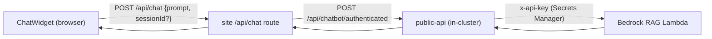

## Overview

The site's chatbot ("Lami") is a thin, secure proxy in front of a
Retrieval-Augmented Generation backend. The browser calls a same-origin
endpoint; the site forwards the prompt to the in-cluster `public-api` BFF,
which holds the Bedrock credential and calls the session-aware RAG Lambda. The
portfolio never embeds an API key and never talks to Bedrock directly. This doc
covers the proxy mechanics, session continuity, and error mapping; the RAG
implementation itself lives in the `ai-applications` repo.

## Request flow

The client helper `sendChatMessage` POSTs to the same-origin `/api/chat` with
an optional `sessionId` for multi-turn continuity
([chat-service.ts:41-51](../../apps/site/src/lib/chat/chat-service.ts#L41-L51)).
The server route forwards to the in-cluster BFF endpoint
`/api/chatbot/authenticated` at `http://public-api.public-api:3001`
([chat/route.ts:31-34,98](../../apps/site/src/app/api/chat/route.ts#L31-L34)).

## Key ownership at the BFF

The portfolio sends only `Content-Type` and the JSON body — no `x-api-key`
([chat/route.ts:98](../../apps/site/src/app/api/chat/route.ts#L98)). The Bedrock
API key is owned by `public-api` (resolved from Secrets Manager), so the public
site holds no Bedrock credential. This is the same secret-ownership principle as
the rest of the [in-cluster BFF consumer architecture](./in-cluster-bff-consumer.md).

## Session continuity

A `sessionId` is optional on the first turn and echoed back on the response.
The authenticated RAG endpoint persists conversation history in RDS
(`chat_sessions` / `chat_messages`) keyed by that id, so subsequent turns pass
the same `sessionId` to continue the thread. The site stores and replays it but
does not interpret it
([chat-service.ts:47-48](../../apps/site/src/lib/chat/chat-service.ts#L47-L48)).

## Contract normalisation and error mapping

The upstream returns `{ response, sessionId }`; the site's `ChatResponse`
contract is `{ message, sessionId }`, so the route normalises `response` →
`message`
([chat/route.ts:137](../../apps/site/src/app/api/chat/route.ts#L137)). Prompts
are validated (required, ≤ 10,000 chars) before forwarding, and a 30s abort
timeout sits above the BFF's own 27s upstream cap
([chat/route.ts:44](../../apps/site/src/app/api/chat/route.ts#L44)). Upstream
and transport failures map to stable client error codes: `429` → `RATE_LIMITED`
([chat/route.ts:124](../../apps/site/src/app/api/chat/route.ts#L124)), abort →
504 `NETWORK_ERROR`, `TypeError` → 502 `NETWORK_ERROR`
([chat/route.ts:153-161](../../apps/site/src/app/api/chat/route.ts#L153-L161)),
other non-2xx → `AGENT_ERROR`. The discriminated `ChatResult` union surfaces
these to the widget
([chat-service.ts:19-24](../../apps/site/src/lib/chat/chat-service.ts#L19-L24)).

## Tradeoffs

Proxying through the BFF adds a hop versus calling Bedrock's API Gateway
directly, but it removes the API key from the site entirely, gives RDS-backed
session continuity, and keeps the browser same-origin. The site stays a dumb
forwarder: all retrieval, guardrails, and persistence are the RAG Lambda's job.

## Deeper detail

- [Chatbot data security](./chatbot-data-security.md) — RAG-not-SQL access
  model, RDS posture, producer-side enforcement
- [In-cluster BFF consumer architecture](./in-cluster-bff-consumer.md) — the
  general consumer/BFF pattern this follows
- RAG Lambda internals (retrieval, guardrails, session persistence) — document
  from the `ai-applications` repository

## Related concepts

- [In-cluster BFF consumer architecture](./in-cluster-bff-consumer.md)
- [Chatbot data security](./chatbot-data-security.md)

<!--
Evidence trail (auto-generated):
- Source: apps/site/src/app/api/chat/route.ts (read on 2026-06-23)
- Source: apps/site/src/lib/chat/chat-service.ts (read on 2026-06-23)
- Source: apps/site/src/lib/types/chat.types.ts (read on 2026-06-23)
- Context: public-api /api/chatbot/authenticated route + 27s upstream cap reviewed in ai-applications (2026-06-23)
-->
