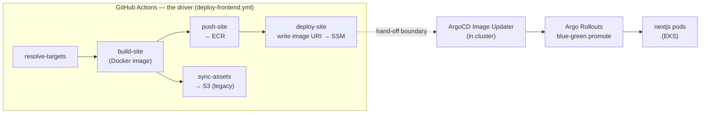

## Overview

Continuous Delivery is **led by GitHub Actions**. The
[`deploy-frontend.yml`](../../.github/workflows/deploy-frontend.yml) workflow owns
everything from source to a published, immutable artifact: it builds the Docker
image, pushes it to **AWS ECR**, runs a legacy static-asset sync to S3, and writes
the new image URI to **SSM Parameter Store**. That SSM write is the **hand-off
boundary** — the last thing GitHub does. (CloudFront has been retired; the pod
serves static assets — see [request routing](./request-routing-dns-to-pod.md).) From there, in-cluster **ArgoCD Image
Updater** and **Argo Rollouts** are downstream *consumers* that pick up the new
image and perform the blue-green cutover to the Kubernetes pods.

> GitHub Actions leads; ArgoCD follows. GitHub decides *what* to ship (which
> image tag) and makes it available; ArgoCD decides *how* it rolls out inside the
> private cluster. Neither reaches into the other's domain.

## What CD does (the GitHub-led path)

The workflow runs six jobs
([deploy-frontend.yml](../../.github/workflows/deploy-frontend.yml)):

1. **resolve-targets** — decides the git ref to deploy (the pushed SHA, or the
   `workflow_dispatch` / `repository_dispatch` ref)
   ([deploy-frontend.yml:55-76](../../.github/workflows/deploy-frontend.yml#L55-L76)).
2. **build-site** — builds the production image with Buildx + GHA layer cache and
   **extracts the Next.js static assets** from the image for the S3 sync
   ([deploy-frontend.yml:85-170](../../.github/workflows/deploy-frontend.yml#L85-L170)).
   The image is tagged `${github.sha}-r${run_attempt}` so a retried run never
   overwrites an existing ECR tag
   ([deploy-frontend.yml:44-45](../../.github/workflows/deploy-frontend.yml#L44-L45)).
3. **push-site** — assumes an AWS role via OIDC (no static keys), resolves the ECR
   URI from SSM, and pushes the image
   ([deploy-frontend.yml:175-242](../../.github/workflows/deploy-frontend.yml#L175-L242)).
4. **sync-assets** — the reusable
   [`_sync-assets.yml`](../../.github/workflows/_sync-assets.yml) uploads the
   hashed static assets to S3 (CloudFront is retired and its invalidation step
   removed; the pod serves static assets directly)
   ([_sync-assets.yml:128-135](../../.github/workflows/_sync-assets.yml#L128-L135)).
5. **deploy-site** — writes the image URI to
   `/nextjs/<env>/image-uri` in SSM. **This is the hand-off**
   ([deploy-frontend.yml:262-313](../../.github/workflows/deploy-frontend.yml#L262-L313)).
6. **summary** — reports per-stage results
   ([deploy-frontend.yml:319-361](../../.github/workflows/deploy-frontend.yml#L319-L361)).

Everything up to and including step 5 is GitHub's responsibility. GitHub does
**not** run `kubectl`, does **not** hold a kubeconfig, and does **not** promote
the rollout.

## The hand-off — what ArgoCD does downstream

Once the SSM parameter holds the new image URI:

1. **ArgoCD Image Updater** (running in the cluster) detects the new tag and
   updates the `nextjs` rollout's desired image.
2. **Argo Rollouts** brings up the new (green) ReplicaSet alongside the stable
   (blue) one and **auto-promotes** the blue-green cutover once the green side is
   healthy.
3. Traffic switches atomically to the new pods.

This is a **pull-based GitOps** hand-off: the cluster pulls its desired state from
what GitHub published, rather than GitHub pushing changes into the cluster.

## Design concept — why this boundary

- **GitHub leads, so delivery logic lives in one place.** Build, tag, push, asset
  sync, and version selection are all in `deploy-frontend.yml`, versioned and
  reviewed like any other code. The pipeline is the single driver of *what ships*.
- **The cluster API stays private.** GitHub's responsibility ends at ECR + SSM —
  public AWS APIs it reaches over short-lived OIDC credentials. It never needs a
  route to, or credentials for, the Kubernetes API. Promotion happens entirely
  in-cluster.
- **Immutable, traceable artifacts.** The `${sha}-r${attempt}` tag ties every
  running image back to an exact commit and run, and prevents retries from
  clobbering a tag.
- **Atomic cutover, trivial rollback.** Blue-green (vs. rolling) means the switch
  is instantaneous and the previous ReplicaSet stays warm — rollback is reverting
  the image the cluster resolves, not rebuilding.
- **Clean separation of concerns.** GitHub owns CI + artifact delivery; ArgoCD
  owns reconciliation and rollout. Each can change independently — e.g. the
  promotion mechanism moved fully in-cluster without touching the build/push jobs.

## Triggers

CD starts on ([deploy-frontend.yml:21-34](../../.github/workflows/deploy-frontend.yml#L21-L34)):

- **`push` to `main`** — the normal path; a merged PR auto-deploys to development.
- **`workflow_dispatch`** — a manual run from the Actions tab, optionally with a
  specific `frontend-ref` (branch, tag, or SHA).
- **`repository_dispatch`** (`deploy-nextjs-dev`) — a cross-repo trigger from an
  upstream infrastructure pipeline.

A `concurrency` group keyed on the ref cancels an in-flight deploy when a newer
one starts ([deploy-frontend.yml:47-49](../../.github/workflows/deploy-frontend.yml#L47-L49)).

## Related

- [CI pipeline & branch strategy](./ci-pipeline.md) — what must pass before a
  merge to `main` triggers this pipeline
- [Frontend deploy pipeline runbook](../runbooks/frontend-deploy-pipeline.md) —
  how to run, verify, and roll back a deploy
- [In-cluster BFF consumer architecture](./in-cluster-bff-consumer.md) — the
  runtime the pods serve

<!--
Evidence trail:
- Source: .github/workflows/deploy-frontend.yml (read 2026-07-04) — 6 jobs, no promote/smoke
- Source: .github/workflows/_sync-assets.yml (read 2026-07-04)
- Source: .github/actions/configure-aws/action.yml (read 2026-07-04)
- Supersedes docs/history/blue-green-rollout-via-ssm.md (SSM-driven promote, removed)
-->
