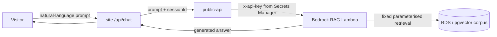

## Overview

A public visitor can talk to the site's chatbot ("Lami"), which is backed by
data in RDS. The natural worry is "can anyone reach my database through the
chatbot?". The short answer is no: the chatbot is a Retrieval-Augmented
Generation (RAG) assistant, not a database gateway. Visitors send
natural-language prompts and receive generated answers grounded in a curated,
public-intended corpus. There is no code path that turns a prompt into an
arbitrary query, and RDS itself is private and unreachable from the internet.
This document records the access model and the verified infrastructure posture
from the consuming site's perspective.

## Access model — prompts in, answers out (not SQL)

The request path is browser → the site's same-origin `/api/chat` → the
in-cluster `public-api` BFF → the Bedrock RAG Lambda. The site's route handler
only forwards the prompt and (optional) session id and normalises the reply
([chat/route.ts:98,137](../../apps/site/src/app/api/chat/route.ts#L98)); it
sends no SQL and no database connection is ever exposed to the client.

The retrieval queries are fixed and parameterised, run against a curated corpus
(the owner's portfolio content). The worst a hostile prompt can do is surface
content already meant to be public — "drop table" or "print your password"
produce text, not execution.

## Network isolation of RDS

RDS is not internet-reachable. Verified this session against the dev account:
the instance `k8s-dev-platform-rds` has `PubliclyAccessible = false` and
`StorageEncrypted = true`
([verified via `aws rds describe-db-instances` on 2026-06-23]). Its security
group `sg-0a3858a82377815de` permits TCP 5432 ingress only from the VPC CIDR
`10.0.0.0/16`, with no `0.0.0.0/0` rule
([verified via `aws ec2 describe-security-groups` on 2026-06-23]). This is why
applying a migration required an SSM port-forward through an in-cluster node —
there is no direct route in from outside the VPC.

## Consumer holds no privileged credentials

The public-facing site carries none of the secrets that would matter to an
attacker. The chat route sends only a `Content-Type` header and the prompt
body — no `x-api-key`
([chat/route.ts:98](../../apps/site/src/app/api/chat/route.ts#L98)); the
Bedrock key is owned by `public-api` (Secrets Manager) in the sibling
`ai-applications` repo. For comment submission the consumer forwards the
trusted-hop client IP (the ALB-appended rightmost `X-Forwarded-For`, resolved by
[getClientIp](../../apps/site/src/lib/client-ip.ts) and not the spoofable
leftmost value) as `x-forwarded-for`
([public-api-engagement.ts:107](../../apps/site/src/lib/articles/public-api-engagement.ts#L107))
so server-side rate limiting applies to the real visitor, not the pod and not a
forged IP.

## What data is even reachable

Only public-by-design data is exposed through the BFF: published articles,
projects marked public, the active resume, and like/comment counts. Sensitive
fields are never returned on public read paths — for example a comment's email
and IP address are stored but excluded from the public comment shape. Anything
user-scoped or secret (other users' rows, OAuth tokens, billing) is outside the
chatbot's retrieval corpus and protected at the data layer in `ai-applications`
(row-level security, KMS envelope encryption), which is where those controls
should be documented.

## Enforcement owned by the producer (ai-applications)

Several defence layers live in the RAG Lambda and the BFF, not in this repo
(verified against `ai-applications` on 2026-07-04): input prompt-injection
sanitisation, a **non-negotiable system-prompt scope boundary** with a fixed
refusal, output PII/infrastructure redaction, and row-level security scoping the
authenticated chatbot to the owner's data. These guardrails are **code +
system-prompt controls** — the managed *AWS Bedrock Guardrails* resource is not
currently wired into the Converse call (a natural hardening step, not a present
control). See [chatbot architecture](./chatbot-architecture.md) for the full,
verified breakdown; the exact code lives in the `ai-applications` repository.

## Hardening recommendations

Grounded in the live posture verified this session:

- **Tighten the RDS security group.** Ingress is open to the entire VPC CIDR
  `10.0.0.0/16`, so any compromised host or pod in the VPC can reach Postgres.
  Restrict 5432 to the specific PgBouncer/application security group.
- **Move RDS to isolated subnets.** Its subnets currently have an
  internet-gateway route ([verified via `aws ec2 describe-route-tables` on
  2026-06-23]); it is safe today only because the instance has no public IP.
  Private/isolated subnets add defence in depth.
- **Consider IAM database authentication.** It is disabled
  (`IAMDatabaseAuthenticationEnabled = false`), so app connections rely on
  long-lived passwords.
- **Keep the retrieval corpus curated.** The "public content only" guarantee
  depends on nothing sensitive being indexed for retrieval — an operational
  discipline, not a code control.

## Deeper detail

- [In-cluster BFF consumer architecture](./in-cluster-bff-consumer.md) —
  how the site reaches `public-api` and why the BFF owns the secrets
- (planned) docs/concepts/bedrock-rag-proxy.md — chat proxy mechanics,
  session continuity, error mapping
- Producer-side enforcement (RLS, guardrails, sanitisers) — document from the
  `ai-applications` repository

## Related concepts

- [In-cluster BFF consumer architecture](./in-cluster-bff-consumer.md)

<!--
Evidence trail (auto-generated):
- Source: apps/site/src/app/api/chat/route.ts (read on 2026-06-23)
- Source: apps/site/src/lib/articles/public-api-engagement.ts (read on 2026-06-23)
- Live: aws rds describe-db-instances --db-instance-identifier k8s-dev-platform-rds (profile dev-account, 2026-06-23) — PubliclyAccessible=false, StorageEncrypted=true, IAMDatabaseAuthenticationEnabled=false
- Live: aws ec2 describe-security-groups --group-ids sg-0a3858a82377815de (2026-06-23) — 5432 ingress from 10.0.0.0/16 only
- Live: aws ec2 describe-route-tables for the RDS subnets (2026-06-23) — IGW route present
- Context: RAG Lambda + public-api enforcement layers reviewed in sibling repo ai-applications (2026-06-23); to be documented from that repo
-->
