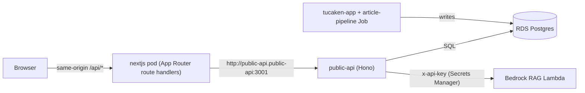

## Overview

The portfolio site is a **consumer-only** application. Every piece of dynamic
data it shows — articles, the chatbot, the active resume, and article
likes/comments — is read from a single in-cluster Backend-for-Frontend (BFF)
service, `public-api`, over Kubernetes service DNS. The site holds **no AWS
data credentials** and makes **no direct DynamoDB, S3, or RDS calls** at
runtime. Content is produced by a separate system (tucaken-app plus an
`article-pipeline` Kubernetes Job) that writes to RDS Postgres; the portfolio
only queries. This separation is what lets the site be deployed publicly while
the data plane and its secrets stay inside the cluster.

## How it works

Each Next.js App Router route handler runs server-side inside the `nextjs` pod
and `fetch()`es the in-cluster `public-api` service at its Kubernetes DNS name,
defaulting to `http://public-api.public-api:3001`
([public-api-articles.ts:32](../../apps/site/src/lib/articles/public-api-articles.ts#L32),
[public-api-engagement.ts:22](../../apps/site/src/lib/articles/public-api-engagement.ts#L22),
[chat/route.ts:31](../../apps/site/src/app/api/chat/route.ts#L31)). The browser
only ever talks to the site's own same-origin `/api/*` routes; the call to
`public-api` happens server-to-server within the cluster.

The BFF owns the privileged dependencies. For chat, `public-api` injects the
Bedrock API key from Secrets Manager and forwards to the session-aware RAG
Lambda; the portfolio's `/api/chat` simply proxies to
`/api/chatbot/authenticated` and normalises the `{ response }` envelope to its
`{ message, sessionId }` contract
([chat/route.ts:34,98,137](../../apps/site/src/app/api/chat/route.ts#L34)). For
data reads, `public-api` runs parameterised SQL against RDS and returns JSON
that the consumer layer maps to its own types.

## Routing model — why server-side proxy, not browser-direct

Ingress is **AWS ALB, host-based** (a shared `public` IngressGroup defined in
the `kubernetes-bootstrap` repo): `api.nelsonlamounier.com` routes to
`public-api`, while the main site host routes to the `nextjs` service at path
`/`. Because routing is by host rather than path, the site's own `/api/*`
handlers are always reached at the site host — they are not transparently
rewritten to `public-api`. The portfolio therefore uses the **Next-proxy
model**: route handlers fetch `public-api` in-cluster and re-serve the result,
exactly as the pre-existing resume route does
([resume/active/route.ts:16,25](../../apps/site/src/app/api/resume/active/route.ts#L16)).
This keeps the browser same-origin and keeps the BFF (and its secrets) off the
public surface.

## Implementation in this codebase

The consumer layer is a set of thin, server-only modules under
`apps/site/src/lib/articles/` plus the API route handlers:

- **Articles** — [public-api-articles.ts](../../apps/site/src/lib/articles/public-api-articles.ts)
  reads `GET /api/articles` and `GET /api/articles/:slug`, mapping RDS rows to
  the frontend `ArticleWithSlug` / `ArticleDetailResponse` types. `article-service.ts`
  consumes it and reports its data source as `rds-public-api`
  ([article-service.ts:50,469](../../apps/site/src/lib/articles/article-service.ts#L50)).
- **Engagement** — [public-api-engagement.ts](../../apps/site/src/lib/articles/public-api-engagement.ts)
  proxies likes (`getLikeStatus`, `toggleLike`) and comments
  (`getApprovedComments`, `createComment`) to `public-api`.
- **Chat** — [chat/route.ts](../../apps/site/src/app/api/chat/route.ts) proxies
  to the session-aware RAG endpoint.
- **Resume** — [resume/active/route.ts](../../apps/site/src/app/api/resume/active/route.ts)
  proxies the active resume.

The upstream contract (the `public-api` Hono routes, the RDS schema, and the
`101_article_engagement.sql` migration) lives in the sibling `ai-applications`
repository and is out of scope for this repo; document it from there.

## Graceful degradation contract

Read paths never hard-fail. `queryPublishedArticles` returns `[]` on a non-OK
response or network error
([public-api-articles.ts:141-145](../../apps/site/src/lib/articles/public-api-articles.ts#L141-L145)),
detail lookups return `null`, and the resume route falls back to HTTP 204 so
the UI uses hardcoded data
([resume/active/route.ts:35,48](../../apps/site/src/app/api/resume/active/route.ts#L35)).
This is deliberate: the Docker build and Next.js ISR prerender run with no
cluster access, so the build must succeed against an unreachable BFF and let
ISR fetch real data at runtime. Reads use `next: { revalidate: 300 }`
([public-api-articles.ts:127](../../apps/site/src/lib/articles/public-api-articles.ts#L127));
chat and like writes use `cache: 'no-store'`.

## Security boundary

The consumer holds no privileged credentials. The Bedrock API key is owned by
`public-api` (Secrets Manager), not the site, so the chat route sends no
`x-api-key`. For comment submission the consumer forwards the original client
IP as `x-forwarded-for`
([public-api-engagement.ts:107](../../apps/site/src/lib/articles/public-api-engagement.ts#L107))
so the BFF's per-IP rate limit applies to the visitor rather than the pod, and
it surfaces the upstream error message so the route can map rate-limit and
validation failures
([public-api-engagement.ts:121](../../apps/site/src/lib/articles/public-api-engagement.ts#L121)).
RDS itself is private (no public IP) and reachable only from inside the VPC.

## Tradeoffs

Routing reads and chat through one BFF adds a network hop versus the previous
direct-DynamoDB/S3 access, but it removes all AWS data credentials from the
public-facing site, centralises secret ownership and rate limiting, and gives a
single typed contract for every data domain. One migration seam remains: the
article metadata Zod schema still requires a non-empty `contentRef`, so the RDS
layer synthesises `rds://<slug>` to satisfy validation and the
`generateStaticParams` filter
([public-api-articles.ts:81,104](../../apps/site/src/lib/articles/public-api-articles.ts#L81)).
RDS `content_md` is Markdown and renders through the existing MDX renderer
unchanged, since MDX is a superset of Markdown.

## Deeper detail

- (planned) docs/concepts/bedrock-rag-proxy.md — how `/api/chat` proxies the
  session-aware RAG endpoint, key ownership at the BFF, error-code mapping
- (planned) docs/runbooks/rds-migration-via-ssm-tunnel.md — applying a numbered
  migration to private RDS through an SSM port-forward
- (planned) docs/concepts/chatbot-data-security.md — RAG-not-SQL access model,
  RDS private posture, RLS, guardrails

## Related concepts

- [BFF migration gap analysis](../history/bff-migration-gap-analysis.md) —
  archived pre-migration decision record (producer side; partially superseded)

<!--
Evidence trail (auto-generated):
- Source: apps/site/src/lib/articles/public-api-articles.ts (read on 2026-06-23)
- Source: apps/site/src/lib/articles/public-api-engagement.ts (read on 2026-06-23)
- Source: apps/site/src/app/api/chat/route.ts (read on 2026-06-23)
- Source: apps/site/src/app/api/resume/active/route.ts (read on 2026-06-23)
- Source: apps/site/src/lib/articles/article-service.ts (read on 2026-06-23)
- Context: in-cluster public-api contract + ALB host-based ingress verified this session (sibling repos ai-applications, kubernetes-bootstrap)
-->
