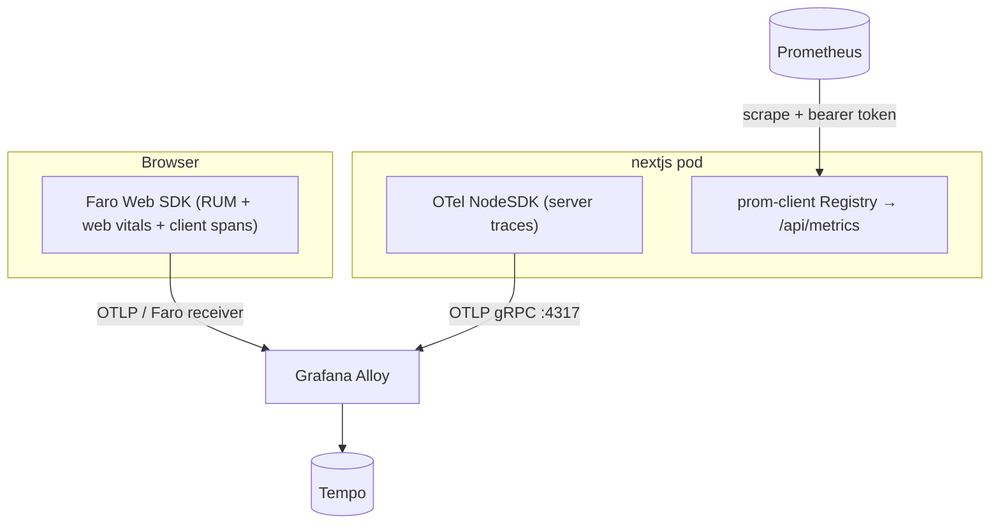

## Overview

The site emits all three observability signals from one application: **traces**
via OpenTelemetry, **metrics** via a Prometheus-compatible endpoint, and
**frontend real-user monitoring (RUM)** via Grafana Faro. Server traces and
client telemetry both flow to a Grafana Alloy collector (and on to Tempo);
metrics are scraped from an authenticated `/api/metrics` endpoint. The signals
share W3C trace context so a backend trace and a browser session can be
correlated.

## Signal topology

## Server-side tracing (OpenTelemetry)

The Next.js instrumentation hook starts an OpenTelemetry `NodeSDK` once per
server boot, but only on the Node runtime and only when `OTEL_SDK_DISABLED` is
not `true`
([instrumentation.ts:22-30](../../apps/site/src/instrumentation.ts#L22-L30)).
It exports spans over **OTLP/gRPC** to the Alloy sidecar (default
`http://localhost:4317`, → Tempo), uses the **W3C TraceContext** propagator
(required by Tempo span-metrics), detects ECS task metadata via
`awsEcsDetector`, and enables HTTP auto-instrumentation while disabling noisy
fs/dns/net instrumentations
([instrumentation.ts:49-95](../../apps/site/src/instrumentation.ts#L49-L95)).
Initialisation failures are non-fatal — the app continues without tracing
([instrumentation.ts:101-105](../../apps/site/src/instrumentation.ts#L101-L105)).

Note: the hook also enables `@opentelemetry/instrumentation-aws-sdk`, which was
added to capture DynamoDB calls. Since the runtime app migrated off the AWS SDK
to the in-cluster BFF, that auto-instrumentation now captures little at runtime;
HTTP instrumentation of the BFF `fetch` calls is the relevant span source.

## Metrics (Prometheus)

A dedicated prom-client `Registry` collects default Node.js metrics (memory,
CPU, event loop, GC) plus a custom set: HTTP request duration/size counters and
histograms, API call/error counters, cache hit/miss, external-API timing, and
article-service request/duration/data-source metrics
([metrics.ts:7-360](../../apps/site/src/lib/observability/metrics.ts#L7-L360)).
All series share default labels (`app`, `environment`, `version`), the
`nextjs_` name prefix, and tuned histogram buckets
([metrics-config.ts:8-48](../../apps/site/src/lib/observability/metrics-config.ts#L8-L48)).
The registry is exposed at `/api/metrics`, which authenticates Prometheus
scrapes with an SSM-sourced bearer token and fails closed in production (see the
companion metrics-endpoint doc).

## Frontend RUM (Grafana Faro)

The browser initialises the Faro Web SDK once (guarded against React
strict-mode double-init), capturing web vitals (LCP/INP/CLS/TTFB/FCP),
uncaught errors, and client spans, forwarding them to the Alloy Faro receiver.
It is configured via `NEXT_PUBLIC_FARO_URL` (default `/faro/collect`) and can be
disabled with `NEXT_PUBLIC_FARO_ENABLED=false`
([faro.ts:13-14,38-54](../../apps/site/src/lib/observability/faro.ts#L13-L54)).
The `TracingInstrumentation` emits browser spans over OTLP so client and server
traces correlate in Tempo
([faro.ts:24](../../apps/site/src/lib/observability/faro.ts#L24)).

## Bundling constraint

OpenTelemetry and prom-client rely on native and Node-only modules that must
not be bundled by Next.js. They are listed in `serverExternalPackages` —
`@opentelemetry/instrumentation`, `@opentelemetry/auto-instrumentations-node`,
`@opentelemetry/exporter-trace-otlp-grpc`, `@grpc/grpc-js`, and `prom-client`
([next.config.mjs:43-49](../../apps/site/next.config.mjs#L43-L49)). This keeps
gRPC working and preserves a single prom-client `Registry` across module
reloads.

## Tradeoffs

Running self-managed OTel + Prometheus + Faro is more setup than a single
managed APM, but it produces vendor-neutral signals, full control of labels and
buckets, and one correlated view across browser and server in Grafana. The cost
is the bundling care above and an Alloy sidecar in the pod to receive OTLP.

## Deeper detail

- [OpenTelemetry observability strategy](./opentelemetry-strategy.md) — the
  deeper rationale (OTel vs aws-xray-sdk, before/after visibility, design intent)
- [/api/metrics endpoint](../tools/metrics-endpoint.md) — SSM bearer-token
  auth, fail-closed behaviour, token caching
- [prom-client metrics break under Next.js bundling](../troubleshooting/prom-client-singleton-registry.md)
  — duplicate metric registration and the `serverExternalPackages` fix
- Alloy sidecar / Tempo wiring — document from the cluster (kubernetes-bootstrap)

## Related concepts

- [In-cluster BFF consumer architecture](./in-cluster-bff-consumer.md)

<!--
Evidence trail (auto-generated):
- Source: apps/site/src/instrumentation.ts (read on 2026-06-23)
- Source: apps/site/src/lib/observability/metrics.ts (read on 2026-06-23)
- Source: apps/site/src/lib/observability/metrics-config.ts (read on 2026-06-23)
- Source: apps/site/src/lib/observability/faro.ts (read on 2026-06-23)
- Source: apps/site/next.config.mjs (read on 2026-06-23)
-->
