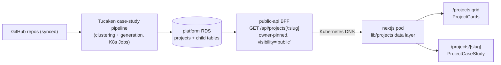

## Overview

The `/projects` page renders real, pipeline-generated project case studies
instead of relabelled articles. Projects are produced by the Tucaken
platform from synced GitHub repositories (clustering, then an
evidence-grounded case-study generation job) and served to this site by the
in-cluster `public-api` BFF. This site is a pure consumer: it holds no AWS
credentials, never touches RDS, and can only receive what the owner
deliberately published
([public-api-projects.ts](../../apps/site/src/lib/projects/public-api-projects.ts)).

## Data flow from repository to rendered page

The BFF exposes two owner-scoped endpoints: a card list
(`GET /api/projects`) and a full case study (`GET /api/projects/:slug`).
Both filter server-side on the portfolio owner's user id and
`visibility='public'`, so a listed card can never 404 on click for
visibility reasons
([upstream contract documented in the adapter header](../../apps/site/src/lib/projects/public-api-projects.ts)).

## The grid and its migration fallback

[projects/page.tsx](<../../apps/site/src/app/(site)/projects/page.tsx>)
fetches the owner's public projects and renders
[ProjectCards](../../apps/site/src/components/projects/ProjectCards.tsx):
type-label filter tabs (hidden when only one type exists), tagline, up to
six stack chips, and a repository count. While the projects source returns
nothing — BFF endpoint not yet deployed, or no project made public — the
page falls back to the legacy article-derived cards, so the route never
renders empty during the migration window. The fallback is explicitly
commented for deletion once the source is stable.

## The case-study detail page

[/projects/[slug]](<../../apps/site/src/app/(site)/projects/[slug]/page.tsx>)
renders
[ProjectCaseStudy](../../apps/site/src/components/projects/ProjectCaseStudy.tsx):
overview (pitch), stack grouped by the pipeline's own ordering, a mermaid
architecture diagram (reusing the site's client-side
[Mermaid](../../apps/site/src/components/articles/Mermaid.tsx) component —
the only client boundary on the page), highlights, challenges, key
decisions, resume bullets ("What This Demonstrates"), and de-duplicated
GitHub repository links. Sections render only when the pipeline produced
content, so a project with a pending case study degrades to header +
repositories rather than empty scaffolding. ISR revalidates hourly, with
the fetch layer caching for 5 minutes to match the BFF's `s-maxage=300`.

## Tradeoffs

Consuming generated case studies rather than raw repository metadata
trades control over the prose for evidence-grounded content: stack items
carry SBOM-verified justifications and the decisions/challenges come from
commit and PR evidence. Producer-owned enums (project type, stack
category) are humanised with a curated-label-plus-fallback map in
[labels.ts](../../apps/site/src/lib/projects/labels.ts), so the producer
can add enum values without a lockstep frontend deploy.

## Deeper detail

- [Owner-identity isolation decision](../decisions/0002-owner-id-isolation.md)
  — why the routes pin a user id and the frontend names no identity
- [Graceful-degradation consumer pattern](../patterns/graceful-degradation-consumer.md)
  — the consume-don't-crash contract this data layer implements
- [In-cluster BFF consumer architecture](./in-cluster-bff-consumer.md)
  — the credential-isolation architecture all consumers share

## Related concepts

- [API and data communication](./api-and-data-communication.md)

<!--
Evidence trail (auto-generated):
- Source: apps/site/src/lib/projects/public-api-projects.ts (read on 2026-07-05)
- Source: apps/site/src/components/projects/ProjectCards.tsx (read on 2026-07-05)
- Source: apps/site/src/components/projects/ProjectCaseStudy.tsx (read on 2026-07-05)
- Source: apps/site/src/app/(site)/projects/page.tsx (read on 2026-07-05)
- Source: apps/site/src/app/(site)/projects/[slug]/page.tsx (read on 2026-07-05)
- Cross-repo: ai-applications api/public-api/src/routes/projects.ts (read on 2026-07-05, PR #414)
-->
