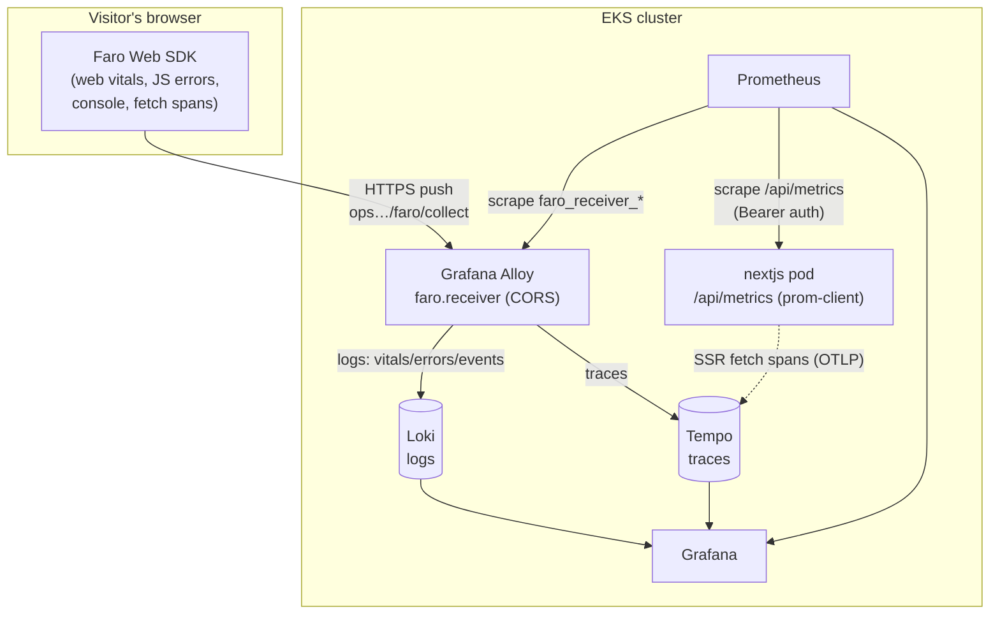

## Overview

Everything the "Frontend & RUM" dashboard shows arrives over **three telemetry
planes**, each with a different transport, chosen for the shape of its data:

1. **Browser RUM** (per-user, high-cardinality events) → **push** → Grafana Alloy
   → **Loki** (logs) + **Tempo** (traces).
2. **Server metrics** (low-cardinality time series) → **pull/scrape** →
   **Prometheus**.
3. **Distributed traces** (browser → SSR → admin-api) → OTLP → **Tempo**.

Grafana sits on top and queries all three datasources. The key design choice:
**RUM is push (the browser can't be scraped), server metrics are pull (the
Prometheus model)** — and RUM lands in **Loki as logs**, not Prometheus, because
each web-vital sample carries per-session, per-page context that would explode
Prometheus cardinality.



## Plane 1 — Browser RUM (Grafana Faro)

### What is collected, and why

The Faro Web SDK is initialised client-side
([faro.ts](../../apps/site/src/lib/observability/faro.ts)) with
`getWebInstrumentations({ captureConsole: true })` plus a
`TracingInstrumentation`. That yields:

| Signal | Why it's needed |
|:-------|:----------------|
| **Web Vitals** (LCP, INP, CLS, TTFB, FCP) | The ranking-critical performance truth — real users, real devices, not lab |
| **JS errors / unhandled rejections** | Client failures the server never sees |
| **console.error / console.warn** | App-level warnings (e.g. the Mermaid render error) |
| **Navigation + `fetch` spans** | Page loads and client-perceived `/api/*` latency/status |

The SDK tags every payload with `app.name` (`portfolio-frontend`), `version`,
and `environment`, and auto-attaches `session_id`, `page_url`, and
`browser_*`. `TracingInstrumentation` propagates `traceparent` on same-origin /
`*.nelsonlamounier.com` fetches so a browser span can be stitched to the SSR /
admin-api spans in Tempo.

### How it ships (push, not scrape)

The SDK **pushes** batched payloads over HTTPS to
`https://ops.nelsonlamounier.com/faro/collect`, which routes to the **Alloy
`faro.receiver`** component (defined in the sibling `kubernetes-bootstrap` repo,
`charts/monitoring/chart/templates/alloy/configmap.yaml`). The receiver:

- enforces a **CORS allow-list** (`cors_allowed_origins`) so only known site
  origins can post telemetry;
- **splits signals by type**: `logs` (vitals, errors, events) → a Loki write
  pipeline → **Loki**; `traces` → the OTLP exporter → **Tempo**;
- exposes its **own** Prometheus metrics `faro_receiver_*` (throughput, request
  duration, payload size) — the pipeline-health signals in the dashboard's
  bottom rows.

### Data model (how to query it)

RUM lands in Loki as **logfmt** log lines under the stream label
`{job="faro"}`. Crucially, the **application is an in-line field `app_name`**
(not a stream label), so dashboard queries filter with
`| logfmt | app_name=~"$app"`. Web vitals are `type="web-vitals"` with one
measurement per line (`lcp`/`inp`/`cls`/`ttfb`/`fcp` + `context_rating`);
errors are `kind="exception"`; client API calls are
`event_name="faro.tracing.fetch"` (`event_data_duration_ns`,
`event_data_http_url`, `event_data_http_status_code`).

## Plane 2 — Server metrics (prom-client → Prometheus scrape)

### What is collected (server), and why

The pod builds a `prom-client` registry with prefix `nextjs_`
([metrics.ts](../../apps/site/src/lib/observability/metrics.ts)):

- **`collectDefaultMetrics`** → Node.js runtime: heap, GC, event-loop lag, CPU,
  file descriptors (`nextjs_nodejs_*`, `nextjs_process_*`). These answer "is the
  pod healthy" — the counterpart to the browser's RUM view.
- **`nextjs_up` / `nextjs_app_info`** → liveness + build metadata.
- **`nextjs_api_calls_total` / `nextjs_api_errors_total` /
  `nextjs_http_request_duration_seconds`** → *defined* HTTP RED metrics. **Note:**
  these currently have no live series — they are registered but not yet
  incremented by request-handling middleware (see the quality report's coverage
  gap).

### How it's scraped (pull, with bearer auth)

Prometheus **pulls** `GET /api/metrics` on the pod (job `nextjs-app`). The
endpoint ([metrics/route.ts](../../apps/site/src/app/api/metrics/route.ts))
**fails closed in production** — it refuses to serve metrics unless a bearer
token is configured, so the endpoint can't leak internal metrics if
accidentally exposed. The scrape therefore has to authenticate:

```yaml
# Prometheus scrape job "nextjs-app"
authorization:
  type: Bearer
  credentials_file: /etc/prometheus/secrets/nextjs-metrics-token/token
```

The **same token** is provisioned to both sides from one SSM SecureString
(`/nextjs/development/metrics-bearer-token`) via the External Secrets Operator:

- → the **nextjs pod** as env `METRICS_BEARER_TOKEN` (what `/api/metrics` checks,
  with `timingSafeEqual`);
- → the **monitoring namespace** as a secret mounted into Prometheus (what the
  scrape sends).

`faro_receiver_*` reach Prometheus the ordinary way — Prometheus scrapes the
**Alloy** pod (job `alloy`); no auth needed for that in-cluster target.

## Plane 3 — Distributed traces (Tempo)

Browser spans (Faro `TracingInstrumentation`) and server spans (SSR / admin-api
via `OTEL_EXPORTER_OTLP_*` → Alloy's `otelcol.receiver.otlp` → batch → Tempo
exporter) both land in **Tempo** under service names
(`portfolio-frontend`, `tucaken-app`, `nextjs-frontend`, `admin-api`). Because
`traceparent` propagates across the same-origin fetch, one `trace_id` links the
browser click → SSR → admin-api → pg — the "follow a slow page load" pivot the
dashboard's live Tempo panel exposes.

## How it reaches Grafana

Grafana has three provisioned datasources — **Loki**, **Prometheus**, **Tempo** —
and dashboards are provisioned from ConfigMaps generated by
`.Files.Glob "dashboards/*.json"`. The "Frontend & RUM" dashboard therefore
reads:

- **Loki** for the experience metrics (vitals, errors, audience, client API,
  per-page tables) — LogQL `quantile_over_time … | unwrap` and
  `count_over_time`;
- **Prometheus** for pipeline + server health (`faro_receiver_*`, `nextjs_*`);
- **Tempo** (TraceQL) for the live slow-trace table.

## Why these transport choices

- **RUM = push:** a browser is not a scrape target; it must post telemetry out.
- **RUM in Loki (logs), not Prometheus:** each vital sample carries
  session/page/browser context — high-cardinality by nature. Storing that as
  logs and computing percentiles at query time (`unwrap`) avoids the Prometheus
  cardinality explosion that per-session labels would cause.
- **Server metrics = pull:** low-cardinality time series fit the Prometheus
  scrape model; the bearer token keeps a fail-closed endpoint scrapeable without
  exposing it publicly.
- **One Alloy front door:** centralises the CORS allow-list, signal routing, and
  its own health metrics, instead of the browser talking to Loki/Tempo directly.

## Related

- ["Frontend & RUM" dashboard — panel review & gaps](../reports/frontend-rum-dashboard-review.md)
- [Frontend application quality assessment](../reports/frontend-quality-assessment.md)
- [Observability architecture](./observability-architecture.md) — the wider OTel + Prometheus + Faro stack

<!--
Evidence trail:
- Source: apps/site/src/lib/observability/faro.ts — initializeFaro url ops…/faro/collect, app portfolio-frontend, getWebInstrumentations(captureConsole), TracingInstrumentation propagate *.nelsonlamounier.com
- Source: apps/site/src/lib/observability/metrics.ts — prom-client Registry, prefix nextjs_, collectDefaultMetrics, nextjs_up/app_info/api_calls_total/api_errors_total/http_request_duration
- Source: apps/site/src/app/api/metrics/route.ts — Bearer auth (METRICS_BEARER_TOKEN / SSM), fail-closed in prod, timingSafeEqual
- Source: kubernetes-bootstrap alloy/configmap.yaml — faro.receiver server{cors_allowed_origins}, output logs→loki.write, traces→otelcol.exporter.otlp.tempo; otelcol.receiver.otlp for SSR/admin-api
- Source: kubernetes-bootstrap prometheus/configmap.yaml — scrape jobs nextjs-app (Bearer), alloy, loki, tempo, grafana
- Live 2026-07-04: up{job=nextjs-app}=1; faro_receiver_* present; nextjs_api_* series absent
-->
