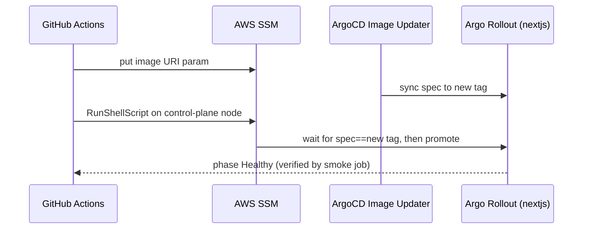

> [!NOTE]
> **Archived — describes a removed mechanism.** This documents an earlier design
> where GitHub Actions drove `kubectl argo rollouts promote` **over an SSM Run
> Command**, plus an in-cluster smoke job. Both the `promote-site` and
> `smoke-site` jobs were **removed** (PRs #9 and #10); promotion is now handled
> in-cluster by ArgoCD Image Updater + Argo Rollouts auto-promotion. GitHub's
> responsibility now ends at the ECR push + SSM write. For the current design see
> [CD pipeline](../concepts/cd-pipeline.md). Kept for provenance; line references
> below point at a version of `deploy-frontend.yml` that no longer exists.

## Overview

The site deploys with an Argo Rollouts **blue-green** strategy, but the GitHub
Actions pipeline has no direct line to the cluster API. Instead it drives the
promotion remotely: it writes the new image URI to SSM, lets ArgoCD Image
Updater move the rollout to the new tag, then runs the `kubectl argo rollouts
promote` command **inside the cluster via an SSM Run Command** against the
control-plane node. This keeps the cluster API private while still automating
the cutover.

## How it works

The promote step builds a remote script and sends it via the
`AWS-RunShellScript` document
([deploy-frontend.yml:443](../../.github/workflows/deploy-frontend.yml#L443)),
which executes `kubectl argo rollouts promote nextjs -n nextjs-app` on the node
([deploy-frontend.yml:421](../../.github/workflows/deploy-frontend.yml#L421)).

## The spec-sync-before-Paused ordering

The critical correctness detail: the script must **not** enter the
"wait-for-Paused" loop until the rollout spec already references the new image
tag
([deploy-frontend.yml:381-387](../../.github/workflows/deploy-frontend.yml#L381-L387)).
"Step 0" polls the rollout's `spec.template…image` until it contains
`EXPECTED_TAG`, and only then proceeds
([deploy-frontend.yml:386-394](../../.github/workflows/deploy-frontend.yml#L386-L394)).
Without this gate, a rollout still `Healthy` on the *old* image would satisfy an
"Already Healthy → no promotion needed" early-exit
([deploy-frontend.yml:405](../../.github/workflows/deploy-frontend.yml#L405)),
and the smoke test would then verify the wrong image. The failure mode this
prevents has its own [troubleshooting doc](./rollout-stale-healthy-early-exit.md).

## Tradeoffs

Driving promotion over SSM avoids exposing the Kubernetes API to CI and removes
the need for long-lived kubeconfig credentials in GitHub, at the cost of a more
elaborate remote-script + polling dance and a dependency on ArgoCD Image Updater
timing. Blue-green (vs rolling) gives an instant, atomic cutover and a trivial
rollback by aborting before promotion.

## Deeper detail

- [Frontend deploy pipeline](../runbooks/frontend-deploy-pipeline.md) — the full
  job sequence and how to operate it
- [Rollout stale-Healthy early exit](./rollout-stale-healthy-early-exit.md)
  — the race this ordering defends against

## Related concepts

- [Frontend deploy pipeline](../runbooks/frontend-deploy-pipeline.md)

<!--
Evidence trail (auto-generated):
- Source: .github/workflows/deploy-frontend.yml (read on 2026-06-23)
-->
