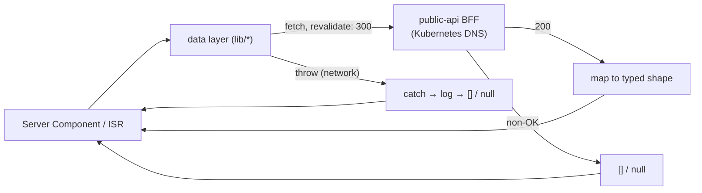

## Intent

Let a public site build, prerender, and keep serving when its upstream
data source is unreachable. Every read in a BFF data layer maps failure to
an empty value — `[]` for collections, `null` for lookups — instead of
throwing, so Docker builds (which have no cluster access) and ISR
prerenders always succeed, and runtime outages degrade to empty states
rather than 500s.

## When to apply

Apply to read paths on public rendering surfaces whose upstream lives
inside the cluster: article lists, project grids, resume data. Do not
apply to writes (a lost like/comment must surface an error, not vanish
silently) or to authenticated surfaces where showing stale-or-empty data
would mislead.

## Structure

Two failure classes collapse to the same contract: a non-OK response
(404 for a private slug, 5xx for BFF trouble) returns early with the empty
value, and a thrown fetch (DNS unresolvable at build time) is caught,
logged with a module-tagged `console.error`, and returns the same empty
value. Callers map `null` to `notFound()` and `[]` to an empty grid.

## Implementation in this codebase

Two independent data layers implement the identical contract:

- **Articles** —
  [public-api-articles.ts](../../apps/site/src/lib/articles/public-api-articles.ts):
  `queryPublishedArticles()` returns `[]` on any failure;
  `getArticleDetailBySlug()` returns `null`. The header documents the
  build-time constraint: "the Docker build has no cluster access".
- **Projects** —
  [public-api-projects.ts](../../apps/site/src/lib/projects/public-api-projects.ts):
  `queryPublicProjects()` returns `[]`; `getPublicCaseStudy()` returns
  `null`. Behaviour is pinned by unit tests for the non-OK, thrown-fetch,
  and happy paths
  ([public-api-projects.test.ts](../../apps/site/src/lib/projects/public-api-projects.test.ts)).

The consequence both layers accept: an upstream outage is
indistinguishable from "no content" to the renderer. The observability
layer, not the UI, is responsible for telling those apart — reads are
logged and the site's metrics/tracing cover the fetch path
([article-service.ts](../../apps/site/src/lib/articles/article-service.ts)
wraps reads in OTel spans and Prometheus counters).

## Variants

- **Fallback rendering** — the projects grid goes one step further than
  empty-state: while the projects source returns nothing it renders the
  legacy article-derived cards
  ([projects/page.tsx](<../../apps/site/src/app/(site)/projects/page.tsx>)),
  a migration-window variant scheduled for deletion once the source is
  stable.
- **Hardcoded-data fallback** — the resume read degrades to HTTP 204 with
  UI-side hardcoded data (see
  [in-cluster BFF consumer](../concepts/in-cluster-bff-consumer.md)),
  trading freshness for a never-empty page on a high-stakes surface.

<!--
Evidence trail (auto-generated):
- Source: apps/site/src/lib/articles/public-api-articles.ts (read on 2026-07-05)
- Source: apps/site/src/lib/projects/public-api-projects.ts (read on 2026-07-05)
- Source: apps/site/src/lib/projects/public-api-projects.test.ts (read on 2026-07-05)
- Source: apps/site/src/app/(site)/projects/page.tsx (read on 2026-07-05)
-->
