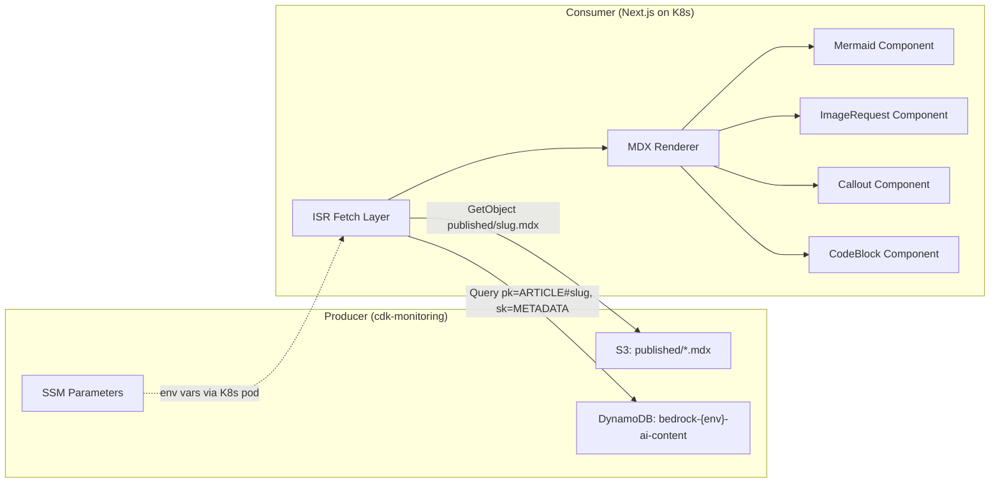

# Frontend Consumer Implementation Guide

> Reference document for implementing the Consumer side (Next.js) of the Producer-Consumer architecture.
> All data contracts below are derived from the deployed Producer in `cdk-monitoring`.

---

## Architecture Summary



---

## 1. Environment Configuration

The K8s worker node already has IAM grants for the Bedrock content resources (wired in Phase 2). The Next.js pod needs these environment variables — discoverable via SSM:

| Env Variable | SSM Path | Example Value |
|---|---|---|
| `CONTENT_TABLE_NAME` | `/bedrock-development/content-table-name` | `bedrock-development-ai-content` |
| `CONTENT_TABLE_ARN` | `/bedrock-development/content-table-arn` | `arn:aws:dynamodb:eu-west-1:...` |
| `ASSETS_BUCKET_NAME` | `/bedrock-development/assets-bucket-name` | `bedrock-development-kb-data` |
| `PUBLISHED_PREFIX` | `/bedrock-development/published-prefix` | `published/` |
| `AWS_REGION` | (already set by K8s) | `eu-west-1` |

### How to inject into the pod

Add to your Helm `values.yaml` or K8s Deployment:

```yaml
env:
  - name: CONTENT_TABLE_NAME
    value: "bedrock-development-ai-content"   # or use ExternalSecret/SSM sidecar
  - name: ASSETS_BUCKET_NAME
    value: "bedrock-development-kb-data"
  - name: PUBLISHED_PREFIX
    value: "published/"
  - name: AWS_REGION
    value: "eu-west-1"
```

---

## 2. Data Contract

### DynamoDB — METADATA Record

```
Table:  bedrock-{env}-ai-content
pk:     ARTICLE#{slug}
sk:     METADATA
```

| Field | Type | Description |
|---|---|---|
| `title` | `string` | Article title |
| `tags` | `string[]` | Tags array |
| `heroImageUrl` | `string` | Hero image URL (may be empty) |
| `contentRef` | `string` | S3 URI: `s3://bucket/published/slug.mdx` |
| `aiSummary` | `string` | 2-3 sentence teaser for cards/SEO |
| `readingTime` | `number` | Minutes to read |
| `mermaidDiagramCount` | `number` | Count of Mermaid diagrams |
| `imageRequestCount` | `number` | Count of screenshot placeholders |

### DynamoDB — CONTENT Version Record

```
pk:     ARTICLE#{slug}
sk:     CONTENT#v_{ISO timestamp}
```

Contains full metadata plus: `description`, `slug`, `publishDate`, `category`, `technicalConfidence`, `sourceKey`, `transformedAt`, `model`, `complexityTier`, `complexityReason`, `thinkingBudgetUsed`.

### S3 — MDX Content

```
Bucket:  bedrock-{env}-kb-data
Key:     published/{slug}.mdx       ← latest version
Key:     content/v1/{slug}.mdx      ← versioned snapshot
```

Each `.mdx` file contains YAML frontmatter + MDX body with:
- `:::note`, `:::tip`, `:::danger` callout blocks
- ` ```mermaid ` code fences (raw Mermaid syntax)
- `<ImageRequest id="..." instruction="..." />` tags
- ` ```language ` code blocks with file path comments on line 1

---

## 3. TypeScript Interfaces

Create these in your project (e.g., `src/lib/types/content.ts`):

```typescript
/** DynamoDB METADATA record — used for article listing cards */
export interface ArticleMetadata {
  pk: string;                    // "ARTICLE#{slug}"
  sk: "METADATA";
  title: string;
  tags: string[];
  heroImageUrl: string;
  contentRef: string;            // "s3://bucket/published/slug.mdx"
  aiSummary: string;
  readingTime: number;
  mermaidDiagramCount: number;
  imageRequestCount: number;
}

/** Parsed MDX frontmatter (embedded in the .mdx file) */
export interface ArticleFrontmatter {
  title: string;
  description: string;
  tags: string[];
  slug: string;
  publishDate: string;           // "YYYY-MM-DD"
  readingTime: number;
  category: string;
  aiSummary: string;
  technicalConfidence: number;   // 0-100
  heroImageUrl?: string;
}

/** Article card for listing pages (derived from METADATA) */
export interface ArticleCard {
  slug: string;
  title: string;
  tags: string[];
  aiSummary: string;
  readingTime: number;
  heroImageUrl: string;
  mermaidDiagramCount: number;
  imageRequestCount: number;
}

/** Full article for detail pages */
export interface Article {
  metadata: ArticleCard;
  mdxContent: string;            // Raw MDX string from S3
}
```

---

## 4. Data Fetching Layer

Create `src/lib/content/fetcher.ts`:

```typescript
import { DynamoDBClient } from "@aws-sdk/client-dynamodb";
import { DynamoDBDocumentClient, QueryCommand } from "@aws-sdk/lib-dynamodb";
import { S3Client, GetObjectCommand } from "@aws-sdk/client-s3";
import type { ArticleMetadata, Article, ArticleCard } from "../types/content";

const TABLE_NAME = process.env.CONTENT_TABLE_NAME!;
const BUCKET_NAME = process.env.ASSETS_BUCKET_NAME!;
const PUBLISHED_PREFIX = process.env.PUBLISHED_PREFIX ?? "published/";
const REGION = process.env.AWS_REGION ?? "eu-west-1";

const dynamoClient = DynamoDBDocumentClient.from(
  new DynamoDBClient({ region: REGION })
);
const s3Client = new S3Client({ region: REGION });

/** List all published article cards (for /blog listing) */
export async function listArticles(): Promise<ArticleCard[]> {
  const result = await dynamoClient.send(
    new QueryCommand({
      TableName: TABLE_NAME,
      IndexName: "gsi-sk-pk",   // Assumes a GSI on sk=METADATA
      KeyConditionExpression: "sk = :sk",
      ExpressionAttributeValues: { ":sk": "METADATA" },
    })
  );

  return (result.Items as ArticleMetadata[]).map((item) => ({
    slug: item.pk.replace("ARTICLE#", ""),
    title: item.title,
    tags: item.tags,
    aiSummary: item.aiSummary,
    readingTime: item.readingTime,
    heroImageUrl: item.heroImageUrl,
    mermaidDiagramCount: item.mermaidDiagramCount,
    imageRequestCount: item.imageRequestCount,
  }));
}

/** Fetch a single article by slug (for /blog/[slug] detail page) */
export async function getArticle(slug: string): Promise<Article | null> {
  // 1. Get metadata from DynamoDB
  const metaResult = await dynamoClient.send(
    new QueryCommand({
      TableName: TABLE_NAME,
      KeyConditionExpression: "pk = :pk AND sk = :sk",
      ExpressionAttributeValues: {
        ":pk": `ARTICLE#${slug}`,
        ":sk": "METADATA",
      },
    })
  );

  const meta = metaResult.Items?.[0] as ArticleMetadata | undefined;
  if (!meta) return null;

  // 2. Fetch MDX content from S3
  const s3Key = `${PUBLISHED_PREFIX}${slug}.mdx`;
  const s3Result = await s3Client.send(
    new GetObjectCommand({ Bucket: BUCKET_NAME, Key: s3Key })
  );
  const mdxContent = await s3Result.Body?.transformToString("utf-8");
  if (!mdxContent) return null;

  return {
    metadata: {
      slug,
      title: meta.title,
      tags: meta.tags,
      aiSummary: meta.aiSummary,
      readingTime: meta.readingTime,
      heroImageUrl: meta.heroImageUrl,
      mermaidDiagramCount: meta.mermaidDiagramCount,
      imageRequestCount: meta.imageRequestCount,
    },
    mdxContent,
  };
}

/** Get all slugs for static path generation */
export async function getAllSlugs(): Promise<string[]> {
  const articles = await listArticles();
  return articles.map((a) => a.slug);
}
```

> [!IMPORTANT]
> The `listArticles()` function assumes a **GSI with sk as partition key**. If your DynamoDB table doesn't have this GSI, you'll need a `Scan` with `FilterExpression` instead — or add the GSI to the content stack.

---

## 5. ISR Page Setup

### Blog listing page — `app/blog/page.tsx`

```typescript
import { listArticles } from "@/lib/content/fetcher";
import { ArticleCard } from "@/components/blog/ArticleCard";

export const revalidate = 3600; // ISR: revalidate every hour

export default async function BlogPage() {
  const articles = await listArticles();

  return (
    <main>
      <h1>Blog</h1>
      <div className="article-grid">
        {articles.map((article) => (
          <ArticleCard key={article.slug} article={article} />
        ))}
      </div>
    </main>
  );
}
```

### Blog detail page — `app/blog/[slug]/page.tsx`

```typescript
import { getArticle, getAllSlugs } from "@/lib/content/fetcher";
import { MdxRenderer } from "@/components/blog/MdxRenderer";
import { notFound } from "next/navigation";

export const revalidate = 3600; // ISR: revalidate every hour

export async function generateStaticParams() {
  const slugs = await getAllSlugs();
  return slugs.map((slug) => ({ slug }));
}

export default async function ArticlePage({
  params,
}: {
  params: { slug: string };
}) {
  const article = await getArticle(params.slug);
  if (!article) notFound();

  return (
    <article>
      <h1>{article.metadata.title}</h1>
      <p>{article.metadata.readingTime} min read</p>
      <MdxRenderer source={article.mdxContent} />
    </article>
  );
}
```

---

## 6. MDX Rendering Pipeline

### Dependencies

```bash
npm install next-mdx-remote gray-matter mermaid prism-react-renderer
```

### MDX Renderer — `components/blog/MdxRenderer.tsx`

```tsx
"use client";

import { MDXRemote, MDXRemoteSerializeResult } from "next-mdx-remote";
import { serialize } from "next-mdx-remote/serialize";
import { Mermaid } from "./Mermaid";
import { ImageRequest } from "./ImageRequest";
import { Callout } from "./Callout";
import { CodeBlock } from "./CodeBlock";

const components = {
  Mermaid,
  ImageRequest,
  Callout,
  CodeBlock,
  // Map HTML elements to styled components
  pre: CodeBlock,
};

interface MdxRendererProps {
  source: string;
}

export async function MdxRenderer({ source }: MdxRendererProps) {
  const mdxSource = await serialize(source, {
    parseFrontmatter: true,
    mdxOptions: {
      remarkPlugins: [],
      rehypePlugins: [],
    },
  });

  return <MDXRemote {...mdxSource} components={components} />;
}
```

---

## 7. Custom React Components

### 7a. Mermaid — `components/blog/Mermaid.tsx`

```tsx
"use client";

import { useEffect, useRef, useState } from "react";
import mermaid from "mermaid";

interface MermaidProps {
  chart: string;
}

export function Mermaid({ chart }: MermaidProps) {
  const containerRef = useRef<HTMLDivElement>(null);
  const [svg, setSvg] = useState<string>("");
  const [error, setError] = useState<string | null>(null);

  useEffect(() => {
    mermaid.initialize({
      startOnLoad: false,
      theme: "dark",
      securityLevel: "loose",
    });

    const renderChart = async () => {
      try {
        const id = `mermaid-${Math.random().toString(36).slice(2, 9)}`;
        const { svg } = await mermaid.render(id, chart);
        setSvg(svg);
      } catch (err) {
        setError(err instanceof Error ? err.message : "Mermaid render failed");
      }
    };

    renderChart();
  }, [chart]);

  if (error) {
    return (
      <div className="mermaid-error">
        <p>Diagram failed to render</p>
        <pre>{chart}</pre>
      </div>
    );
  }

  return (
    <div
      ref={containerRef}
      className="mermaid-container"
      dangerouslySetInnerHTML={{ __html: svg }}
    />
  );
}
```

> [!NOTE]
> Mermaid code arrives as ` ```mermaid ` fenced code blocks in the MDX. You'll need a custom remark plugin or serialize wrapper to convert these into `<Mermaid chart="..." />` components. Alternatively, parse code blocks in your `CodeBlock` component and delegate to `Mermaid` when `language === "mermaid"`.

### 7b. ImageRequest — `components/blog/ImageRequest.tsx`

```tsx
interface ImageRequestProps {
  id: string;
  instruction: string;
}

export function ImageRequest({ id, instruction }: ImageRequestProps) {
  const bucketName = process.env.NEXT_PUBLIC_ASSETS_BUCKET_NAME;
  const imageUrl = `https://${bucketName}.s3.eu-west-1.amazonaws.com/assets/screenshots/${id}.png`;

  // In dev: show a yellow placeholder with the AI instruction
  if (process.env.NODE_ENV === "development") {
    return (
      <div className="image-request-placeholder">
        <span className="badge">📸 Screenshot Needed</span>
        <p className="instruction">{instruction}</p>
        <code className="id">ID: {id}</code>
      </div>
    );
  }

  // In prod: render the real image (fallback to placeholder if missing)
  return (
    <figure className="image-request">
       {
          (e.target as HTMLImageElement).style.display = "none";
        }}
      />
      <figcaption>{instruction}</figcaption>
    </figure>
  );
}
```

### 7c. Callout — `components/blog/Callout.tsx`

```tsx
interface CalloutProps {
  type: "note" | "tip" | "danger";
  children: React.ReactNode;
}

const icons = { note: "ℹ️", tip: "💡", danger: "🚨" };

export function Callout({ type, children }: CalloutProps) {
  return (
    <aside className={`callout callout-${type}`}>
      <span className="callout-icon">{icons[type]}</span>
      <div className="callout-content">{children}</div>
    </aside>
  );
}
```

### 7d. CodeBlock — `components/blog/CodeBlock.tsx`

```tsx
"use client";

import { Highlight, themes } from "prism-react-renderer";
import { Mermaid } from "./Mermaid";

interface CodeBlockProps {
  children: string;
  className?: string; // "language-typescript", "language-mermaid", etc.
}

export function CodeBlock({ children, className }: CodeBlockProps) {
  const language = className?.replace("language-", "") ?? "text";
  const code = typeof children === "string" ? children.trim() : "";

  // Delegate Mermaid code blocks to the Mermaid component
  if (language === "mermaid") {
    return <Mermaid chart={code} />;
  }

  // Extract file path from first line comment (if present)
  const lines = code.split("\n");
  const filePath = lines[0]?.match(/^[/#]\s*(.+)/)?.[1];

  return (
    <div className="code-block">
      {filePath && <div className="code-filepath">{filePath}</div>}
      <Highlight theme={themes.nightOwl} code={code} language={language}>
        {({ tokens, getLineProps, getTokenProps }) => (
          <pre>
            <code>
              {tokens.map((line, i) => (
                <div key={i} {...getLineProps({ line })}>
                  <span className="line-number">{i + 1}</span>
                  {line.map((token, key) => (
                    <span key={key} {...getTokenProps({ token })} />
                  ))}
                </div>
              ))}
            </code>
          </pre>
        )}
      </Highlight>
    </div>
  );
}
```

---

## 8. Recommended Project Structure

```
src/
├── app/
│   ├── blog/
│   │   ├── page.tsx              # Blog listing (ISR)
│   │   └── [slug]/
│   │       └── page.tsx          # Article detail (ISR)
│   └── layout.tsx
├── components/
│   └── blog/
│       ├── ArticleCard.tsx       # Card for listing grid
│       ├── MdxRenderer.tsx       # MDX serializer + component map
│       ├── Mermaid.tsx           # Client-side Mermaid renderer
│       ├── ImageRequest.tsx      # Screenshot placeholder/image
│       ├── Callout.tsx           # :::note/tip/danger blocks
│       └── CodeBlock.tsx         # Syntax-highlighted code + Mermaid delegation
└── lib/
    ├── content/
    │   └── fetcher.ts            # DynamoDB + S3 data fetching
    └── types/
        └── content.ts            # TypeScript interfaces
```

---

## 9. Implementation Order

| Step | What | Why |
|------|------|-----|
| 1 | `lib/types/content.ts` | Type safety foundation |
| 2 | `lib/content/fetcher.ts` | Data layer (DynamoDB + S3) |
| 3 | `components/blog/CodeBlock.tsx` | Most common MDX element |
| 4 | `components/blog/Mermaid.tsx` | Delegated from CodeBlock |
| 5 | `components/blog/Callout.tsx` | Simple presentational |
| 6 | `components/blog/ImageRequest.tsx` | Dev placeholder + prod image |
| 7 | `components/blog/MdxRenderer.tsx` | Wires components together |
| 8 | `components/blog/ArticleCard.tsx` | Listing cards |
| 9 | `app/blog/page.tsx` | Blog listing with ISR |
| 10 | `app/blog/[slug]/page.tsx` | Article detail with ISR |
| 11 | Helm `values.yaml` | Inject env vars into pod |

---

## 10. Validation Checklist

- [ ] Pod can `aws dynamodb get-item` from `bedrock-{env}-ai-content`
- [ ] Pod can `aws s3 cp` from `bedrock-{env}-kb-data`
- [ ] `/blog` listing page renders article cards from DynamoDB
- [ ] `/blog/{slug}` renders full MDX with frontmatter
- [ ] Mermaid diagrams render client-side (dark theme)
- [ ] `<ImageRequest />` shows yellow placeholder in dev
- [ ] `:::note` / `:::tip` / `:::danger` render as styled callouts
- [ ] Code blocks show file path header and line numbers
- [ ] ISR revalidation works (content updates within `revalidate` window)
