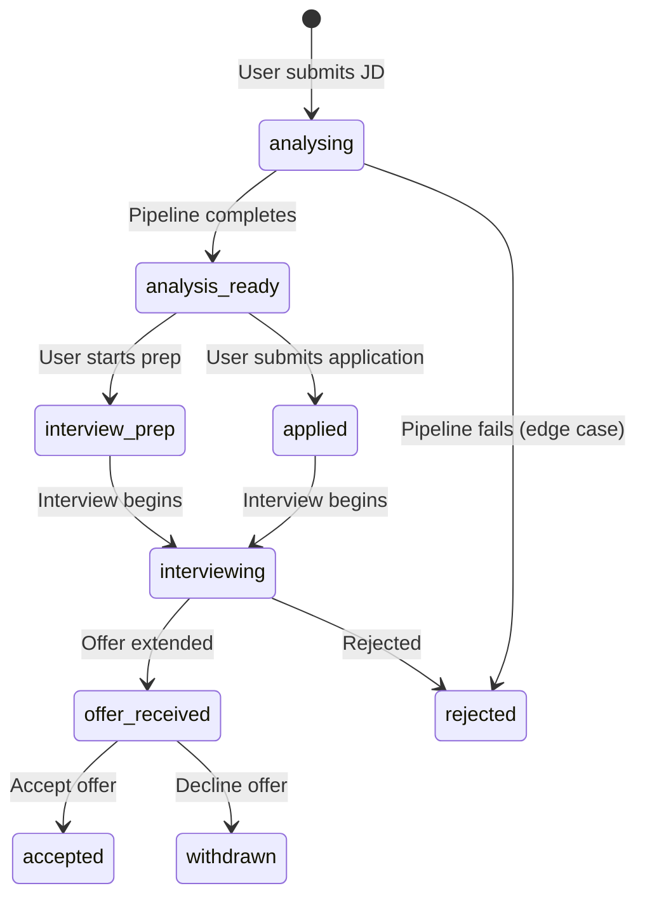

# Job Strategist — Frontend Design Specification

> Derived from infrastructure contract review of: `strategist-types.ts`, `trigger-handler.ts`, `coach-handler.ts`, `strategist-data-stack.ts`, `strategist-pipeline-stack.ts`, and the existing article pipeline frontend integration pattern.

---

## 1. Infrastructure Contracts Summary

### 1.1 API Surface — Trigger Lambda

The trigger handler accepts an `APIGatewayProxyEventV2` POST request:

```typescript
// REQUEST BODY (POST)
interface TriggerRequestBody {
    jobDescription: string;     // Raw JD text (free-form, pasted)
    targetCompany: string;      // e.g. "Revolut"
    targetRole: string;         // e.g. "Senior DevOps Engineer"
    interviewStage?: InterviewStage; // Defaults to 'applied'
}

// RESPONSE BODY (200)
interface TriggerResponse {
    pipelineId: string;         // Unique execution ID
    applicationSlug: string;    // Kebab-case slug (e.g. "revolut-senior-devops-engineer")
    status: 'analysing';        // Always 'analysing' on trigger
    executionArn: string;       // Step Functions execution ARN
}
```

> [!IMPORTANT]
> The trigger Lambda is **not yet exposed via API Gateway**. It's currently invoked directly via Lambda ARN (exported via SSM: `/bedrock-dev/strategist-trigger-function-arn`).
>
> **Design decision required:** Should we add an API Gateway route to the existing `BedrockApiStack`, or invoke via the Lambda SDK from a Next.js API route?

### 1.2 DynamoDB Entity Structure

The table `bedrock-dev-job-strategist` has 3 sort key patterns per application:

| `pk` | `sk` | Contains |
|------|------|----------|
| `APPLICATION#<slug>` | `METADATA` | Status, fitRating, recommendation, interviewStage, timestamps |
| `APPLICATION#<slug>` | `ANALYSIS#<pipelineId>` | Full XML analysis, cover letter, resume suggestions |
| `APPLICATION#<slug>` | `INTERVIEW#<stage>` | Interview prep JSON for a specific stage |

**GSI1 (status-date)** — Admin listing queries:
- `gsi1pk`: `APP_STATUS#<status>` (e.g. `APP_STATUS#analysis-ready`)
- `gsi1sk`: `<YYYY-MM-DD>#<slug>` (newest first with `ScanIndexForward: false`)

### 1.3 Application Status Lifecycle



### 1.4 Pipeline Output Shapes (per agent)

| Agent | Key Output | Frontend Use |
|-------|-----------|-------------|
| **Research** | `verifiedMatches[]`, `partialMatches[]`, `gaps[]`, `fitRating`, `fitSummary`, `technologyInventory` | Fit dashboard, skills matrix |
| **Strategist** | `analysisXml`, `coverLetter`, `metadata.overallFitRating`, `metadata.applicationRecommendation`, `resumeAdditions/Reframes` | Full analysis viewer, cover letter export |
| **Coach** | `technicalQuestions[]`, `behaviouralQuestions[]`, `difficultQuestions[]`, `technicalPrepChecklist[]`, `questionsToAsk[]`, `coachingNotes` | Interview prep cards, practice mode |

### 1.5 SSM Parameters Available for K8s Wiring

**Frontend secrets (injected into Next.js K8s secret):**

| SSM Path | Env Var Name | Used by Frontend? | Purpose |
|----------|-------------|-------------------|---------|
| `/bedrock-dev/strategist-table-name` | `STRATEGIST_TABLE_NAME` | ✅ Yes | DynamoDB reads + status polling |
| `/bedrock-dev/strategist-trigger-function-arn` | `STRATEGIST_TRIGGER_ARN` | ✅ Yes | Lambda invoke (single entry point for both analyse & coach) |

**Backend-only (Lambda env vars, NOT in frontend secrets):**

| SSM Path | Purpose |
|----------|---------|
| `/bedrock-dev/strategist-analysis-state-machine-arn` | Trigger Lambda starts the Analysis SM internally |
| `/bedrock-dev/strategist-coaching-state-machine-arn` | Trigger Lambda starts the Coaching SM internally |

> [!NOTE]
> **Status polling uses DynamoDB (Option A)** — the frontend polls `METADATA.status`
> via the existing `GET /api/admin/strategist/applications/[slug]/status` route.
> No SM ARNs or `DescribeExecution` calls are needed on the frontend.

---

## 2. K8s Secret Wiring (deploy.py Changes)

Following the established pattern from the article pipeline (`PUBLISH_LAMBDA_ARN`, `SSM_BEDROCK_PREFIX`), the deploy script needs:

```python
# Add to _BEDROCK_AGENT_PARAMS in deploy.py
_STRATEGIST_PARAMS: dict[str, str] = {
    "strategist-table-name": "STRATEGIST_TABLE_NAME",
    "strategist-trigger-function-arn": "STRATEGIST_TRIGGER_ARN",
}
```

And add to `_NEXTJS_SECRET_KEYS`:
```python
"STRATEGIST_TABLE_NAME",
"STRATEGIST_TRIGGER_ARN",
```

---

## 3. Next.js API Routes Required

### 3.1 `POST /api/strategist/trigger`
Invokes the trigger Lambda from the server side.

```typescript
// Server-side: uses AWS SDK to invoke the Lambda directly
import { LambdaClient, InvokeCommand } from '@aws-sdk/client-lambda';

// Input:  TriggerRequestBody from req.body
// Output: TriggerResponse { pipelineId, applicationSlug, status }
```

### 3.2 `GET /api/strategist/applications`
Lists applications from DynamoDB GSI1 by status.

```typescript
// Query params: ?status=analysis-ready | ?status=all
// Server-side: DynamoDB QueryCommand on gsi1-status-date
// Output: Array<ApplicationSummary>
```

### 3.3 `GET /api/strategist/applications/[slug]`
Gets full application details (METADATA + latest ANALYSIS + INTERVIEW records).

```typescript
// Server-side: DynamoDB QueryCommand on pk = APPLICATION#<slug>
// Output: { metadata, analysis, interviewPrep }
```

### 3.4 `PATCH /api/strategist/applications/[slug]/status`
Updates application lifecycle status (e.g. move to `applied`, `interviewing`).

```typescript
// Body: { status: ApplicationStatus, interviewStage?: InterviewStage }
// Server-side: DynamoDB UpdateCommand on METADATA record
```

---

## 4. Frontend Components Design

### 4.1 Page: `/admin/strategist` — Applications Dashboard

The main landing page for the Job Strategist section.

**Layout:** Sidebar navigation tab (alongside existing AI Agent tab) → Main content area.

```
┌─────────────────────────────────────────────────────────────────┐
│  🎯 Job Strategist                                    [+ Analyse New Job] │
├─────────────────────────────────────────────────────────────────┤
│  Filters:  [All ▾]  [Company ▾]  [Fit Rating ▾]                │
├─────────────────────────────────────────────────────────────────┤
│                                                                 │
│  ┌───────────────────────────────────────────────────────────┐  │
│  │  🟢 STRONG FIT  │  Revolut — Senior DevOps Engineer       │  │
│  │  Applied → Phone Screen  │  2026-03-29                    │  │
│  │  Recommendation: APPLY   │  Cost: $0.0342                 │  │
│  └───────────────────────────────────────────────────────────┘  │
│                                                                 │
│  ┌───────────────────────────────────────────────────────────┐  │
│  │  🟡 REASONABLE FIT  │  Monzo — Platform Engineer          │  │
│  │  Analysing... ◌       │  2026-03-30                       │  │
│  └───────────────────────────────────────────────────────────┘  │
│                                                                 │
│  ┌───────────────────────────────────────────────────────────┐  │
│  │  🔴 STRETCH  │  Google — Staff SRE                        │  │
│  │  Analysis Ready  │  2026-03-28                             │  │
│  │  Recommendation: STRETCH APPLICATION  │  Cost: $0.0518    │  │
│  └───────────────────────────────────────────────────────────┘  │
│                                                                 │
└─────────────────────────────────────────────────────────────────┘
```

**Components:**
| Component | Props | Description |
|-----------|-------|-------------|
| `ApplicationCard` | `ApplicationSummary` | Status badge, fit rating chip, company/role, date, cost |
| `StatusBadge` | `status: ApplicationStatus` | Colour-coded pill (green/amber/blue/red) |
| `FitRatingChip` | `rating: FitRating` | STRONG FIT → green, REASONABLE → amber, STRETCH → orange, REACH → red |
| `ApplicationFilters` | `onFilter` callback | Status dropdown, company search, fit rating filter |
| `NewAnalysisModal` | `onSubmit` callback | Job description textarea + company/role inputs + stage selector |

---

### 4.2 Page: `/admin/strategist/[slug]` — Application Detail

The deep-dive view for a single application, with tabbed sub-sections.

```
┌─────────────────────────────────────────────────────────────────┐
│  ← Back                                                         │
│                                                                 │
│  Revolut — Senior DevOps Engineer                               │
│  🟢 STRONG FIT  │  APPLY  │  Stage: Phone Screen               │
│  Started: 2026-03-29  │  Pipeline Cost: $0.0342                 │
│                                                                 │
│  [Update Stage ▾]  [Export Cover Letter]  [Mark Applied]        │
├─────────────────────────────────────────────────────────────────┤
│  [Overview]  [Skills Matrix]  [Cover Letter]  [Interview Prep]  │
├═════════════════════════════════════════════════════════════════┤
```

#### Tab 1: Overview
Renders the strategist metadata and fit summary.

| Component | Data Source | Description |
|-----------|-----------|-------------|
| `FitSummaryCard` | `research.fitSummary` | Paragraph assessment with fit rating badge |
| `RecommendationBanner` | `analysis.metadata.applicationRecommendation` | Full-width banner: APPLY/APPLY WITH CAVEATS/STRETCH/NOT RECOMMENDED |
| `CostBreakdown` | `context.cumulativeTokens`, `cumulativeCostUsd` | Input/output/thinking tokens + USD cost per agent |
| `ExperienceSignals` | `research.experienceSignals` | Years expected, domain, leadership, scale |

#### Tab 2: Skills Matrix
Renders verified/partial/gap analysis from the Research Agent.

| Component | Data Source | Description |
|-----------|-----------|-------------|
| `VerifiedMatchesTable` | `research.verifiedMatches[]` | Skill, source citation, depth badge, recency |
| `PartialMatchesTable` | `research.partialMatches[]` | Skill, gap description, transferable foundation, framing suggestion |
| `GapsTable` | `research.gaps[]` | Skill, gap type (hard/soft), severity badge, disqualifying assessment |
| `TechnologyRadar` | `research.technologyInventory` | Visual breakdown: languages, frameworks, infra, tools, methodologies |

#### Tab 3: Cover Letter
Renders the generated cover letter with copy/export functionality.

| Component | Data Source | Description |
|-----------|-----------|-------------|
| `CoverLetterViewer` | `analysis.coverLetter` | Formatted markdown rendering with copy-to-clipboard |
| `ResumeSuggestions` | `analysis.resumeAdditions/Reframes/eslCorrections` | Counts + actionable summary |
| `FullAnalysisAccordion` | `analysis.analysisXml` | Collapsible raw XML viewer (for power users) |

#### Tab 4: Interview Prep
Renders the Interview Coach output for the current stage.

| Component | Data Source | Description |
|-----------|-----------|-------------|
| `StageHeader` | `coaching.stage`, `coaching.stageDescription` | Current stage name + description |
| `QuestionCard` | `InterviewQuestion` | Question text, difficulty badge, answer framework, key points, source project |
| `DifficultQuestionCard` | `DifficultQuestion` | Question, answer framework, bridge strategy (highlighted) |
| `TechnicalPrepChecklist` | `coaching.technicalPrepChecklist[]` | Topic, priority badge, rationale, resources |
| `QuestionsToAskList` | `coaching.questionsToAsk[]` | Question + rationale (for end of interview) |
| `CoachingNotes` | `coaching.coachingNotes` | Free-text coaching advice rendered as markdown |

---

## 5. State Management (TanStack Query + Zustand)

Following the established pattern from the article pipeline:

### TanStack Query Hooks

```typescript
/** List all applications (with status filter) */
useStrategistApplications(status?: ApplicationStatus)
  → queryKey: ['strategist', 'applications', { status }]
  → queryFn:  GET /api/strategist/applications?status=...

/** Single application detail */
useStrategistApplication(slug: string)
  → queryKey: ['strategist', 'application', slug]
  → queryFn:  GET /api/strategist/applications/[slug]

/** Trigger new analysis (mutation) */
useStrategistTrigger()
  → mutationFn: POST /api/strategist/trigger
  → onSuccess:  invalidateQueries(['strategist', 'applications'])

/** Update application status (mutation) */
useStrategistStatusUpdate(slug: string)
  → mutationFn: PATCH /api/strategist/applications/[slug]/status
  → onSuccess:  invalidateQueries(['strategist', 'application', slug])
```

### Zustand Store (UI State Only)

```typescript
interface StrategistUIStore {
    /** Currently selected filter tab */
    activeStatusFilter: ApplicationStatus | 'all';
    /** Active tab on the detail page */
    activeDetailTab: 'overview' | 'skills' | 'cover-letter' | 'interview-prep';
    /** Modal state */
    isNewAnalysisOpen: boolean;
    
    setStatusFilter: (status: ApplicationStatus | 'all') => void;
    setDetailTab: (tab: string) => void;
    toggleNewAnalysis: () => void;
}
```

---

## 6. Component Tree Summary

```
/admin/strategist (Dashboard)
├── ApplicationFilters
├── NewAnalysisModal
│   ├── JobDescriptionTextarea
│   ├── CompanyInput
│   ├── RoleInput
│   └── InterviewStageSelect
└── ApplicationCard[] (mapped from query data)
    ├── StatusBadge
    ├── FitRatingChip
    └── CostBadge

/admin/strategist/[slug] (Detail)
├── ApplicationHeader
│   ├── FitRatingChip
│   ├── RecommendationBadge
│   └── StageSelector
├── ActionBar
│   ├── ExportCoverLetterButton
│   └── StatusUpdateDropdown
└── TabPanel
    ├── OverviewTab
    │   ├── FitSummaryCard
    │   ├── RecommendationBanner
    │   ├── CostBreakdown
    │   └── ExperienceSignals
    ├── SkillsMatrixTab
    │   ├── VerifiedMatchesTable
    │   ├── PartialMatchesTable
    │   ├── GapsTable
    │   └── TechnologyRadar
    ├── CoverLetterTab
    │   ├── CoverLetterViewer
    │   ├── ResumeSuggestions
    │   └── FullAnalysisAccordion
    └── InterviewPrepTab
        ├── StageHeader
        ├── QuestionCard[]
        ├── DifficultQuestionCard[]
        ├── TechnicalPrepChecklist
        ├── QuestionsToAskList
        └── CoachingNotes
```

---

## 7. Open Questions Requiring User Input

> [!IMPORTANT]
> ### Q1: API Gateway vs Direct Lambda Invoke
> The trigger Lambda is currently **not exposed via API Gateway**. Two options:
> - **A)** Add a `/strategist/trigger` route to the existing `BedrockApiStack` API Gateway (consistent, has API key auth)
> - **B)** Invoke the Lambda directly from a Next.js API route using the AWS SDK (simpler, fewer infrastructure changes)
>
> The article pipeline uses **option B** (direct invoke via `PUBLISH_LAMBDA_ARN`). Recommend continuing that pattern for consistency.

> [!IMPORTANT]
> ### Q2: Poll Mechanism for 'Analysing' Status
> When the user triggers an analysis, the pipeline takes ~30–90 seconds. Options:
> - **A)** TanStack Query polling with `refetchInterval: 5000` on the detail page
> - **B)** Optimistic UI: redirect to the applications list, show `analysing` badge, let user check back
>
> The article pipeline uses **option A** (polling via `useArticleStatus`). Recommend the same.

> [!IMPORTANT]
> ### Q3: Admin Navigation Placement
> Should the Strategist appear as:
> - **A)** A new top-level `/admin/strategist` route with its own sidebar tab
> - **B)** A sub-tab within the existing AI Agent page
> - **C)** Its own page but accessible from the main admin sidebar

> [!WARNING]
> ### Q4: Cover Letter Export Format
> The cover letter is stored as a plain text string. Should the export be:
> - **A)** Copy-to-clipboard only (simplest)
> - **B)** Download as `.pdf` (requires server-side rendering)
> - **C)** Download as `.docx` (requires a library like `docx`)
> - **D)** Copy + download as `.md`
